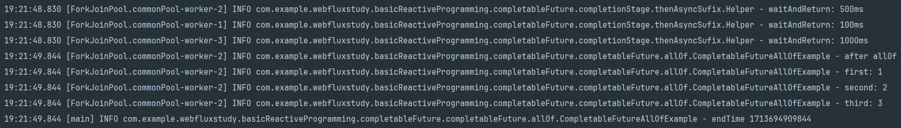
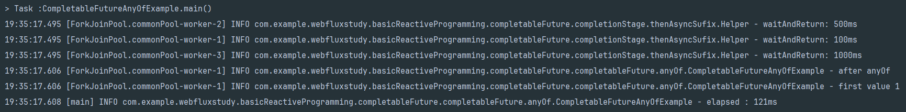

## CompletableFuture
- CompletableFuture 클래스는 Future 인터페이스가 가진 한계점을 보완하기 위해 CompletionStage 인터페이스와 합쳐진 형태의 클래스로, Java 8부터 제공되는 클래스이다.
- Future와 다르게 외부에서 작업을 완료시킬 수 있고, 콜백 등록 및 Future 조합 등...이 가능하다.

````java
import java.util.concurrent.CompletionStage;
import java.util.function.Supplier;

public class CompletableFuture<T> implements Future<T>, CompletionStage<T> {
    public static <U> CompletableFuture<U> supplyAsync(Supplier supplier) { }
    public static CompletableFuture<Void> runAsync(Runnable runnable) {}
    
    public boolean complete(T value) {}
    public boolean isCompletedExceptionally(){}
    
    public static COmpletableFuture<Void> allOf(CompletableFuture<?> ... cfs) {}
    public static CompletableFuture<Object> anyOf(CompletableFuture<?> ... cfs) {}
}
````

### supplyAsync
- Supplier를 제공하여 CompletableFuture를 생성가능하고, Supplier의 반환값이 CompletableFuture의 결과로 주어진다.

````java
public class CompletableFutureSupplyAsyncExample {

    public static void main(String[] args) throws InterruptedException, ExecutionException {
        var future = CompletableFuture.supplyAsync(() -> {
            try {
                Thread.sleep(100);
            } catch (InterruptedException e) {
                throw new RuntimeException(e);
            }
            return 1;
        });
        // SupplyAsync는 Non-blocking으로 동작하기 때문에 해당 시점에서는 Done 상태가 아님
        assert !future.isDone(); // -> false

        // 시간이 지나면서 1이 반환됐을거고, 아래 코드는 true가 반환된다.
        Thread.sleep(1000);

        assert future.isDone();
        assert future.get() == 1;
    }
}
````

### runAsync
- Runnable을 제공하여 CompletableFuture를 생성할 수 있고, 값을 반환하지 않는다.
- 다음 task에 null이 전달된다.
````java
public class CompletableFutureRunAsyncExample {
    public static void main(String[] args) throws InterruptedException, ExecutionException {
        var future = CompletableFuture.runAsync(() -> {
            try {
                Thread.sleep(100);
            } catch (InterruptedException e) {
                throw new RuntimeException(e);
            }
        });
        // 현재 시점에는 isDone이 false
        assert !future.isDone();

        // 1초가 지나면서 isDone이 true로 반환
        Thread.sleep(1000);
        assert future.isDone();
        // runAsync의 반환값은 null이다.
        assert future.get() == null; 
    }
}
````
### complete
- Future, CompletionStage는 둘 다 외부에서 Future를 완료시킬 수 있는 메서드가 제공되지 않는 반면, CompletableFuture 클래스는 complete를 사용해서 외부에서 완료 시킬 수 있다.
- CompletableFuture가 완료되지 않았다면 주어진 값으로 채우고, complete에 의해서 상태가 바뀌었다면 true, 아니라면 false를 반환한다.
````java
public class CompletableFutureCompleteExample {
    // 이미 complete가 되었다면 complete가 된 시점에 있는 값을 유지
    public static void main(String[] args) throws ExecutionException, InterruptedException {
        CompletableFuture<Integer> future = new CompletableFuture<>();
        assert !future.isDone();

        // Future에 1을 채우고 complete 시킴
        var triggered = future.complete(1);
        // complete 시켜서 곧 바로 완료.
        assert future.isDone();
        // true
        assert triggered;
        // complete에서 1을 할당했기 떄문에 1을 가지고 있음
        assert future.get() == 1;

        // 2로 complete 시도
        triggered = future.complete(2);
        // 위에서 완료 시켰기 때문에 true
        assert future.isDone();
        // value 2로 complete 시킨것이 아니기 때문에 false가 반환된다.
        assert !triggered;
        // 이미 위에서 1을 할당해서 complete 시켰기 때문에 future의 값은 여전히 1을 유지한다.
        assert future.get() == 1; 
    }
}
````

### isCompletedExceptionally
- Future 인터페이스에서는 isDone, canceled 두 가지 밖에 제공되지 않았다.
- CompletableFuture에서는 isCompletedExceptionally 메서드로 익셉션에 의해 complete 되었는지, 상태 체크를 할 수 있다.
````java
public class CompletableFutureIsCompletedExceptionallyExample {
    public static void main(String[] args) throws InterruptedException {
        var futureWithException = CompletableFuture.supplyAsync(() -> {
            // exception 
            return 1 / 0; 
        });
        Thread.sleep(100);
        // complete 되었는지 체크
        assert futureWithException.isDone();
        // exception으로 종료 되었는지 체크
        assert futureWithException.isCompletedExceptionally(); 
    }
}
````
### allOf
- CompletableFuture는 각각의 다른 스레드에서 따로 동작한다. A, B, C 스레드가 각각 반환한 completableFuture를 하나로 모아서 다른 스레드에게 내려 주어야할때 사용한다.
- 여러 completableFuture를 모아서 completableFuture로 변환하고, 모든 completableFuture가 완료되면 상태가 done으로 변경된다.
- 반환값이 Void, 없기 때문에 각각의 값에 get으로 접근해야 한다.

````java
@Slf4j
public class CompletableFutureAllOfExample {
    public static void main(String[] args) {
        var startTime = System.currentTimeMillis();
        // 100 미리 세컨즈 대기 후 1 future 반환
        var firstFuture = Helper.waitAndReturn(100, 1);
        // 500 미리 세컨즈 대기 후 future 2 반환
        var secondFuture = Helper.waitAndReturn(500, 2); 
        var thirdFuture = Helper.waitAndReturn(1000, 3);

        CompletableFuture.allOf(firstFuture, secondFuture, thirdFuture)
                .thenAcceptAsync(v -> {
                    // 3개의 future가 모두 끝날때까지 대기. -> 한 지점에서 출력.
                    log.info("after allOf");
                    try {
                        log.info("first: {}", firstFuture.get());
                        log.info("second: {}", secondFuture.get());
                        log.info("third: {}", thirdFuture.get());
                    } catch (Exception e) {
                        throw new RuntimeException(e);
                    }
                }).join();

        var endTime = System.currentTimeMillis();
        log.info("endTime {} ", endTime);
    }
}
````
  
allOf의 실행결과를 보면 1, 2, 3 future가 각각 다른 스레드에서 생성되고, 하나의 스레드에서 로그를 출력한다.    
이는 하나의 스레드로, 하나의 지점으로 모여서 하나의 스레드가 처리했다는 것을 알수있다.  

### anyOf
- allOf와 다르게 인자로 받은 모든 future를 기다리지 않고, 여러개의 future 중 가장 먼저 완료(Done)된 future의 값을 반환한다.  
- 여러 completableFUture를 모아서 하나의 future로 만드는것은 동일하다. 하지만 주어진 future 중 하나라도 완료되면 반환되는 future의 상태는 done으로 변경된다.  
````java
@Slf4j
public class CompletableFutureAnyOfExample {
    public static void main(String[] args) {
        // anyOf는 가장 빨리 반환된 future에 대한 객체를 반환한다

        var startTime = System.currentTimeMillis();
        // 100 미리 세컨즈 대기 후 1 반환
        var firstFuture = Helper.waitAndReturn(100, 1);
        // 500 미리 세컨즈 대기 후 2 반환
        var secondFuture = Helper.waitAndReturn(500, 2); 
        var thirdFuture = Helper.waitAndReturn(1000, 3);

        CompletableFuture.anyOf(firstFuture, secondFuture, thirdFuture)
                .thenAcceptAsync(v -> {
                    try {
                        log.info("after anyOf");
                    // 100미리 세크 후에 오는 1이 가장 빨리 실행되는 future이다. 
                    // -> value는 1
                        log.info("first value {}", v); 
                    } catch (Exception e) {
                        throw new RuntimeException(e);
                    }
                }).join();

        var endTime = System.currentTimeMillis();
        log.info("elapsed : {}ms", endTime - startTime);
    }
}
````
      
실행결과를 보면 가장 처음 만들어진 firstFuture의 value가 출력된걸 볼 수 있고, 종료 시간도 1000ms가 아닌 100ms 근처인것을 확인할 수 있다.  

### CompletableFuture의 한계 
CompletableFuture는 호출하는 즉시 completableFuture를 반환하는 함수를 호출하게 된다면 그 즉시 실행이된다.  
스레드를 개발자가 슬립을 걸어서 원하는 시점에 실행 시킨다고 해도 이미 스레드는 동작 한다는 뜻이다. 이는 지연로딩을 지원하지 않는다는 큰 단점이 된다.  
그리고 지속적으로 계속해서 생성되는 데이터를 처리해야 한다면 하나의 completableFuture로 모아서 반환을 해야하기 때문에 데이터를 반환하고 나서 바로 다른 값을 전달하기 어렵다는 한계가 있다.


