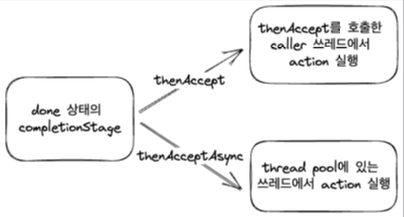
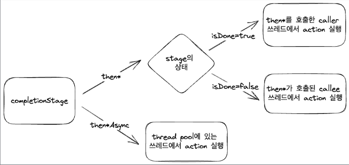

## CompletionStage에서 Async가 붙어있는 함수와 붙지 않은 함수의 차이는 무엇인가?


CompletionStage의 제공되는 함수들에 같은 이름인데 Async가 붙어있는 함수가 있고 붙어있지 않은 함수들이 있는데 무슨 차이점이 있을까?

#### 반환받은 Future가 Done인 경우
````java
import com.example.webfluxstudy.basicReactiveProgramming.completableFuture.completionStage.thenAsyncSufix.Helper;
import lombok.extern.slf4j.Slf4j;
import java.util.concurrent.CompletionStage;

@Slf4j
public class CompletionStageThenAcceptExample {
    // not Async
    public static void main(String[] args) {
        log.info("start main");
        // 종료된 future를 반환
        CompletionStage<Integer> stage = Helper.finishedStage();
        stage.thenAccept(i -> {
            log.info("{} in thenAccept", i);
        }).thenAccept(i -> {
            log.info("{} in thenAccept2", i);    
        });
        log.info("after thenAccept");
        
        Thread.sleep(100);
    }
}

@Slf4j
public class CompletionStageThenAcceptAsyncExample {
    public static void main(String[] args) {
        // use Async
        log.info("start main");
        CompletionStage<Integer> stage = Helper.finishedStage();
        stage.thenAcceptAsync(i -> {
            log.info("{} in thenAccept", i);
        }).thenAcceptAsync(i -> {
            log.info("{} in thenAccept2", i);
        });
        log.info("after thenAccept");
        Thread.sleep(100);
    }
}
````
예시 코드를 보면 나머지는 다 똑같지만 thenAccept, thenAcceptAsync 둘 중 어떤것을 호출하냐의 차이만 존재한다.

#### ThenAccept 실행결과
[main] INFO com.example.webfluxstudy.basicReactiveProgramming.completableFuture.completionStage.thenAsyncSufix.CompletionStageThenAcceptExample - start main  
[ForkJoinPool.commonPool-worker-1] INFO com.example.webfluxstudy.basicReactiveProgramming.completableFuture.completionStage.thenAsyncSufix.Helper - supplyAsync  
**[main]** INFO com.example.webfluxstudy.basicReactiveProgramming.completableFuture.completionStage.thenAsyncSufix.CompletionStageThenAcceptExample - 1 in then Accept  
**[main]** INFO com.example.webfluxstudy.basicReactiveProgramming.completableFuture.completionStage.thenAsyncSufix.CompletionStageThenAcceptExample - null in thenAccept2  
**[main]** INFO com.example.webfluxstudy.basicReactiveProgramming.completableFuture.completionStage.thenAsyncSufix.CompletionStageThenAcceptExample - after thenAccept

#### ThenAcceptAsync 실행결과
**[main]** INFO com.example.webfluxstudy.basicReactiveProgramming.completableFuture.completionStage.thenAsyncSufix.CompletionStageThenAcceptAsyncExample - start main
**[ForkJoinPool.commonPool-worker-1]** INFO com.example.webfluxstudy.basicReactiveProgramming.completableFuture.completionStage.thenAsyncSufix.Helper - supplyAsync
**[main]** INFO com.example.webfluxstudy.basicReactiveProgramming.completableFuture.completionStage.thenAsyncSufix.CompletionStageThenAcceptAsyncExample - after thenAccept
**[ForkJoinPool.commonPool-worker-1]** INFO com.example.webfluxstudy.basicReactiveProgramming.completableFuture.completionStage.thenAsyncSufix.CompletionStageThenAcceptAsyncExample - 1 in thenAcceptAsync
**[ForkJoinPool.commonPool-worker-2]** INFO com.example.webfluxstudy.basicReactiveProgramming.completableFuture.completionStage.thenAsyncSufix.CompletionStageThenAcceptAsyncExample - null in thenAcceptAsync2

위 코드의 실행 결과를 보면 가장 큰 차이점은 ThenAccept는 caller의 스레드에서 로직이 동작한다. 즉, ThenAccept의 로그는 main 스레드가 실행시킨다는 의미이다.  
ThenAccept의 실행결과 로그를 보면 순차적으로 실행된것처럼 보여진다. 이는 비동기 None-blocking으로 동작한다고 보기 힘들다.
반대로 ThenAcceptAsync의 진행 로그를 보면 각각의 ForkJoinPool에서 진행됐고, main이 시작된 후 마지막에 있는 로그가 실행되고, 중간에 있는 로그가 출력된다.    
이는 caller(main)가 callee의 결과에 관심이 없는것을 의미하고 이는 비동기 None-blocking 방식으로 동작한다는 것을 알 수 있다.


정리하자면 thenAccept의 실행 스레드는 done상태에서 thenAccept는 caller(main)의 스레드에서 실행되고, done상태의 completionStage에 thenAccept를 사용하는 경우, caller 스레드를 block 할 수 있다.  
  

#### 반환받은 Future가 Done이 아닌 Running 중인 경우

````java
import com.example.webfluxstudy.basicReactiveProgramming.completableFuture.completionStage.thenAsyncSufix.Helper;
import lombok.extern.slf4j.Slf4j;

import java.util.concurrent.CompletionStage;

@Slf4j
public class CompletionStageThenAcceptRunningExample {
    public static void main(String[] args) {
        log.info("start main");
        // Done 상태가 아닌 Future 반환
        CompletionStage<Integer> stage = Helper.runningStage();
        stage.thenAccept(i -> {
            log.info("{} in thenAccept", i);
        }).thenAccept(i -> {
            log.info("{} thenAccept2", i);
        });
        Thread.sleep(2000);
    }
}

@Slf4j
public class CompletionStageThenAcceptAsyncRunningExample {
    public static void main(String[] args) {
        log.info("start main");
        // Done 상태가 아닌 Future 반환
        CompletionStage<Integer> stage = Helper.runningStage();
        stage.thenAcceptAsync(i -> {
            log.info("{} in thenAccept", i);
        }).thenAcceptAsync(i -> {
            log.info("{} thenAccept2", i);
        });
        Thread.sleep(2000);
    }    
}
````
#### thenAccept의 실행결과
**[main]** INFO com.example.webfluxstudy.basicReactiveProgramming.completableFuture.completionStage.thenAsyncSufix.CompletionStageThenAcceptRunningExample - start main  
**[ForkJoinPool.commonPool-worker-1]** INFO com.example.webfluxstudy.basicReactiveProgramming.completableFuture.completionStage.thenAsyncSufix.Helper - I'm running!  
**[ForkJoinPool.commonPool-worker-1]** INFO com.example.webfluxstudy.basicReactiveProgramming.completableFuture.completionStage.thenAsyncSufix.CompletionStageThenAcceptRunningExample - 1 in thenAccept  
**[ForkJoinPool.commonPool-worker-1]** INFO com.example.webfluxstudy.basicReactiveProgramming.completableFuture.completionStage.thenAsyncSufix.CompletionStageThenAcceptRunningExample - null in thenAccept2  

#### thenAcceptAsync의 실행결과
 **[main]** INFO com.example.webfluxstudy.basicReactiveProgramming.completableFuture.completionStage.thenAsyncSufix.CompletionStageThenAcceptAsyncRunningExample - start main  
 **[ForkJoinPool.commonPool-worker-1]** INFO com.example.webfluxstudy.basicReactiveProgramming.completableFuture.completionStage.thenAsyncSufix.Helper - I'm running!  
 **[ForkJoinPool.commonPool-worker-2]** INFO com.example.webfluxstudy.basicReactiveProgramming.completableFuture.completionStage.thenAsyncSufix.CompletionStageThenAcceptAsyncRunningExample - 1 in thenAcceptAsync    
 **[ForkJoinPool.commonPool-worker-2]** INFO com.example.webfluxstudy.basicReactiveProgramming.completableFuture.completionStage.thenAsyncSufix.CompletionStageThenAcceptAsyncRunningExample - null in thenAcceptAsync    
    
done 상태가 아닌 thenAccept는 callee(forkJoinPool)의 스레드에서 실행되고, done 상태가 아닌 completionStage에 thenAccept를 사용하는 경우, callee를 block 할 수 있기 때문에 주의가 필요하다.  
  

> Async가 붙어있지 않은 메서드는 Stage의 상태에 따라서, isDone이 true이면 thread를 호출한 caller 스레드에서 실행되고, false라면 thread가 홀출된 callee 스레드에서 실행된다.  
  Async가 붙어있는 메서드는 thread pool에 있는 스레드에서 실행된다.

### then * Async의 스레드풀 변경

````java
import com.example.webfluxstudy.basicReactiveProgramming.completableFuture.completionStage.thenAsyncSufix.Helper;
import lombok.extern.slf4j.Slf4j;

import java.util.concurrent.CompletionStage;
import java.util.concurrent.ExecutorService;
import java.util.concurrent.Executors;

@Slf4j
public class CompletionStageThenAcceptAsyncExecutorExample {
    public static void main(String[] args) {
        var single = Executors.newSingleThreadExecutor();
        var fixed = Executors.newFixedThreadPool(10);
        
        log.info("start main");
        CompletionStage<Integer> stage = Helper.completionStage();
        stage.thenAcceptAsync(i -> {
            log.info("{} in thenAcceptAsync", i);
        }, fixed).thenAcceptAsync(i -> {
            log.info("{} in thenAcceptAsync2", i);
        }, single);
        log.info("after thenAccept");
        Thread.sleep(200);
        
        single.shutdown();
        fixed.shutdown();
     }
}
````
모든 then*Async 연산자는 executor를 추가 인자로 넘기면, 이를 통해서 다른 스레드풀로 task를 실행할 수 있다.

