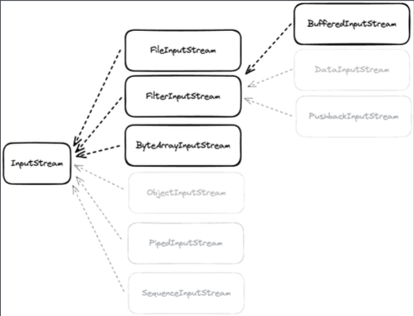
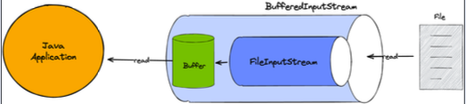
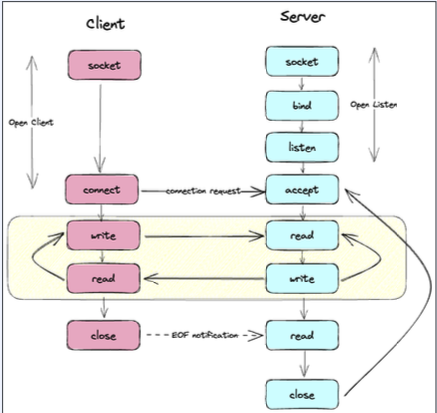

## Java IO - InputStream
Java IO는 동기 Blocking으로 동작한다. Java 1.0 에서 처음 도입 되었으며 파일과 네트워크에 데이터를 읽고 쓸 수 있는 API들을 제공한다.  
byte 단위로 읽고 쓸 수 있는 stream이다. (InputStream과 OutputStream) 

## InputStream
InputStream은 Closable을 구현한다. 명시적으로 close하거나 try-with-resource 사용이 가능하다.
read는 stream으로 데이터를 읽고, 읽은 값을 반환하고 -1 이라면 끝에 도달했다는 것을 의미하며, close는 stream을 닫고 더 이상 데이터를 읽지 않는다.

````java
import java.io.Closeable;
import java.io.IOException;

public abstract class InputStream implements Closeable {
    public abstract int read() throws IOException;
    public void close() throws IOException;
}
````
InputStream은 어떤 source로부터 데이터를 읽을지에 따라 다양한 구현체가 존재한다.   
FileInputStream, ByteArrayInputStream, BufferedInpuStream..등등이 있다  
  

##  ByteArrayInputStream
byteArray(source)로부터 값을 읽을 수 있고, 메모리가 source가 된다.
````java
@Slf4j
public class ByteArrayInputStreamExample {
    @SneakyThrows
    public static void main(String[] args) {
        var bytes = new byte[]{100, 101, 102, 103, 104};

        try(var bais = new ByteArrayInputStream(bytes)) {
            var value = 0 ;
            while ((value = bais.read()) != -1) {
                log.info("value : {}", value);
            }

        }
        try(var bais = new ByteArrayInputStream(bytes)) {
            var values = bais.readAllBytes();
            log.info("ALL VALUES : {}", values);
        }
    }
}
````
ByteArray는 JVM에 메모리에 있는 값이기 때문에 메모리가 곧 source가 된다.  

## FileInputStream
File로부터 byte단위로 값을 읽을 수 있고 File 객체나 path를 통해서 FileInputStream을 열 수 있다.  
application에서 FileInputStream을 사용하는 동안 **blocking**이 일어난다.

````java
@Slf4j
public class FileInputStreamExample {
    @SneakyThrows
    public static void main(String[] args) {
        var file = FileInputStreamExample.class
                .getClassLoader()
                .getResource("/com/example/webfluxstudy/javaIoNioAio/javaIO/InputStream/data.txt")
                .getFile();

        try (var fis = new java.io.FileInputStream(file)){
            var value = 0;

            while ((value = fis.read()) != -1) {
                log.info("value: {}", (char) value);
            }
        }
    }
}
````  

## BufferedInputStream
다른 inputStream과 **조합**해서 사용하고 임시 저장 공간인 buffer를 사용한다. 한번 read를 호출할 때 buffer 사이즈만큼 미리 조화한 후 read를 호출할 때 미리 저장한 buffer 데이터를 반환한다.  


````java

import lombok.extern.slf4j.Slf4j;

import java.io.BufferedInputStream;
import java.io.FileInputStream;

@Slf4j
public class BufferedInputStreamExample {
    @SneakyThrows
    public static void main(String[] args) {
        
        var file = new File(BufferedInputStream.class.
                getClassLoader()
                .getResource("data.txt")
                .getFile());

        try (var fis = new FileInputStream(file)) {
            try (var bis = new BufferedInputStream(fis)) {
                var value = 0;
                while ((value = bis.read() != -1)) {
                    log.info("value : {}", (char) value);
                }
            }
        }
    }
}
````
 실행 결과는 당연히 파일의 내용이 한글자씩 출력된다. 결과만 놓고 보면 파일의 내용을 파일에서 읽어오는 것처럼 보이지만, 내부적으로 BufferedInputStream이 이미 한번 조회를 해서 buffer에 적재를 해두었기 때문에 파일에 접근해서 가져오는게 아니다.  
 즉, BufferedInputStream을 사용하면 여러번 파일 혹은 resource에 직접적으로 접근하는 것을 막을 수 있다.

## SocketInputStream
외부 클라이언트에서 요청을 보낸다면, 요청에 데이터가 있다면 데이터에 접근할 수 있는 Stream이다.  

Server와 Client 사이 Socket에서 어떤 과정이 생기는지 살펴보자   
  
서버와 클라이언트는 모두 통신을 시작하기 전에 대기 상태다. 서버는 특정 주소와 포트에 바인드되고, 클라이언트의 연결 요청을 받기 위해 대기한다. 이를 "Listen" 상태라고 하고, 클라이언트는 서버에 연결하려면 해당 서버의 주소와 포트에 연결 요청을 보낸다.  
서버가 클라이언트의 연결 요청을 받으면, "Accept" 상태로 전환되어 연결을 수락하고 서버와 클라이언트 사이의 데이터 교환을 시작할 수 있게된다. 서버는 클라이언트로부터 데이터를 받기 위해 "Read" 단계로 진입하고, 클라이언트는 데이터를 보내는 "Write" 단계에 있다.   
이 단계에서 서버와 클라이언트간의 통신을 위한 소켓이 반환된다.  
서버는 받은 데이터를 처리하고, 응답으로 클라이언트에게 데이터를 보낸다. 이러한 데이터 교환은 반복될 수 있으며, 서버와 클라이언트 간에 메시지를 주고 받는다.    
클라이언트가 통신을 종료하고자 할 때, EOF(End of File) 신호를 보내어 통신의 끝을 나타낸다 서버는 이 신호를 읽고, 이에 따라 통신을 종료한다.  

[참고] listen 상태는 Csocket 프로그래밍에서는 있지만 자바에서는 Listen이 존재하지 않고, accept 상태가 두가지의 역할을 한다고 보면 된다.  

SocketInputStream은 public이 아니기 때문에 직접 접근이 불가능하고 socket.getInputStream으로만 접근이 가능하다.  
사용하는 동안 blocking이 발생하게 된다
````java
@Slf4j
public class SocketInputStream {
    @SneakyThrows
    public static void main(String[] args) {
        // 8080포트 Listen 서버 소켓 생성
        ServerSocket serverSocket = new ServerSocket(8080);

        // 클라이언트 접속 대기 -> listen 상태로 blocking
        Socket clientSocket = serverSocket.accept();

        var inputStream = clientSocket.getInputStream();

        // 클라이언트로부터 데이터를 읽어들임
        // bufferedInputStream은 inputStream 즉,
        // 담고있는 Stream도 close가 되기 때문에 client측 Stream도 close..!
        try (BufferedInputStream bis = new BufferedInputStream(inputStream)) {
            // 1KB 크기의 버퍼 생성
            byte[] buffer = new byte[1024];
            int bytesRead = bis.read(buffer);

            String inputLine = new String(buffer, 0, bytesRead);

            log.info("bytes : {}", inputLine);
        }
        
        clientSocket.close();
        serverSocket.close();
    }
}
````
[참고] Socket 프로그래밍에서 close로 닫아야 하는 이유는 Stream같은 자원은 사용하고 나서 해제하지 않으면 메모리 누수 및 포트의 독점 등... 여러가지 문제가 발생할 수 있다. 까먹지 말고 꼭 닫아주도록 하자.


