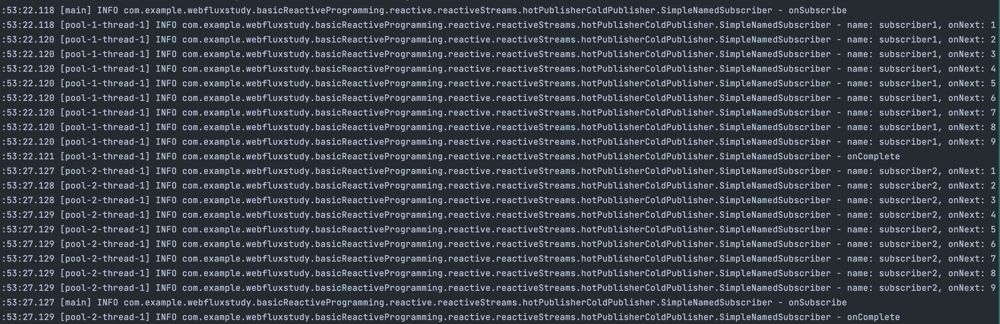
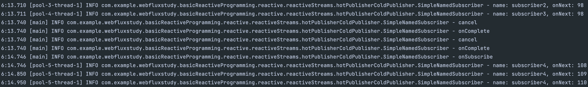

## Hot, Cold Publisher
### Cold Publisher ?
- Reactive streams 예시 코드처럼 subscribe가 시작되는 순간 데이터를 생성해서 전송하는 케이스를 Cold Publisher라고 한다.  
Cold Publisher는 파일 읽기, 웹 API 요청 등 subscriber에 따라 독립적인 데이터 스트림을 제공한다.

### Hot Publisher ? 
- subscriber가 없더라도 데이터를 생성하고 stream에 push하는 publisher이다. 트위터 게시글 읽기, 공유 리소스 변화 등 여러 subscriber에게 동일한 데이터를 전달한다.


## ColdPublisher 구현

````java
public class SimpleColdPublisher implements Flow.Publisher<Integer>{
    // Subscriber 하는 순간부터 데이터를 내려주는 퍼블리셔. -> 동일한 데이터가 보장되는 경우
    @Override
    public void subscribe(Flow.Subscriber<? super Integer> subscriber) {
        var iterator = Collections.synchronizedList(
                // 생성한 값. -> subscribe 하게 된다면 출력될 값 -> cold publisher
                IntStream.range(1, 10).boxed().collect(Collectors.toList()) 
        ).iterator();
        var subscription = new SimpleColdSubscription(iterator, subscriber);
        subscriber.onSubscribe(subscription);
    }

    @RequiredArgsConstructor
    public class SimpleColdSubscription implements Flow.Subscription {
        private final Iterator<Integer> iterator;
        private final Flow.Subscriber<? super Integer> subscriber;
        private final ExecutorService executorService = Executors.newSingleThreadExecutor();

        @Override
        public void request(long n) {
            // 새로운 스레드에서 요청 받은 만큼 값을 넘기는 형태
            executorService.submit(() -> {
                for (int i = 0; i < n; i++) {
                    if(iterator.hasNext()) {
                        var number = iterator.next();
                        iterator.remove();
                        subscriber.onNext(number);
                    } else {
                        // iterator 값이 없어지면 shutdown
                        subscriber.onComplete();
                        executorService.shutdown();
                        break;
                    }

                }
            });
        }

        @Override
        public void cancel() {
            subscriber.onComplete();
        }
    }
}
````

### Subscriber
````java
@Slf4j
public class SimpleNamedSubscriber<T> implements Flow.Subscriber<T> {
    // Publisher에에게 넘겨받을 subscription을 처리하는 SubsCriber 
    
    private Flow.Subscription subscription;
    private final String name;

    public SimpleNamedSubscriber(String name) {
        this.name = name;
    }

    @Override
    public void onSubscribe(Flow.Subscription subscription) {
        this.subscription = subscription;
        this.subscription.request(1);
        log.info("onSubscribe");
    }

    @Override
    public void onNext(Object item) {
        log.info("name: {}, onNext: {}", name, item);
        this.subscription.request(1);
    }

    @Override
    public void onError(Throwable throwable) {
        log.error("onError: {}", throwable.getMessage());
    }

    @Override
    public void onComplete() {
        log.info("onComplete");
    }

    public void cancel() {
        log.info("cancel");
        this.subscription.cancel();
    }
}

````

### ColdPublisher 실행 클래스 
````java
public class SimpleColdPublisherMain {

    @SneakyThrows
    public static void main(String[] args) {
        // create publisher
        var publisher = new SimpleColdPublisher();

        // create subscriber1
        var subscriber = new SimpleNamedSubscriber<Integer>("subscriber1");
        publisher.subscribe(subscriber);
        
        // 5초 뒤에
        Thread.sleep(5000);

        // create subscriber2
        var subscriber2 = new SimpleNamedSubscriber<Integer>("subscriber2");
        publisher.subscribe(subscriber2);
    }
}
````
- ColdPublisher는 subscribe한 순간에 데이터를 만들어서 내려주는 Publisher이기 때문에 실행 결과는  
OnNext가 실행되는 만큼 즉, 1 ~ 10 까지를 2번 출력하고 onComplete가 호출되고 shutdown된다.  
  

### HotPublisher
````java
@Slf4j
public class SimpleHotPublisher implements Flow.Publisher<Integer>{
    private final ExecutorService publisherExecutor = Executors.newSingleThreadExecutor();
    private final Future<Void> task;
    private static List<Integer> numbers = new ArrayList<>();
    private static List<SimpleHotSubscription> subscriptions = new ArrayList<>();

    public SimpleHotPublisher() {
        // 누군가가 구독을 하지 않는다고 하더라도 값은 계속 생성되고 있어야한다.
        // ex) SNS를 생각해보면 사용자가 접속을 하지 않는다고 SNS에 새로운 글이나 뭔가 활동이 없는것이 아니다.
        // SimpleHotPublisher가 생성되는 순간 계속해서 값이 생성
        numbers.add(1);
        task = publisherExecutor.submit(() -> {
            for (int i = 2;!Thread.interrupted(); i++) {
                numbers.add(i);
                // 새로운 값이 생성되면 전달.
                subscriptions.forEach(SimpleHotSubscription::wakeUp);
                
                Thread.sleep(100);
            }
           return null;
        });
    }

    public void shutdown() {
        this.task.cancel(true);
        publisherExecutor.shutdown();
    }

    @Override
    public void subscribe(Flow.Subscriber<? super Integer> subscriber) {
        // 새로운 값이 생겼다. -> subscriber 들에게 새로운 값이 생성 되었음을 전파해야함.
        // 전파할때, subscriber들에게 요청한 값이 있는지 확인하고 줄수있는 상황이면 바로 줘버리고, 만약 따로 request가 오지 않았다면 새로운 값이 추가 되었음을 알고만 있어.. 라는 설정이 필요함

        // subscriber에게 줄 subscription 생성
        var subscription = new SimpleHotSubscription(subscriber);
        subscriber.onSubscribe(subscription);
        subscriptions.add(subscription);
    }

    private static class SimpleHotSubscription implements Flow.Subscription {
        // HotPublisher의 특징은 subscriber한 순간부터 데이터를 받아간다는 특징이 있음 -> 쌓이고 있는 중간에 subscribe 한다면 쌓이는 데이터 중간부터 값을 받아감
        // -> subscription이 최초에 생성되었을 때는, numbers(publisher가 계속 쌓고있는 데이터) 의 마지막 값을 가르켜야 한다.
        // 각각의 subscriber는 개인마다 offset이 따로 존재 해야 한다.

        // 어디까지 전달했는지 -> 현재 마지막으로 전달한 부분 -> 실제로 데이터를 준 마지막
        private int offset; 

        // Hot Publisher가 item을 더 이상 생성하지 않는 상황에 100개의 요청이 왔다면 줄 수 없고, 이 정보를 미리 저장해두자 -> 요청이 이만큼 필요해!
        private int requiredOffset;

        // 여러 subscriber에 대한 데이터를 저장해둘 객체
        private final Flow.Subscriber<? super Integer> subscriber;
        private final ExecutorService subscriptionExecutorService = Executors.newSingleThreadExecutor(); // 별도의 스레드에서 동작시키기 위함

        public SimpleHotSubscription(Flow.Subscriber<? super Integer> subscriber) {
            // 생성자로 인덱스의 마지막 값을 집어넣음 -> 객체가 생성될 때 마지막 인덱스의 값을 가지고 생성 -> 뭔가 작업이 생긴다면 그 이후부터 값을 가져갈것임.
            int lastElementIndex = numbers.size() -1;
            this.offset = lastElementIndex;
            this.requiredOffset = lastElementIndex;
            this.subscriber = subscriber;
        }
        @Override
        public void request(long n) {
            // 요청이 n개 만큼 들어오면 requiredOffset에 추가
            requiredOffset += n;

            // offset은 numbers의 사이즈보다 커지면 안된다. -> 생성된 값보다 커지면 당연히 안된다..
            onNextWhilePossible();
        }

        @Override
        public void cancel() {
            // 더이상 받지 않겠다.
            this.subscriber.onComplete();
            if (subscriptions.contains(this)) {
                subscriptions.remove(this);
            }
            subscriptionExecutorService.shutdown(); // 별도로 동작하던 스레드를 shutdown
        }

        public void wakeUp() {
            // 새로운 값이 생겼으니, subscriber에게 값을 전달 가능한 상황이면 전달해라.
            // request 메서드와 동일하게 동작한다. -> 클라이언트가 요청했는지, subscriber가 요청을 한것인지 차이..
            onNextWhilePossible();
        }

        private void onNextWhilePossible() {
            // 계속 가능한 시간동안 onNext를 하겠다는 함수
            subscriptionExecutorService.submit(() -> {
                while(offset < requiredOffset && offset < numbers.size()) {
                    var item = numbers.get(offset);
                    subscriber.onNext(item);
                    offset++;
                }
            });
        }

    }

}
````
### HotPublisher main
````java
public class SimpleHotPublisherMain {

    @SneakyThrows
    public static void main(String[] args) {
        // prepare publisher
        var publisher = new SimpleHotPublisher();

        // prepare subscriber1
        var subscriber = new SimpleNamedSubscriber<>("subscriber1"); // subscribe 하는 동안 값이 출력 될거고,
        publisher.subscribe(subscriber);

        // cancel after 5s
        Thread.sleep(5000);
        // 종료 시키고 나면,
        subscriber.cancel(); 

        // prepare subscriber 2, 3
        // 처음부터 시작하고 조회하는게 아니라 1에서 하던 작업에 이어서 조회하고 출력하게 될것
        var subscriber2 = new SimpleNamedSubscriber<>("subscriber2");
        var subscriber3 = new SimpleNamedSubscriber<>("subscriber3");
        publisher.subscribe(subscriber2);
        publisher.subscribe(subscriber3);

        // cancel after 5s
        Thread.sleep(5000); // 5초가 딜레이 되면서 1초동안 데이터가 더 생성되었을거고 그 사이에는 공백이 있을것
        subscriber2.cancel();
        subscriber3.cancel();

        Thread.sleep(1000);

        var subscriber4 = new SimpleNamedSubscriber<>("subscriber4");
        publisher.subscribe(subscriber4);

        //cancel after 5s
        Thread.sleep(5000);
        subscriber4.cancel();

        // shutdown publisher
        publisher.shutdown();
    }
}
````
    
- 코드를 보면 subscriber2, 3이 실행한 후, 둘다 cancel onComplete가 호출된 후 1초 후에 subscriber4가 동작한다.  
이때 onNext값은 1초 동안 10개가 만들어져서 중간이 비어있게 되는데 이는, offSet기반이고 subscription에서 publisher가 요청을 하지 않더라도 데이터를 계속 생성하고 있기 떄문이다.
- HotPublisher는 결국, 데이터는 계속 만들어지고 **subscribe하는 순간** offset을 넘기고   
offSet과 RequiredOffset을 기반으로 그 위치부터 데이터를 가져가서 데이터를 사용하게 된다.


