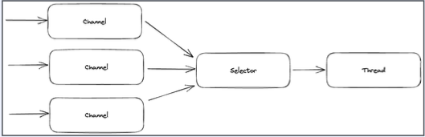
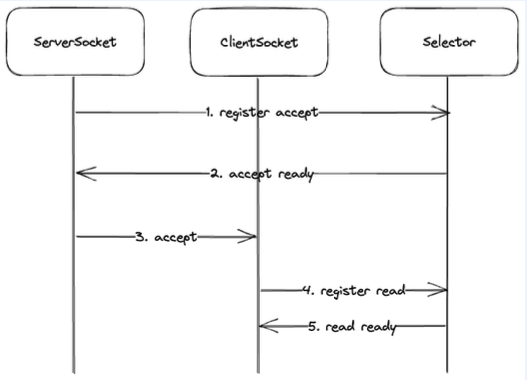
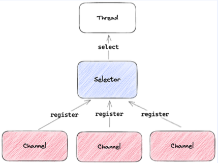

Java NIO의 문제점은 main스레드에서 accept가 완료되었는지 주기적으로 확인하고, 각각의 스레드에서 read 가능한지 주기적으로 확인해야한다.
채널의 상태를 개발자가 수동으로 관리해야하고 코드의 복잡성이 증가한다. main 스레드 하나에서 이벤트를 추적 관리하기 때문에 트래픽이 동시에 많이 생기는 경우 연결 처리가 순차적으로 발생하여 성능이 감소할 수 있다.

이러한 동기 non-blocking에서 주로 발생하는 문제점이 busy-wait 문제이다.  
계속해서 callee 스레드의 작업 결과가 궁금하기 때문에 주기적으로 결과를 확인해야 한다. 이때, loop를 계속해서 돌면서 원하는 자원을 얻을 때까지 확인을 하기 때문에, 지속적인 cpu를 점유하게 되고, cpu의 낭비가 생기는 문제가 발생한다.


그래서 JavaNIO의 가장 큰 문제는 I/O와 관련된 이벤트를 각각의 스레드가 확인해야한다는 문제와 채널의 상태를 개발자가 수동으로 관리해야한다.

이런 문제점, 즉 여러 이벤트를 자동으로 추적하고, 채널의 상태를 자동으로 관리하기 위해 등장한게 **Selector** 다.

## Selector
- java.nio.channels 패키지에 위치한다.
- 여러 Channel의 이벤트를 등록하고 준비된 이벤트를 모아서 조회 가능하다.
- select와 selectedKeys 메소드를 제공한다.
- SelectobleChannel을 multiplexor로 관리할 수 있다.

````java
/**
 * A multiplexor of {@link java.nio.channels.SelectableChannel} objects
 * 
 * **/

import java.io.Closeable;
import java.io.IOException;
import java.nio.channels.SelectionKey;

public abstract class Selector implements Closeable {
    public abstract int select() throws IOException;

    public abstract Set<SelectionKey> selectedKeys();
}

````
  

## Selector 생성
- Selector.open 으로 생성 가능하고, Closable을 구현했기 때문에 직접 close하거나 try-with-resources 사용이 가능하다.

````java
import java.nio.channels.Selector;

public class CreateSelector {
    public static void main(String[] args) {
        var selector = Selector.open();
        // do something....
        selector.close();
        
        try (var selector = Selector.open()) {
            // do something
        }
    }
}
````
  
Selector.open을 하게 되면 SelectorProvider에 openSelector를 실행하게 된다.  
Provider의 내부로 들어가보면 SelectorProvider의 인터페이스를 구현한 객체를 찾아서 반환한다. 즉, 플랫폼마다 최적화된 객체를 제공한다.  

- 제공되는 주요 Provider
1. PollSelectorProvider: Solaris의 poll 시스템 콜을 활용하는 PollSelector 제공
2. EPollSelectorProvider: Linux에서 사용하는 epoll 기반의 EPollSelector 제공
3. KQueueSelectorProvider: macOS / BSD에서 사용하는 kqueue 기반의 KQueueSelector
4. WindowsSelectorProvider: Windows의 IOCP 기능을 활용한 WindowsSelector 제공
````java
public static class TestClass { 
  public static Selector open() throws IOException{
          return SelectorProvider.provider().openSelector();
  }
}
````
제공되는 Provider들을 보면 전부 특정 시스템과 관련되어 있다.  
즉, Selector를 생성하고 Open을 하게되면 시스템콜과 관련한 동작이 생긴다는 것을 의미한다.

## Selector 등록
- channel에 모든 이벤트를  등록하는것이 아니라 selector와 관심있는 이벤트를 등록한다.
- channel의 register 내부 함수에서 다시 selector의 register를 호출한다.
````java
public abstract class SelectableChannel
        extends AbstractInterruptibleChannel implements Channel {
    public final SelectionKey register(Selector sel, int ops) throws ClosedChannelException { }
}
````
인자로 받는 ops는 관심있는 이벤트를 의미한다. 즉, READ, WRITE, ACCEPT, CONNECT를 의미한다.  
이렇게 하면 동작은 특정 Channel이 Selector에게 인자로 넘긴 이벤트가 발생하면, 혹은 준비되면 스레드에게 알려줘. 라고 하는것이다.  

제공되는 Selector 이벤트 타입  
1. OP_READ: channel의 읽기 준비가 완료
2. OP_WRITE: channel에 쓸 준비가 완료
3. OP_ACCEPT: serverSocketChannel에서 accept할 준비가 완료
4. OP_CONNECT: socketChannel에서 connect 준비가 완료
````java
public abstract class SelectionKey {
        public static final int OP_READ = 1 << 0;
        public static final int OP_WRITE = 1 << 2;
        public static final int OP_CONNECT = 1 << 3;
        public static final int OP_ACCEPT = 1 << 4;
    }
````

## Selector에 Accept 작업 등록
- bind.configureBlocking까지는 기존에 NIO에서 설정하듯이 설정한다.
- register를 통해서 serverSocketChannel의 Accept 이벤트를 selector에 등록한다.
- register에서는 별도의 blocking 없이 바로 패스한다.

````java
import io.netty.channel.ServerChannel;

import java.net.InetSocketAddress;
import java.nio.channels.Channel;
import java.nio.channels.ServerSocketChannel;
import java.nio.channels.SocketChannel;

public class registerAcceptSelector {
    public static void main(String[] args) {

        // serverSocketChannel 생성
        try( ServerSocketChannel serverSocket = ServerSocketChannel.open();
             Selector selector = Selector.open(); ) 
        {
            // localhost:8080 bind
            serverSocket.bind(new InetSocketAddress("localhost", 8080));
            // ServerSocketChannel non-blocking으로 설정
            serverSocket.configureBlocking(false);
            // serverChannel의 Accept 작업을 selector에 등록한다.
            serverSocket.register(selector, SelectionKey.OP_ACCEPT);    
        }

    }
}
````

## Selector 대기
- select : 등록한 채널들 중 준비된 이벤트가 없다면 계속해서 스레드를 blocking하고, 준비가 완료된 작업들이 발견되면, 다음 line으로 이동한다.
- selectedKeys : 준비가 완료된 이벤트 목록을 Set으로 제공하고, iterator로 변경하여 하나씩 순회하며, 조회 이후에 remove를 통해서 제거한다. 제거하지 않으면 계속해서 처리하려고 시도한다.

````java
import io.netty.channel.ServerChannel;

import java.net.InetSocketAddress;
import java.nio.channels.Channel;
import java.nio.channels.Selector;
import java.nio.channels.ServerSocketChannel;
import java.nio.channels.SocketChannel;

public class waitSelector {
    public static void main(String[] args) {
        try (ServerSocketChannel serverSocket = ServerSocketChannel.open();
             Selector selector = Selector.open();) {
            // 무한 루프를 통해서 지속적으로 채널의 작업들을 처리한다.
            while (true) {
                // 준비될때까지 스레드 blocking
            // 계속해서 확인하지 않고 blocking하고 있기 때문에, busy wait은 발생하지 않는다.
                selector.select();
                
                // selector에서 준비가 완료된 작업 목록을 가져옴
                var selectedKeys = selector.selectedKeys().iterator();
                
                // 준비가 완료된 작업들을 하나씩 처리한다.
                while (selectedKeys.hasNext()) {
                    var key = selectedKeys.next();
                    
                    // 준비 완료된 작업 목록에서 제외한다.
                    // iterator가 마지막으로 반환한 값을 제거한다.
                    selectedKeys.remove();
                }
            }
        }
    }
}
````
## SelectedKeys에서 반환되는 SelectionKey ? 
등록했던 channel과 selector, 이벤트 타입을 포함하며, isReadble, isWritable, isConnectable, isAcceptable을 통해서 channel의 어떤 이벤트가 준비되었는지 체크할 수 있는 객체다. 
````java
public abstract class SelectionKey {
    public abstract SelectableChannel channel();

    public abstract Selector selector();

    public abstract int interestOps();

    public final boolean isReadable() {
        return (readyOps() & OP_READ) != 0;
    }

    public final boolean isWritable() {
        return (readyOps() & OP_WRITE) != 0;
    }

    public final boolean isConnectable() {
        return (readyOps() & OP_CONNECT) != 0;
    }

    public final boolean isAcceptable() {
        return (readyOps() & OP_ACCEPT) != 0;
    }
}
````

## accept와 Read 이벤트 처리
selectionKey로부터 등록했던 channel을 조회하고 accept를 실행한다.  
select() 이후이므로, accept()를 통해서 clientSocket에 접근이 보장되는 상태다 즉, blocking 상태가 아니라 준비된 이벤트가 있어서다음으로 넘어갔다는 뜻이다.
clientSocket을 non-blocking 모드로 만들고 read 작업을 selector에 등록한다.

````java
import io.netty.channel.ServerChannel;

import java.net.InetSocketAddress;
import java.nio.channels.Channel;
import java.nio.channels.Selector;
import java.nio.channels.ServerSocketChannel;
import java.nio.channels.SocketChannel;

public class waitSelector {
    public static void main(String[] args) {
        try (ServerSocketChannel serverSocket = ServerSocketChannel.open();
             Selector selector = Selector.open();) {
            // 무한 루프를 통해서 지속적으로 채널의 작업들을 처리한다.
            while (true) {
                // 준비될때까지 스레드 blocking
            // 계속해서 확인하지 않고 blocking하고 있기 때문에, busy wait은 발생하지 않는다.
                selector.select();
                
                // selector에서 준비가 완료된 작업 목록을 가져옴
                var selectedKeys = selector.selectedKeys().iterator();
                
                // 준비가 완료된 작업들을 하나씩 처리한다.
                while (selectedKeys.hasNext()) {
                    var key = selectedKeys.next();
                    
                    // 준비 완료된 작업 목록에서 제외한다.
                    // iterator가 마지막으로 반환한 값을 제거한다.
                    selectedKeys.remove();

                    // 작업이 ACCEPT 라면
                    if (key.isAcceptable()) { 
                        // accept를 통해서 clientSocket에 접근
                        var clientSocket = ((ServerSocketChannel) key.channel()).accept();
                        // clientSocket을 non-blocking으로 설정
                        clientSocket.configureBlocking(false);
                        // clientSocket의 read 작업을 selector에 등록
                        clientSocket.register(selector, SelectionKey.OP_READ);
                    } else if (key.isReadable()) { // 작업이 READ 라면
                        // clientSocket에 접근
                        var clientSocket = (SocketChannel) key.channel();
                        
                        // clientSocket으로부터 데이터를 읽음
                        var requestBuffer = ByteBuffer.allocateDirect(1024);
                        
                        clientSocket.read(requestBuffer);
                        
                        requestBuffer.flip();
                        
                        var requestBody = StandardCharsets.UTF_8.decode(requestBuffer);
                        var response = "received: " + requestBody;
                        
                        // clientSocket에 데이터를 씀
                        var responseBuffer = ByteBuffer.wrap(response.getBytes());
                        clientSocket.write(responseBuffer);
                        responseBuffer.clear();
                        
                        // clientSocket을 닫음
                        clientSocket.close();
                    }
                }
            }
        }
    }
}
````


## 결과적으로 정리하자면, Channel 이벤트의 흐름은..
1. 서버 소켓 채널(ServerSocketChannel) 생성 및 바인딩: 서버 소켓 채널을 생성하고 원하는 포트에 바인딩
2. Selector 생성 및 서버 소켓 채널 등록: Selector를 생성하여 이벤트를 감시할 준비하고, 서버 소켓 채널을 Selector에 등록하고, 접속 허용(OP_ACCEPT) 이벤트를 설정
3. Selector 대기 및 이벤트 처리 루프: 무한 루프를 시작하여 Selector의 select() 메서드를 통해 이벤트를 기다린다. 이벤트가 발생하면 선택된 키셋을 획득하여 각 이벤트를 처리
4. Accept 이벤트 처리: 선택된 키가 접속 허용 이벤트를 가지고 있다면, 새로운 클라이언트의 연결을 수락하고 새로운 클라이언트 소켓 채널을 생성하고, 새로운 클라이언트 소켓 채널을 Selector에 등록하고 읽기 이벤트를 설정한다.
5. Read 이벤트 처리: 선택된 키가 읽기 이벤트를 가지고 있다면, 클라이언트에서 데이터를 읽어들이고 적절한 처리를 수행한 후에 클라이언트에게 응답을 내려준다.  
  


## I/O multiplexing이란?
통신에서의 다중화(Multiplexing) : 두 개 이상의 저수준의 채널들을 하나의 고수준의 채널로 통합하는 과정을 뜻한다.  
Selector의 설명을 보면 A multiplexor of {@link SelectableChannel} objects 라고 되어있다. 통신에서의 다중화라는 것은, I/O에서의 Multiplexing 이라고도 할 수 있다.    
Selector는 SelectobleChannel들의 multiplexor다. 라고 이해하는게 적절하다.  
    
