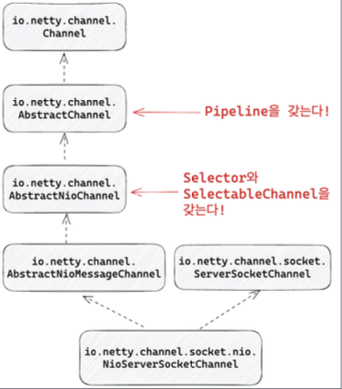
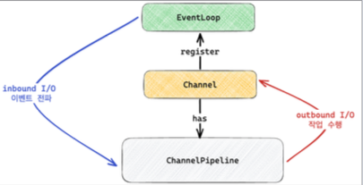

## Channel
Netty에서 중요한 역할을 하는 channel은 JavaNIO에서 사용되는 Channel과 비슷한 역할을 가진다.  
Netty에서의 channel은 pipeline, channelFuture 기능을 추가하여 channel에서 IO 연산이 완료 되었을 때 리스너를 추가하거나 결과를 조회할 수 있는 기능을 제공한다.

## ChannelFuture

````java
import io.netty.util.concurrent.GenericFutureListener;

import java.nio.channels.Channel;

public interface ChannelFuture extends Future<Void> {
    /*
     * Returns a channel where the I/O operation associated with this future takes place.
     */

    Channel channel();

    @Override
    ChannelFuture addListener(GenericFutureListener<? extends Future<? super Void>> listener);

    @Override
    ChannelFuture removeListener(GenericFutureListener<? extends Future<? super Void>> listener);

    @Override
    ChannelFuture sync() throws InterruptedException;
}
````
ChannelFuture는 Channel I/O 작업이 완료되면 isDone이 ture가 되는 Future로, futureListener 등록/삭제를 지원하여 비동기 처리가 가능하다.
futureListener를 등록하고 삭제함으로인해 get으로 접근하지 않아서 더 손쉽고 정확하게 비동기적으로 처리가 가능해진다.

addListener : Channel I/O 작업이 완료되면 수행할 futureListener을 등록한다.  
removeListener : 등록된 futureListener 제거  
sync : 작업이 완료될때까지 blocking 처리한다.

## NioServerSocketChannel
Netty에서는 java nio의 Channel을 사용하지 않고 거의 자체 구현해서 사용한다.  
AbstractChannel : ChannelPipeline을 갖는다.  
AbstractNioChannel : 내부적으로 java.nio.ServerSocketChannel을 저장하고 register할 때 java nio Selector에 등록한다.  
  


## ChannelPipeline 
Channel의 I/O이벤트가 준비되면, EventLoop가 pipeline 실행한다. I/O task에 해당하며, pipelien에서는 결과로 I/O 작업을 수행한다.
    
Channel에서 전체적인 플로우를 보면,    
EventLoop에서 시작해, Selector를 통해서 이벤트가 감지되고 처리가 완료되면 inbound I/O 이벤트가 ChannelPipeline으로 이벤트가 전파된다.   
그리고 channelPipeline을 통해 channel에 write(outbound I/O) 작업을 수행한다.  

ChannelPipeline은 ChannelHandlerContext의 연속으로 구성되어 있다.    
Head context와 Tail context는 기본적으로 무조건 생성되며, 각각의 context는 LinkedList 형태로 next, prev를 통해서 이전 혹은 다음 context에 접근 가능하다.    
inbound I/O 이벤트는 ChannelPipeline으로 들어오는 것이기 때문에 next, outbound 이벤트는 prev로 진행된다.  
    


ChannelHandlerContext의 내부에는 EventExecutor와 ChannelHandler를 포함하고 있고, ChanneelHandler는 I/O 이벤트를 받아서 다음 context에게 넘겨줄 수도 있고, 다음 context에게 넘겨주지 않고 I/O 작업을 수행할 수도 있다.
  


## ChannelHandlerContext 에서 별도의 EventExecutor를 지원하는 이유
특정 ChannelHandler에서 시간이 오래 걸리는 작업을 처리한다면 EventLoop 스레드에서 해당 ChannelHandler에서 blocking이 걸리고, EventLoop에 등록된 다른 Channel의 I/O 처리 또한 blocking된다.  

ChannelHandler는 EventLoop 스레드가 실행한다. 이는 특정 ChannelHandler에서 blocking이 발생한다면 이는 EventLoop 스레드가 blocking 된다는 의미가 된다.  
EventLoop는 ChannelHandler의 실행뿐 아니라 I/O task 즉, channel의 이벤트 감지 및 감시 또한 실행해야 한다.  
blocking이 발생한다면 EventLoop에 요청이 계속 들어와서 EventLoop에 쌓이게 되는데 channelHandler는 EventLoop 스레드를 붙잡고 있고 쌓인 channel에 대한 작업은 실행되지 못하는 경우가 발생한다.  

이런 상황, 시간이 오래 걸리는 작업을 수행을 해야 되는 경우에 EventExecutor가 사용된다.  
ChannelHandlerContext에 등록된 EventExecutor가 있다면, next context가 다른 스레드풀에서 동작해야하는구나 라고 판단하여 직접 이벤트 처리를 호출하지 않고  
executor.execute로 taskQueue에 넣고 EventLoop 스레드는 복귀한다.  

        

특정 context에서 next context로 이벤트를 전파하는 상황에서 스레드가 다르다면 next executor의 task queue에 이벤트 처리를 추가하고, 스레드가 같다면 해당 스레드가 직접 이벤트 처리를 실행한다.


