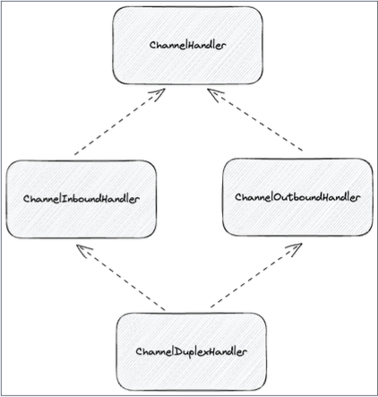
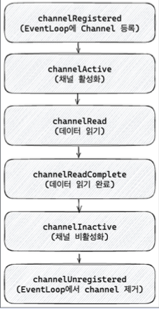

## ChannelHandler
ChannelHandler는 Channel의 I/O 이벤트를 처리하거나 I/O 작업을 수행하는 핸들러다.  

1. ChannelInboundHandler : Channel I/O 이벤트를 수행한다.
2. ChannelOutboundHandler : Channel I/O 작업을 수행한다.
3. ChannelDuplexHandler : ChannelInboundHandler, ChannelOutboundHandler 모두를 구현한 핸들러다.

    

## ChannelInboundHandler
inbound I/O 이벤트를 처리하기 위한 handler  

1. channelRegistered : channel이 eventLoop에 등록되는 경우
2. channelUnregistered : channel이 eventLoop 에서 제거되는 경우
3. channelActive : channel이 active되는 경우
4. channelInactive : channel이 inActive되고 close되는 경우
5. channelRead : channel로부터 메시지를 읽을 준비가 된 경우 
6. channelReadComplete : channelRead를 통해서 모든 메시지를 읽은 경우
7. userEventTriggered : user event가 트리거된 경우
8. channelWritabilityChanged : channel이 쓸 수 있는 상태가 변경된 경우, 딱 한번 호출된다.



````java
import io.netty.buffer.ByteBuf;
import io.netty.channel.ChannelFutureListener;
import io.netty.channel.ChannelHandlerContext;
import io.netty.channel.ChannelInboundHandlerAdapter;
import io.netty.util.ReferenceCountUtil;

import java.nio.charset.StandardCharsets;

public class SampleInboundChannelHandler extends ChannelInboundHandlerAdapter {
    @Override
    public void channelRead(ChannelHandlerContext ctx, Object msg) throws Exception {
        if (msg instanceof String) {
            // 다음 context로 이벤트를 전달하지 않고
            // Outbound I/O 작업을 수행한 후 채널을 닫는다.
            ctx.writeAndFlush("Hello, " + msg).addListener(ChannelFutureListener.CLOSE);
        } else if (msg instanceof ByteBuf) {
            // 별도의 Outbound I/O 작업을 수행하지 않고 다음 context로 이벤트를 전달한다.
            // msg를 변형해서 전달 가능
            try {
                var buf = (ByteBuf) msg;
                var len = buf.readableBytes();
                var charset = StandardCharsets.UTF_8;
                var body = buf.readCharSequence(len, charset);
                ctx.fireChannelRead(body);
            } finally {
                ReferenceCountUtil.release(msg);
            }
        }
    }
}
````
현재의 context와 이전 값이 주어지고, fireChannelRead 는 다음 context로 read 이벤트를 전달할 수 있고, msg를 변경해서 다른 값을 수정 후 전달한다. 그리고 writeAndFlush메서드는 channel로 Write 작업을 전달 할 수 있다.  
ReferenceCountUtil.release(msg)를 사용하는 이유는 Netty는 메모리를 효율적으로 관리하기 위해 메시지나 버퍼와 같은 리소스를 참조 카운트로 관리한다. 메세지나 버퍼를 사용하게 되면 참조 카운트가 증가하게 되는데, finally에 작업이 끝난 시점에 사용해서 참조 카운트를 하나 감소시켜야 효율적인 메모리 관리를 할 수 있다.

### 참조 카운트란 (reference count)?
참조카운트란 객체나 자원이 현재 몇 번 참조되고 있는지를 나타내는 값이다. 기본적으로 1로 시작하여, 다른 객체나 변수가 이 객체를 참조할 때마다 카운트가 증가하고 이 객체를 참조하지 않게 되면 참조 카운트가 감소한다.  


## ChannelOutboundHandler
outbound I/O 작업을 가로채서 처리하는 handler
1. bind : serverSocketChannel에 bind 요청 시 호출된다.
2. connect : socketChannel이 connect 요청 시 호출된다.
3. disconnect : socketChannel이 disconnect 요청 시 호출된다.
4. deregister : eventLoop로부터 deregister 되면 호출된다.

### OutboundHandler의 주요 이벤트는 아래 4가지다.
5. read : channel에 대한 Read 요청 시 호출된다.
6. write : chnnel에 대한 write 요청 시 호출. 나중에 작업하는 handler
7. flush : flush 작업이 수행된 경우 호출.
8. close : channel이 닫히면 호출된다.


````java
import io.netty.buffer.ByteBuf;
import io.netty.channel.ChannelHandlerContext;
import io.netty.channel.ChannelOutboundHandlerAdapter;
import io.netty.channel.ChannelPromise;

public class SmapleChannelOutboundHandler extends ChannelOutboundHandlerAdapter {

    @Override
    public void write(ChannelHandlerContext ctx, Object msg, ChannelPromise promise) throws Exception {
        if (msg instanceof String) {
            // 받은 msg가 스트링이라면,
            // 그대로 값을 outbound에게 전달한다
            ctx.write(msg instanceof String);
        } else if (msg instanceof ByteBuf) {
            var buf = (ByteBuf) msg;
            var len = buf.readableBytes();
            var charset = StandardCharsets.UTF_8;
            var body = buf.readCharSequence(len, charset);
            ctx.fireChannelRead(body);
        }
    }
}
````
예제 코드를 보면 OutboundHandler는 밖으로 메세지가 가기 전에 가로채서 작업, 메세지 내용을 변경하거나 확인하거나 하는 기능을 제공한다.

