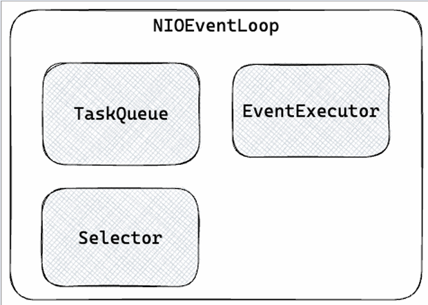
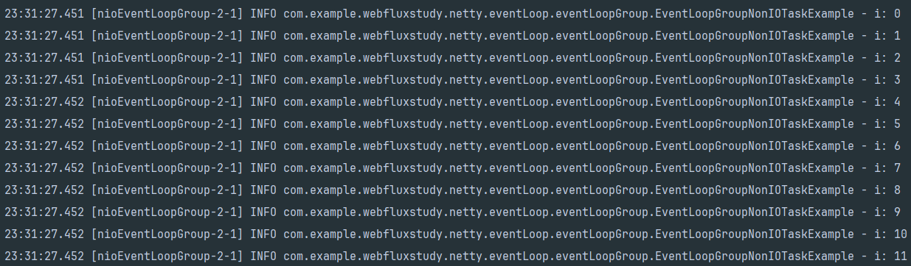
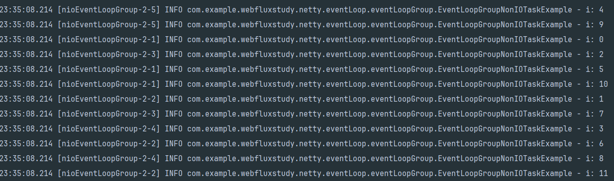

## Netty
Netty는 비동기 이벤트 기반의 네트워크 어플리케이션 프레임워크이다.  HTTP 뿐만 아니라 다양한 프로토콜을 지원하며, JavaIO, NIO, selector를 기반으로 적은 리소스로 높은 성능을 보장한다.  
불필요한 메모리 copy를 최소한으로 동작하고, 유연하며 확장 가능한 이벤트 모델 기반으로 서버와 클라이언트 모두 지원한다.

## NIOEventLoop
이벤트루프는 EventExecutor, TaskQueue, Selector를 포함한다. 
1. EventExecutor : task를 실행하는 쓰레드풀
2. TaskQueue : task를 저장하는 queue, eventExecutor가 즉시 task를 수행하지 않고 taskQueue에 넣은 후, 나중에 꺼내서 처리 가능하다.
3. Selector : I/O Multiplexing을 지원한다.  
    

NIOEventLoop는 selector를 이용해서 Multiplexing을 할 수 있고, EventExecutor와 TaskQueue를 이용해서 이벤트에 대한 작업을 처리할 수 있는 루프다.    

NIOEventLoop의 task는 I/O task와 Non I/O task로 구분할 수 있다.  
I/O task는 register를 통해서 내부의 selector에 channel을 등록하고 I/O 준비 완료 이벤트가 발생하면 channel의 pipeline을 실행한다.  
Non I/O task는 task queue에서 Runnable 등 실행 가능한 모든 종류의 task를 꺼내서 실행한다. 

## NIOEventLoop의 I/O task
NIOEventLoop를 직접 생성할 수 없기 떄문에 NIOEventLoopGroup를 사용해야한다.  
NIO를 수행하는 ServerSocketChannel을 생성하고 accept network I/O 이벤트를 eventLoop에 등록한다.  
하나의 eventLoopGroup에 여러 개의 channel을 등록 할 수 있다.
**I/O 이벤트 완료**시 channel의 pipeline을 실행한다.
````java
@Slf4j
public class EventLoopIOTaskExample {
    public static void main(String[] args) {
        var channel = new NioServerSocketChannel();
        // 하나의 그룹에 여러개의 NIOEventLoop가 존재할수있음 
        // -> 인자로 1을 넘겼기 떄문에 이 상태는 하나의 이벤트 루프가 존재함.
        var eventLoopGroup = new NioEventLoopGroup(1);

        // NIO 를 수행하는 ServerSocketChannel을 생성하고 accept network I/O 이벤트를 eventLoop에 등록한다.
        // 하나의 eventLoopGroup에 여러 개의 channel 등록이 가능하다. 
        // -> 여러 요청이 들어와도 처리할 수 있는 형태가 된다.
        eventLoopGroup.register(channel);

        channel.bind(new InetSocketAddress(8080))
                .addListener(future -> {
                    if(future.isSuccess()) {
                        log.info("Server biund to port 8080");
                    } else {
                        log.info("Failed to bind to port 8080");
                        eventLoopGroup.shutdownGracefully();
                    }
                });
    }
}
````

## NIOEventLoop의 Non I/O task 
일반적인 Executor 처럼 Non I/O task를 수행한다. 하나의 스레드에서 for문이 돌기 떄문에 순서가 보장된다.  
eventLoopGroup.execute 을 실행하는 스레드와, new NioEventLoopGroup 의 스레드는 서로 다르다.  
 execute를 실행하면 taskQueue에 먼저 적재한다. -> Queue는 FIFO 구조이기 때문에 순서가 보장된다.
````java
@Slf4j
public class EventLoopNonIOTaskExample {
    public static void main(String[] args) {
        EventLoopGroup eventLoopGroup = new NioEventLoopGroup(1);

        for (int i = 0; i < 10; i++) {
            final int idx = i;
            eventLoopGroup.execute(() -> {
                log.info("i : {}", idx);
            });
        }
        eventLoopGroup.shutdownGracefully();
    }
}
````
       

## EventLoopGroup
EventLoop를 포함하는 Group이다. 생성자를 통해서 내부에 몇 개의 EventLoop를 포함할지 설정 가능하다.  
EventLoopGroup eventLoopGroup = new NioEventLoopGroup(n);

group 에서 execute는 eventLoopGroup 내의 eventLoop를 순회하면서 execute를 실행한다.   
각각의 eventLoop에 순차적으로 task가 추가되고 실행하기 떄문에 eventExecutor 단위로 놓고 보면 순서가 보장된다.  
````java
@Slf4j
public class EventLoopNonIOTaskExample {
    public static void main(String[] args) {
        EventLoopGroup eventLoopGroup = new NioEventLoopGroup(5);

        for (int i = 0; i < 10; i++) {
            final int idx = i;
            eventLoopGroup.execute(() -> {
                log.info("i : {}", idx);
            });
        }
        eventLoopGroup.shutdownGracefully();
    }
}
````
           

실행결과를 보면 직관적으로 보면 순서 보장이 되지 않는것처럼 보이는데, task queue에 적재된 데이터를 5개의 스레드가 동시에 일을 하는것이기 떄문이다.  
nioEventLoopGroup-2 라는 그룹에 1부터 5까지의 eventLoop가 있다. 5개의 스레드가 무작위로 데이터를 꺼내서 쓰는게 아니라 taskQueue 에 있는 값을 순차적으로 처리했다.  

nioEventLoopGroup-2-1 : 0   
nioEventLoopGroup-2-2 : 1  
nioEventLoopGroup-2-3 : 2  
nioEventLoopGroup-2-4 : 3    
...  

정리하자면, 이벤트 루프는 각각의 루프가 task queue를 갖기 떄문에 group의 생성자에 5라는 값을 주면 5개의 이벤트 루프가 포함된 group이 생성된것이고,
순차적으로 5개의 taskQueue에 하나씩 값을 집어넣은것이다.  
즉, 몇개의 이벤트 루프를 생성하던 먼저 task Queue에 적재된 값이 먼저 실행된다.