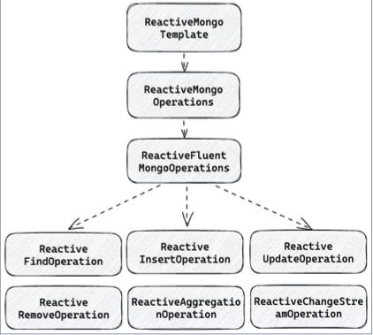
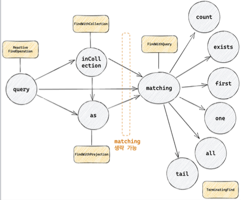
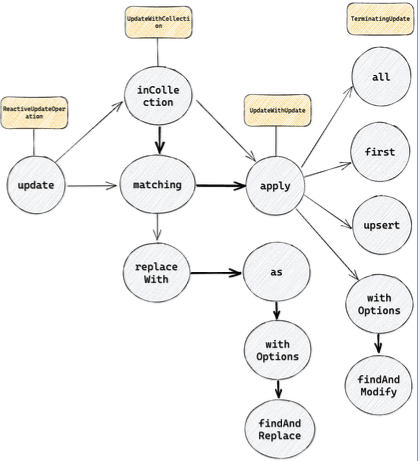
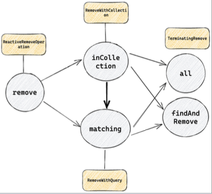
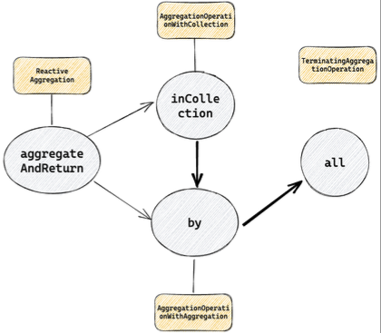
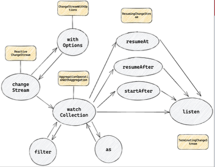

# operation
ReactiveMongoOperations는 ReactiveFluentOperations를 상속하고, ReactiveFluentMongoOperations는 여러 Operations를 상속하고 있다.
- ReactiveFindOperation : find query 관련 메서드 제공 
- ReactiveInsertOperation : insert query 관련 메서드 제공
- ReactiveUpdateOperation : update query 관련 메서드 제공
- ReactiveRemoveOperation : delete query 관련된 메서드 제공
- ReactiveAggregationOperation : aggregation query와 관련된 메서드 제공
- ReactiveChangeStreamOperation : watch query와 관련된 메서드 제공

  

## ReactiveFindOperation
ReactiveFindOperation의 query 부터 시작하여 TerminatingFind의 count, exists, first, one, all, tail 등으로 종료된다. 메서드를 체이닝 하는 구조로 되어있기 때문에 상황에 맞게 체이닝해서 사용하면 된다

  

- 체이닝의 예시는 다음과 같다
  - query -> inCollection -> as -> matching -> 최종
  - query -> inCollection -> matching -> 최종
  - query -> as -> matching -> 최종
  - query -> matching -> 최종
  - query -> 최종

### inCollection, as 
inCollection은 query를 실행할 collection 이름을 전달한다. inCollection이 제공되지 않는다면 domainType의 class 이름이나 @Document 어노테이션을 통해서 collection 이름을 획득할 수 있다.  
as는 Entity를 전부 mapping 하지 않고 **특정 필드만 mapping** 하고 싶은 경우 Entity의 일부 property만 담고 있는 subclass(혹은 interface)를 넘겨서 projection할 수 있다. projection이 따로 제공되지 않는다면 Entity에 모든 필드를 mapping한다
````java
public interface ReactiveFindOperation {
    <T> ReactiveFind<T> query(Class<T> domainTpye);
}

interface FindWithCollection<T> extends FindWithQuery<T> {
    FindWithProjection<T> inCollection(String collection);
}

interface FindWithProjection<T> extends FindWithQuery<T>, FindDistinct {
    <R> FIndWithQuery<R> as(Class<R> resultType);
}

````

### matching, 최종
query의 filter에 해당하며, Query를 전달하여 filter에 들어갈 내용을 설정한다. matching을 생략하는 경우 collection 전체에 대한 요청과 동일하게 동작한다.
최종은 마지막으로 count, exists, first, one, all, tail 등의 연산을 선택한다.
- count : 조건에 맞는 document 개수 반환
- exists : 조건에 맞는 document 존재 여부 반환
- first : 조건에 맞는 첫 번째 document 반환
- one : 조건에 맞는 하나의 document 반환, 하나가 초과되면 exception
- all : 조건에 맞는 모든 document 반환
- tail : cursor를 이용하여 조건에 해당하는 document를 지속적으로 수신

### ReactiveFindOperation 실행

````java
import com.mongodb.reactivestreams.client.MongoClients;
import org.springframework.data.mongodb.core.ReactiveMongoTemplate;
import org.springframework.data.mongodb.core.query.Criteria;
import org.springframework.data.relational.core.query.Query;

@Slf4j
public class ReactiveFindOperationRun {
  var connection = new ConnectionString("mongodb://localhost:27017/capo");

  var settings = MongoClientSettings.builder()
          .applyConnectionString(connection);

  MongoClient mongoClient = MongoClients.create(settings);
  var mongoTemplate = new ReactiveMongoTemplate(mongoClient, "capo");

  var qeury = Query.query(
          Criteria.where("anme").is("capo");
        );
  
  mongoTemplate.query(PersonDocument.class)
            .inCollection("person")
            .as(PersonNameOnlyDocument.class)
            .matching(query)
            .first()
            .subscribe(it -> log.info("person: {}", it))
}
````

## ReactiveInsertOperation
ReactiveOperation의 insert 부터 시작하여 TerminatingInsert의 one, all 로 종료된다.
- insert -> into -> (one, all)
- insert -> (one, all)

### one, all
- one : insert query에 이용할 entity 하나를 전달한다.
  - 주어진 entity를 Document로 변환하고 insert에 대한 결과를 Mono로 반환한다. 
- all : bulk insert 지원 
  - 주어진 entity Collection을 Document Collection으로 반환하고 insert 결과를 Flux로 반환한다.

### ReactiveInsertOperation 실행

````java
import com.mongodb.reactivestreams.client.MongoClients;
import org.springframework.data.mongodb.core.ReactiveMongoTemplate;
import org.springframework.data.mongodb.core.query.Criteria;
import org.springframework.data.relational.core.query.Query;

@Slf4j
public class ReactiveInsertOperationRun {
  var connection = new ConnectionString("mongodb://localhost:27017/capo");

  var settings = MongoClientSettings.builder()
          .applyConnectionString(connection);

  MongoClient mongoClient = MongoClients.create(settings);
  var mongoTemplate = new ReactiveMongoTemplate(mongoClient, "capo");

  var people = List.of(
          new PersonDocument("capo", 10, "M");
          new PersonDOcument("capo2", 20, "F");
  );
          
  mongoTemplate.isnert(PersonDocument.class)
          .inCollection("person")
          .all(people)
          .subscribe(it -> log.info("person: {}", it));
}
````

## ReactiveUpdateOperation
ReactiveUpdateOperation의 update 부터 시작하여 단순 update뿐만 아니라 findAndModify, findAndReplace 같은 Atomic한 기능도 제공된다.  

  

### findAndReplace 
Document를 찾고 다른 Document로 대체한다. replaceWith는 대상을 찾게 되었을때 대체할 객체를 제공한다.
````java
interface UpdateWithUpdate<T> {
    FindAndReplaceWithProjection<T> replaceWith(T replacement);
}
````
### withOptions
findAndReplace에 대한 옵션을 제공한다.
- return new : true 라면 대체된 document를 반환하고 false라면 기존 document를 반환한다. 기본값은 false
- upsert : true라면 조건에 만족하는 document가 없는 경우 insert, false라면 존재하는 경우에만
````java
  interface FindAndReplaceWithOptions<T> extends TerminatingFindAndReplace<T> {
    FindAndReplaceWithProjection<T> withOptions(FindAndReplaceOptions options);
}

public class FindAndReplaceOptions {
    private boolean returnNew;
    private boolean upsert;
}

````
### as 
값을 대체한 후 그 결과를 전부 mapping 하지 않고 특정 필드만 mapping 하고 싶은 경우에 사용한다.
````java
interface FindAndReplaceWithProjection<T> extends FindAndReplaceWithOptions<T> {
    <R> FindAndReplaceWithOptions<R> as(Class<R> resultType);
}
````
### findAndModify
findAndModify는 update에 옵션을 추가하고 싶은 경우에 사용하면 된다. 
- return new : true 라면 대체된 document를 반환하고 false라면 기존 document를 반환한다. 기본값은 false
- upsert : true라면 조건에 만족하는 document가 없는 경우 insert, false라면 존재하는 경우에만
- remove : true인 경우, update 하는 대신 삭제
````java
public class FIndAndModifyOptions {
 
    private boolean returnNew;
    private boolean upsert;
    private boolean remove;
    
    private @Nullable Collation collation;
}
````
## update
apply 메서드를 통해서 수행하며, isnert와 다르게 Entity가 아닌 Update객체를 전달한다. 
set, unset, setOrInsert, inc, push, pop, pull, rename, currentDate, multiply 등 다양한 연산자를 제공한다.
- all : 조건을 만족하는 모든 document 업데이트
- first : 조건을 만족하는 첫 document에 대해 update
- upsert : 조건을 만족하는 document가 있다면 update 하고 없다면 새로 생성한다.

### findAndReplace 실행

````java
import com.mongodb.reactivestreams.client.MongoClients;
import org.springframework.data.mongodb.core.FindAndReplaceOptions;
import org.springframework.data.mongodb.core.ReactiveMongoTemplate;
import org.springframework.data.mongodb.core.query.Criteria;
import org.springframework.data.relational.core.query.Query;

@Slf4j
public class RunFindAndReplace {
  var connection = new ConnectionString("mongodb://localhost:27017/capo");

  var settings = MongoClientSettings.builder()
          .applyConnectionString(connection);

  MongoClient mongoClient = MongoClients.create(settings);
  var mongoTemplate = new ReactiveMongoTemplate(mongoClient, "capo");

  var query = Query.query(
          Criteria.where("name").is("taeil")
  );

  var replacePerson = new PersonDocument("taeil2", 100, F);
  
  var options = new FindAndReplaceOptions().returnNew();
  
  mongoTemplate.update(PersonDocument.class)
            .inCollection("person")
            .matching(query)
            .replaceWith(replacePerson)
            .withOptions(options)
            .findAndReplace()
            .subscribe(it -> log.info("person: {}", it ));
}
````
### findAndModify 실행

````java
import com.mongodb.reactivestreams.client.MongoClients;
import org.springframework.data.mongodb.core.FindAndReplaceOptions;
import org.springframework.data.mongodb.core.ReactiveMongoTemplate;
import org.springframework.data.mongodb.core.query.Criteria;
import org.springframework.data.relational.core.query.Query;

@Slf4j
public class RunFindAndReplace {
  var connection = new ConnectionString("mongodb://localhost:27017/capo");

  var settings = MongoClientSettings.builder()
          .applyConnectionString(connection);

  MongoClient mongoClient = MongoClients.create(settings);
  var mongoTemplate = new ReactiveMongoTemplate(mongoClient, "capo");

  var query = Query.query(
          Criteria.where("name").is("taeil")
  );

  var update = Update.update("name", "taeil2")
                    // age 필드는 100을 증가시킬거야.
                  .inc("age", 100) 
                    // gender 필드는 F로 변경
                  .set("gender", "F") 
  
  mongoTemplate.update(PersonDocument.class)
            .inCollection("person")
            .matching(query)
            .apply(update)
            .withOptions(options)
            .findAndModify()
            .subscribe(it -> log.info("person: {}", it ));
}
````

## ReactiveRemoveOperation
ReactiveRemoveOperation의 remove부터 시작하여 TerminatingRemove의 all, findAndRemove로 종료된다.
- remove -> inCollection -> matching -> 실행
- remove -> inCollection -> 실행
- remove -> matching -> 실행
- remove -> 실행

  
all은 삭제된 document를 삭제된 document를 반환하는 반면, findAndRemove는 삭제된 Flux의 document를 반환한다.

## ReactiveAggregationOperation
ReactiveAggregationOperation의 aggregationAndReturn 부터 시작하여 TerminatingAggregationOperation의 all로 종료된다.
- aggregateAndReturn -> inCollection -> by -> all
- aggregateAndReturn -> by -> all

    

## ReactiveChangeStreamOperation
ReactiveChangeStreamOperation의 changeStream 부터 싲가하여 TerminatingChangeStream의 listen으로 종료
- withOptions : changeStream과 관련된 옵션을 제공한다
- filter : stream을 listen 하는 동안 filter할 대상
- as : stream의 결과로 mapping할 Class 제공
- resumeAt : 주어진 Token 부터 listen 재개
- resumeAfter : 주어진 Token 이후부터 listen 재개
- startAfter : 주어진 Token 부터 listen 새로 시작

   

### 매번 이런식으로 하기엔 불편하고 번거롭다. 그래서 mongoDB는 ReactiveMongoRepository와 queryMethod도 같이 제공한다.


