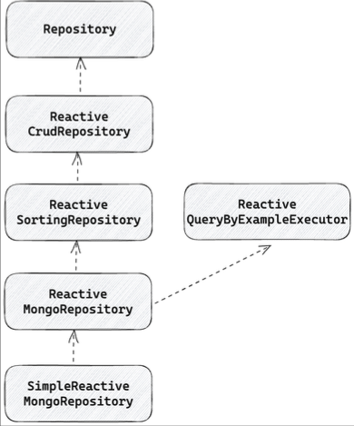

# ReactiveMongoRepository
ReactiveSortingRepository와 ReactiveQueryByExampleExecutor를 상속한 interface로 SimpleReactiveMongoRepository에서 구현한다. Query method, Query By Example, Entity callback을 제공한다.

   

## ReactiveMongoRepository 등록
mongoRepository의 등록은 MongoReactiveRepositoriesAutoConfiguration이 활성화 되어 있다면 SpringBoot 기준으로 자동으로 스캔해서 사용할 수 있지만, r2dbc와 같이 사용하는 경우라면 스프링 입장에선 CRUDRepository, ReactiveSortingRepository 두개만 보고서는 어떤 레포지토리가 mongoDB의 것인지 알수가 없다. 그래서 이런 경우라면 따로 scan을 잡아서 사용해야 한다.

````java
import org.springframework.context.annotation.Configuration;
import org.springframework.data.mongodb.config.AbstractReactiveMongoConfiguration;
import org.springframework.data.mongodb.repository.config.EnableReactiveMongoRepositories;

@EnableReactiveMongoRepositories(
        basePackages = "com.test.example.example.repository"
        reactiveMongoTemplateRef= "reactiveMongoTemplate"
)
@Configuration
public class ReactiveMongoConfig extends AbstractReactiveMongoConfiguration {
    /* ... */
}
````

## SimpleReactiveMongoRepository
ReactiveMongoRepository를 구현하고, ReactiveMongoOperations를 기반으로 Mongo 쿼리를 실행하고 결과를 Entity로 mapping한다.
- save
  - mongoOperations의 insert 혹은 update를 이용한다. 새로운 entity라면 insert, 아니라면 update
  - 있는 객체인지 아닌지는 Id 필드가 null이라면 없는 객체로 판단하고 isnert를 실행한다.
- saveAll 
  - concatMap을 이용하여 save를 순차적으로 실행한다.
  - 전부 새로운 객체로 판단하면 한번에 모아서 bulkInsert를 실행하고, 아니라면 각각 save 메서드를 실행한다.
  - 특이한 점은 @Transactional 어노테이션이 포함되어 있지 않기 때문에, 문제가 생겨도 마지막까지 save한 부분은 저장이 될것이다. (성능 괜찮나 ..?)
- find
  - findById, existsById, count 모두 ReactiveMongoOperations 에서 제공하는 단축 메서드(findById, exists, count) 를 사용한다.
- delete 
  - ReactiveMongoOperations 에서 제공하는 단축 메서드 (remove)를 사용한다.

## Query method
ReactiveMongoRepository를 상속한 repository interface에 메서드를 추가할 수 있고, 메서드의 이름을 기반으로 Query를 생성하고 조회와 삭제를 지원한다.  
@Query, @Update, @Aggregation 어노테이션을 사용해서 복잡한 쿼리를 실행할 수 있다.

````java
import lombok.extern.slf4j.Slf4j;
import org.springframework.beans.factory.annotation.Autowired;
import org.springframework.data.mongodb.repository.Aggregation;
import org.springframework.data.mongodb.repository.Query;
import org.springframework.data.mongodb.repository.Update;
import org.springframework.data.repository.reactive.ReactiveSortingRepository;

public interface PersonQueryMethodAnnotationMongoRepository extends ReactiveSortingRepository<PersonDocument, ObjectId> {
    Flux<PersonDocument> findAllByName(Publisher<String> name);

    Mono<PersonNameOnlyDocument> findFirstByName(String name);

    Mono<PersonDocument> findFirstByNameOrderByAgeDesc(String name);

    Mono<Long> deleteByName(String name);

    Flux<PersonDocument> deleteByAgeGreaterThan(int age);

    @Query("{ 'name' : ?0}")
    Flux<PersonDocument> findAllByName(String name);

    @Aggregation(pipeline = {
            "{ $match: {name: ?0 } }",
            "{ $group: { _id: '$name', count: { $sum: 1 } } }"
    })
    Mono<PersonAggreate> aggregateGroupByName(String name);

    @Query("{ '_id': ?0}")
    @Update(value = "{ $set: { name: ?1 } }")
    Mono<Integer> updateNameById(String id, String name);
}


@Slf4j
public class MethodTest {
    @Autowired
    private PersonQueryMethodAnnotationMongoRepository personQueryMethodAnnotationMongoRepository;

    public Mono<PersonNameOnlyDocument> findFirstByName(String name) {
        personQueryMethodAnnotationMongoRepository.findFirstByNameOrderByAgeDesc("taeil")
                .subscribe(person -> {
                    log.info("person: {}", person);
                });
    }
}
````

### delete
delete는 다른 필드를 이용해서 삭제할 수 있지만, 반환타입은 다른 타입은 안되고 Long 타입이나 삭제된 Document만 지정 가능하다.

````java
import org.springframework.data.repository.reactive.ReactiveSortingRepository;

public interface PersonQueryMethodDeleteMongoRepository extends ReactiveSortingRepository<PersonDocument, ObjectId> {
    Mono<Long> deleteByName(String name);
    Flux<PersonDocument> deleteByAgeGreaterThan(int age);
}


@Slf4j
public class DeleteMethodTest {
    @Autowired
    private PersonQueryMethodDeleteMongoRepository personQueryMethodDeleteMongoRepository;

    public Flux<PersonDocument> deleteTest(int age) {
        personQueryMethodDeleteMongoRepository.deleteByAgeGreaterThan(100)
                .subscribe(person -> {
                    log.info("person:{}", person);
                }, null, () -> {
                    log.info("complete");
                });
    }
}

````
## 쿼리 메서드 시작 키워드 
| 키워드                                   | 설명                                                              |
|---------------------------------------|-----------------------------------------------------------------|
| find, read, get, query, search, stream | find 쿼리를 실행하고 결과를 Publisher 로 반환                                |   
| exists                                | find exists 쿼리를 실행하고 결과를 Publisher<Boolean 으로 반환                |  
| count                                 | find count 쿼리를 실행하고 결과를 Publisher<Integer 로 반환                  |  
| delete, remove                        | delete 쿼리를 실행하고 Publisher<Void 혹은 Publisher<Integer 로 삭제된 개수 반환 |  
  
## 쿼리 메서드 - @Query
- @Query 어노테이션을 사용하는 경우는 다음과 같다
  1. query가 메서드 이름으로 전부 표현이 되지 않는 경우
  2. 쿼리 메서드 예약어에서 지원되지 않는 문법을 사용하는 경우
  3. 복잡한 query문을 사용해야 하는 경우 
  4. @Update와 조합하여 update를 수행하는 경우

다만, jpa와 다른건.. 문법이랑 쿼리 전체를 넣는게 아니라 filter 즉, 조건을 @Query 어노테이션에 작성한다. 이 때 인자로 들어오는 값을 조건에 넣는거다.

````java
import org.springframework.data.mongodb.repository.Aggregation;
import org.springframework.data.mongodb.repository.Update;
import org.springframework.data.repository.reactive.ReactiveSortingRepository;

public interface PersonQueryMethodAnnotationsMongoRepository extends ReactiveSortingRepository<PersonDocument, ObjectId> {

    // 인자로 받은 name 값을 필터로 해당 메서드를 실행해줘.
    @Query("{ 'name': ?0 }")
    Flux<PersonDocument> findAllByName(String name);

    @Query("{'_id' : ?0}")
    @Update(value = "{ $set: {name: ?1 } }")
    Mono<Integer> updateNameById(String id, String name);

    
}
````


  
  
  
 