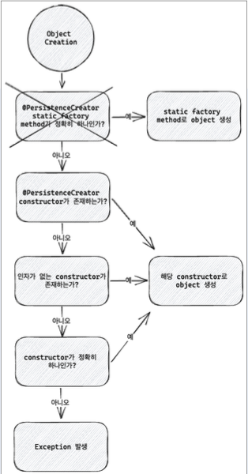

# spring data mongo reactive

## Entity
데이터베이스에서 하나의 Document와 매칭되는 클래스로, ReactiveMongoEntityTemplate, ReactiveMongoRepository등은 데이터베이스에 요청을 보내고 그 결과를 Entity 형태로 반환한다. Collection, Document에 필요한 데이터베이스 metadata를 어노테이션 등으로 제공한다.

````java
import lombok.AllArgsConstructor;
import lombok.Data;
import lombok.NoArgsConstructor;
import org.springframework.data.mongodb.core.mapping.Document;

@Document(collation = "person")
@NoArgsConstructor
@AllArgsConstructor
@Data
public class PersonDocument {
    @Id
    private objectId id;
    private String name;
    
    @Field(name = "age")
    private Integer age;
    private String gender; 
    
    @Version
    private Long version
}
````
## ReactiveMongoTemplate
ReactivMongoTemplate는 Spring data mongodb reactive의 추상화 클래스로 Mongo 쿼리들을 Bson 형태로 넘기거나 PojoCodec, Custom codec 등을 등록하지 않아도 메소드 체이닝을 통해 쿼리를 수행하고 결과를 entity 객체로 받을 수 있고 ReactiveMongoOperations를 구현한다.  
MongoTemplate는 Spring을 사용하지 않는다면 MongoClient와 databaseName을 전달하여 생성할 수 있고, Spring에서는 ReactiveMongoDatabaseFactory와 MongoConverter를 주입 받아 생성한다.

````java
import com.mongodb.reactivestreams.client.MongoClient;
import org.springframework.boot.autoconfigure.AutoConfiguration;
import org.springframework.boot.autoconfigure.condition.ConditionalOnMissingBean;
import org.springframework.boot.autoconfigure.mongo.MongoProperties;
import org.springframework.boot.autoconfigure.mongo.MongoReactiveAutoConfiguration;
import org.springframework.context.annotation.Bean;
import org.springframework.data.mongodb.ReactiveMongoDatabaseFactory;
import org.springframework.data.mongodb.core.ReactiveMongoOperations;
import org.springframework.data.mongodb.core.ReactiveMongoTemplate;
import org.springframework.data.mongodb.core.SimpleReactiveMongoDatabaseFactory;
import org.springframework.data.mongodb.core.convert.MappingMongoConverter;
import org.springframework.data.mongodb.core.convert.MongoConverter;
import org.springframework.data.mongodb.core.convert.MongoCustomConversions;
import org.springframework.data.mongodb.core.mapping.MongoMappingContext;

// 직접 생성하는 경우
public class createExample {
    MongoClient mongoClient = MongoClients.create(settings);
    var mongoTemplate = new ReactiveMongoTemplate(mongoClient, "capo");
            
}

// configuration
@AutoConfiguration(after = MongoReactiveAutoConfiguration.class)
public class MongoReactiveDataAutoConfiguration {
    @Bean
    @ConditionalOnMissingBean(ReactiveMongoDatabaseFactory.class)
    public SimpleReactiveMongoDatabaseFactory reactiveMongoDatabaseFactory(MongoProperties properties, MongoClient mongoClient) {
        String database = properties.getMongoClientDatabase();
        return new SimpleReactiveMongoDatabaseFactory(mongoClient, database);
    }

    @Bean
    @ConditionalOnMissingBean(ReactiveMongoOperations.class)
    public ReactiveMongoTemplate reactiveMongoTemplate(ReactiveMongoDatabaseFactory reactiveMongoDatabaseFactory, MongoConverter converter) {
        return new ReactiveMongoTemplate(reactiveMongoDatabaseFactory, converter);
    }

    @Bean
    @ConditionalOnMissingBean(MongoConverter.class)
    public MappingMongoConverter mappingMongoConverter(MongoMappingContext context, MongoCustomConversions customConversions) { ... }
}
````

## ReactiveMongoOperations
Reactive MongoTemplate의 operations를 담당하는 interface로 ReactiveFluentMongoOperations를 상속하고 MongoConverter를 제공하는 객체다. MongoConverter는 주어진 Document를 Entity로 만드는 converter다.

````java
import org.springframework.data.mongodb.core.ReactiveFluentMongoOperations;
import org.springframework.data.mongodb.core.convert.MongoConverter;

public interface ReactiveMongoOperations extends ReactiveFluentMongoOperations {
    MongoConverter getConverter();
}
````
## ReactiveMongoDatabaseFactory
MongoDatabaseFactory의 역할과 mongoDatabase를 ReactiveMongoTemplate 에서 내부적으로 사용할 수 있게 해주는 역할을 담당한다.
- getMongoDatabase : MongoDatabase를 반환
- getCodecRegistry : bson의 CodecRegistry를 반환
- ReactiveMongoTemplate는 ReactiveMongoDatabaseFactory의 MongoDatabase를 통해서 MongoCollection에 접근한다.

````java
import com.mongodb.reactivestreams.client.MongoDatabase;
import dev.miku.r2dbc.mysql.codec.CodecRegistry;
import org.springframework.dao.DataAccessException;
import org.springframework.data.mongodb.CodecRegistryProvider;

public interface ReactiveMongoDatabaseFactory extends CodecRegistryProvider {
    Mono<MongoDatabase> getMongoDatabase() throws DataAccessException;

    Mono<MongoDatabase> getMongoDatabase(String dbName) throws DataAccessException;

    CodecRegistry get CodecRegistry();
}
````
## MongoConverter
MongoConverter는 다양한 전략을 통해서 Object를 데이터베이스의 document로, 데이터베이스의 document를 object로 변환한다.  
- custom converter로 Mapping
- Spring data의 object mapping
- convention 기반의 mapping
- metadata 기반의 mapping
custom converter가 존재하면 custom converter를 우선 적용, 존재하지 않는다면 Spring data Object Mapping 전략을 실행한다.

### Custom converter mapping
Configuration을 통해서 converter들을 등록한다. 데이터베이스에 읽고 쓰기를 하기 위해 두 개의 Converter가 필요하다. bson.Document를 Target 클래스로 변환하는 Converter, Target 클래스를 bson.Document로 변환하는 Converter
- ReadConverter 
  - Document를 source로 Entity를 target으로 하는 converter
  - Document로부터 Name으로 field에 접근할 수 있고, 변환하고자 하는 type에 해당하는 메서드를 호출한다.

````java
import org.bson.Document;
import org.bson.json.Converter;
import org.bson.json.StrictJsonWriter;
import org.springframework.data.convert.ReadingConverter;
import org.springframework.data.convert.WritingConverter;
import org.springframework.data.mongodb.config.AbstractMongoClientConfiguration;
import org.springframework.data.mongodb.core.convert.MongoCustomConversions;

@ReadingConverter
public class PersonDocumentReadConverter implements Converter<Document, PersonDocument> {
    // Reading Converter
    @Override
    public void convert(Document source) {
        ObjectId id = source.getObjectId("_id");
        String name = source.getString("name");
        Integer age = source.getInteger("age");
        String gender = source.getString("gender");

        return new PersonDocument(id, name, age, gender);
    }
}

@WritingConverter
public class PersonDocumentWriteConverter implements Converter<PersonDocument, Document> {
    // Write Converter
    @Override
    public void convert(PersonDocument source) {
        Document document = new Document();
        document.put("_id", source.getId());
        document.put("name", source.getName());
        document.put("age", source.getAge());
        document.put("gender", source.getGender);

        return document;
    }
}

// Custom Converter 등록
@Configuration
public class ReactiveMongoConfig extends AbstractMongoClientConfiguration {
    @Override
    protected String getDatabaseName() {
        return "capo";
    }

    protected void configureConverters(MongoCustomConversions.MongoConverterConfigurationAdapter adapter) {
        adapter.registerConverter(new PersonDocumentReadConverter());
        adapter.registerConverter(new PersonDocumentReadConverter());
    }
}
````
이렇게 하면 엔티티가 늘어날수록 관리 포인트가 늘어날 수 있겠지만, 일반적인 상황에서 안되는 경우에 커스텀할 필요는 있어보인다.

## Spring data의 object mapping
만약 지원하는 custom converter가 없다면 MappingMongoConverter는 다음 과정을 거쳐서 Document를 entity로 반환한다.
1. Object creation : constructor, factory method 등을 이용해서 Document의 field들로 Object를 생성한다.
2. Property population : setter, with.. 메서드 등을 이용해서 Document의 field를 Object에 주입한다.

  
- 위와 같은 순서로 체크해서 해당하는 알고리즘으로 Document를 Object로 반환한다.
  1. @PersistenceCreator 어노테이션을 갖는 constructor가 있다면 해당 constructor를 사용한다.
  2. 인자가 없는 constructor가 있다면 해당 constructor를 사용한다.
  3. constructor가 정확히 하나 있다면 해당 constructor를 사용한다.

### id mapping
mongodb에서 모든 document는 _id를 필요로한다. MappingMongoConverter는 다음의 방법으로 _id를 감지한다.
1. @Id가 붙어있는 필드
2. 필드명이 id이고 @Field를 통해서 별도의 이름이 부여되지 않는 경우
그리고 id 필드가 제공되지 않으면 자동으로 추가한다.

### Property population
r2dbc에서는 property가 mutable할때만 property population을 적용할 수 있지만, mongodb에서는 with 메서드 지원으로 No-args constructor를 호출하여 기본 생성자를 만들어서 사용할 수 있다.

````java

import lombok.AllArgsConstructor;
import lombok.extern.slf4j.Slf4j;
import org.bson.types.ObjectId;
import org.springframework.data.annotation.Id;
import org.springframework.data.mongodb.core.mapping.Document;

@AllArgsConstructor
@Slf4j
@Document(collation = "person")
public class PersonWitherDocument {
  @Id
  private ObjectId id;
  private String name;
  private Integer age;
  private final String gender;

  public PersonWitherDocument() {
      log.info("No-args constructor is called");
      this.gender = null;
  }
  
  public PersonWitherDocument withGender(String gender) {
      log.info("withGender is called");
      return new PersonWitherDocument(id, name, age, gender);
  }
}
````
Object Mapping하는 상황에서 id, name, age 변수는 뮤터블한 변수이기 때문에 property population이 동작하면서 값을 할당하고, gender는 불변이기 때문에 withGender 메서드를 호출해서 주입하게 된다.


## Metadata mapping
Entity 클래스에 annotation을 추가하여 데이터베이스와 관련된 설정들을 주입한다.
- @Id : _id에 해당하는 필드에 적용
- @Document : entity class에 적용, Collection 이름을 변경할 수 있다.
- @DBRef : mongodb의 DBRef 형태로 저장해야 하는 필드
- @Indexed : 필드에 대해서 인덱스를 생성한다. 기본적으로 자동 생성이 비활성화이므로 별도로 설정이 필요하다. (굳이 어노테이션으로 인덱스를 생성해야할까?)
- @CompoundIndex : 클래스에 적용, 여러 필드로 구성된 복합 인덱스 적용
- @TextIndexed : 필드에 text index를 적용
- @HashIndexed : 필드에 hash index를 적용
- @Transient : 기본적으로 모든 필드는 mapping 대상이다. 해당 어노테이션을 사용하면 mapping 대상에서 제외된다.
- @Field : entity의 property 필드에 적용. @Field가 붙은 필드에 대해서는 convention 기반 대신 Field에 주어진 name으로 적용한다.
- @Version : 낙관적 Lock (Optimistic Lock)에 이용한다. entity가 update 될때마다 자동으로 update
- @PersistenceConstructor : 특정 생성자에 대해서 Object creation할 때 사용하게끔 지정한다. 생성자의 인자 이름에 따라서 mapping 한다.