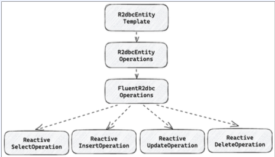
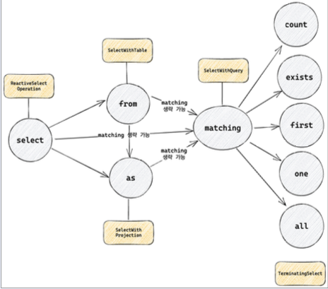
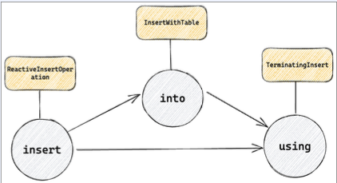
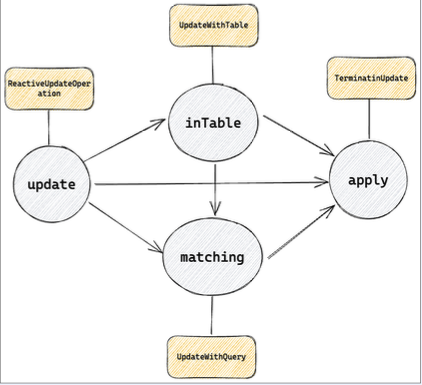
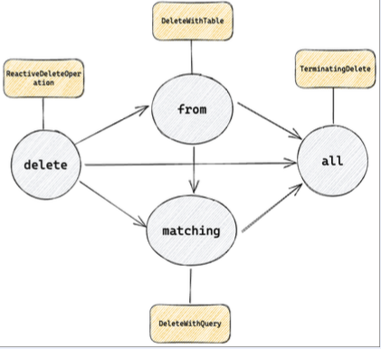

## R2dbcEntityOperations
- Database Client로 부터 SQL을 실행하고 그 결과를 R2dbc Converter로 바꿔서 Row를 Entity로 변환..!
- 이 두가지 기능을 구현해서 SQL을 대체할 수 있는 메서드..
> - 이 역할을 하는것이 R2dbc Operations

## R2dbcEntityOperations (1)
- FluentR2dbcOperations를 상속
- FluentR2dbcOperations는 여러 Operations를 상속
> - ReactiveSelectOperation : select query와 관련된 메서드 제공  
> - ReactiveInsertOperation : insert query와 관련된 메서드 제공  
> - ReactiveUpdateOperation : update query..  
> - ReactiveDeleteOperation : delete query  
>     

## ReactiveSelectOperation
- ReactiveSelectOperation의 select부터 시작하여 TerminatingSelect의 Count, exists, first, one, all 등으로 종료
- select -> from -> as -> matching -> 실행
- select -> from -> matching -> 실행
- select -> as -> matching -> 실행
- select -> matching -> 실행
- select -> 실행      
>     
> > - from : qeury를 실행할 table 이름을 전달  
> > String이나 SqlIdentifire 형태로 from이 제공되지 않는다면 domainType의 class 이름이나 @Table 어노테이션을 통해서 table 이름 획득 가능  
> > - as : Entity를 전부 mapping 하지 않고 특정 필드만 mapping 하고 싶은 경우   
> > Entity의 일부 propery만 담고 있는 subclass (혹은 interface)를 넘겨서 projection  
> > projection이 제공되지 않는다면 Entity에 모든 필드를 mapping
> > - matching : query의 where문에 해당한다.
> > Query를 전달하여 query의 where에 들어갈 내용을 설정.
> > matching을 생략하면 table 전체에 대한 요청을 보내는 것과 동일하다.  
>

실행 : 마지막으로 count, exists, first, one, all 등의 연산을 선택한다.  
1. count : 조건에 맞는 row의 개수 반환 
2. exists : 조건에 맞는 row존재 여부 반환
3. first : 조건에 맞는 첫 번째 row 반환
4. one : 조건에 맞는 하나의 row 반환, 하나가 넘으면 exception 발생
5. all : 조건에 맞는 모든 row 반환

## ReactiveInsertOperation
- ReactiveInsertOperation의 insert부터 시작하여 TerminatingInsert의 using으로 종료
- insert -> into -> using
- insert -> using
>       
> > - into : query를 실행할 table 이름을 전달
> > String이나 SqlIdentifire 형태로 into가 제공되지 않는다면 domainType의 class 이름이나 @Table 어노테이션을 통해서 table 이름 획득 가능  
> > - using : insert query에 이용할 Entity를 전달   
> > 주어진 entity를 OutboundRow로 변환  
> > 변환된 OutboundRow로 쿼리 실행  

## ReactiveUpdateOperation
- ReactiveUpdateOperation의 update 부터 시작하여 TerminatingUpdate의 apply로 종료
- update -> inTable -> matching -> apply
- update -> inTable -> apply
- update -> matching -> apply
- update -> apply  
>       
> > - inTable : query를 실행할 이름을 전달  
> > String이나 SqlIdentifire 형태로 inTable이 제공되지 않는다면 domainTpye의 class 이름이나 @Table 어노테이션을 통해서 table 이름 획득 가능  
> > - matching : query의 where문에 해당    
> > Query를 전달하여 query의 where에 들어갈 내용을 설정    
> > matching을 생략하면 table 전체에 대한 요청을 보내는 것과 동일     
> > - apply : update를 수행  
> > insert와 다르게 Entity가 아닌 Update 객체 전달   
> > Update는 내부에 SqlIdentifire를 Key로 변경하려는 값을 Value로 갖는 Map 포함  
> > from과 update static method로 Update 객체 생성  
> > 결과로 영향을 받은 row의 숫자 반환  

## ReactiveDeleteOperation  
- ReactiveDeleteOperation의 delete 부터 시작하여 TerminatingDelete의 all로 종료  
- delete -> from -> matching -> all  
- delete -> from -> all  
- delete -> matching -> all  
- delete -> all  
>           
> > all : delete를 수행 -> 결과로 영향을 받은 row의 숫자를 반환한다.

## R2dbcEntityOperations (2)
- FluentR2dbcOperations에서 제공하는 조합 방식 대신 다양한 쿼리를 수행하는 단축 메소드 제공.
> - Query 객체를 인자로 받는 경우 : count, exists, select, selectOne, update, delete...  
> - Entity를 직접 인자로 받는 경우 : insert, update의 경우 주어진 entity로 값을 추가하거나 변경, delete는 id를 추출하여 해당 id를 갖는 row를 제거