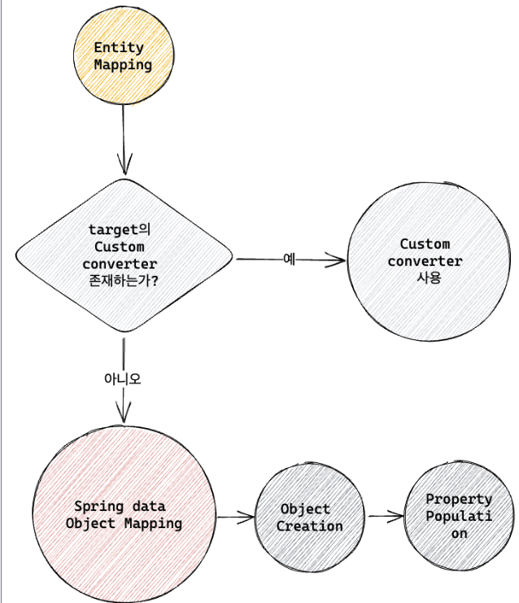
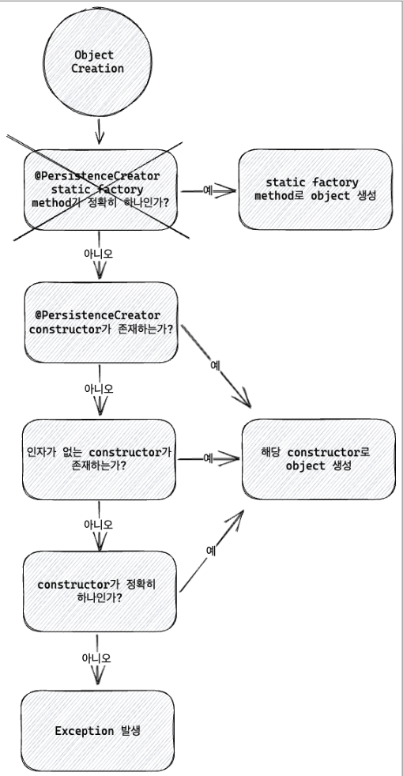
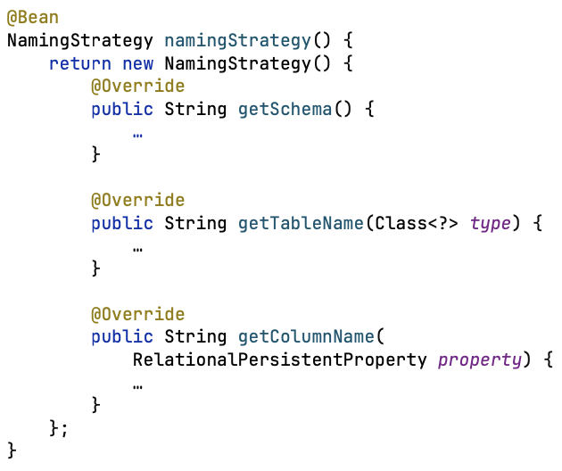

## Spring data의 object mapping
- 만약 지원하는 converter가 없다면 MappingR2dbcConverter는 다음 과정을 거쳐서 Row를 entity로 변환
> 1. Object creation : constructor, factory method 등을 이용해서 Row의 column들로 Object 생성
> 2. Property population : direct set, setter, with.. 메소드 등을 이용해서 Row의 column Object에 주입한다.  
>   
### Object creation 
- 다음 순서로 체크하여 해당하는 알고리즘으로 Row를 Object로 변환
> 1. @PersistenceCreator 어노테이션을 갖는 constructor가 있다면 해당 constructor 사용
> 2. 인자가 없는 constructor가 있다면 해당 constructor 사용
> 3. constructor가 정확히 하나 있다면 해당 constructor 사용    
>     

### Object mapping 최적화
 - 객체를 가능한한 Immutable하게 구성
 - 모든 property를 인자로 갖는 All-args 제공
> - property population이 발생하지 않고, constructor만 호출하기 때문에 30% 정도 성능이 좋다
- 코드 중복을 방지하기 위해서 lombok을 사용하기

### Naming_strategy
- 별도의 @Table이나 @Column과 같은 어노테이션이 따로 주어지지 않았다면
- naming strategy에 맞춰서 클래스명, 변수명을 변경해서 table과 column에 mapping
- NamingStrategy interface를 구현하여 bean으로 등록하면 일괄 변경 가능
> - ex) PersonArticle 이라는 이름의 경우, PERSONE_ARTICLE table로 mapping
> - ex) firstName 이라는 필드를 가지고 있는 경우, FIRST_NAME column과 mapping
>         