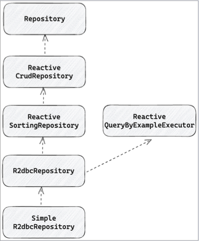

## R2dbcRepository
- ReactiveSortingRepository와 ReactiveQueryByExampleExecutor를 상속한 interface
> simpleR2dbcRepository에서 구현
- Qeury method 제공  
- Query By Example 제공  
- Entity callback 제공  
      

### R2dbcRepository 등록
```` java
R2dbcRepositoriesAutoConfiguration이 활성화되어 있다면 SpringBootApplication 기준으로 자동 scan
혹은 EnableR2dbcRepositories를 통해서 repository scan

@AutoConfiguration(after = R2dbcDataAutoConfiguration.class)
@ConditionalOnClass({ ConnectionFactory.class, R2dbcRepository.class })
@ConditionalOnBean(DatabaseClient.class)
@ConditionalOnProperty(prefix = "spring.data.r2dbc.repositories", name = "matchIfMissing = true)
@ConditionalOnMissingBean(R2dbcRepositoryFactoryBean.class)
@Import(R2dbcRepositoriesAutoConfigureRegistrar.class)
public class R2dbcRepositoriesAutoConfiguration {
}

만약 여러 r2dbcEntityTemplate이 존재하거나 여러 데이터베이스를 사용하는 경우, basePackages, entityOperationRef 등을 통해서 
다른 경로, 다른 entity Template 설정 가능

@EnableR2dbcRepositories(
basePackages =
"com.example.datareactive.r2dbc.spring.repository",
entityOperationsRef = "r2dbcEntityTemplate"
)
@Configuration
public class R2dbcConfig
extends AbstractR2dbcConfiguration

````

## R2dbcRepository가 상속한 인터페이스 살펴보기

### Repository
- Spring data에서는 Repository interface를 제공
- 데이터에 접근하는 계층을 추상화하고 CRUD 작업, Entity mapping, SQL 쿼리 생성 등을 자동으로 수행한다.
```` java
@Indexed
public interface Repository(T, ID) { }
````
### ReactiveCrudRepository
- Spring data reactive에서는 CrudRepository의 Reactive 버전인 ReactiveCrudRepository 지원
- entity의 CRUD에 집중
- 모든 결과값 그리고 일부 인자들이 Publisher 지원
```` java
@NoRepositoryBean
public interface ReactiveCrudRepository<T, ID> extends Repository<T, ID>
````

### ReactiveCrudRepository - save
- 하나의 entity를 save 하거나
- entity Iterable을 save 하거나
- entity Publisher를 인자로 받고 save
- saveAll은 @Transactional을 사용해서 각각의 save를 하나의 tx로 묶고
- concatMap을 통해서 save를 순차적으로 수행한다.
```` java
<S extends T> Mono<S> save(S entity);
<S extends T> Flux<S> saveAll(Iterable<S> entities);
<S extends T> Flux<S> saveAll(publisher<S> entityStream);
````

### ReactiveCrudRepository - find
- id 기반으로 하나 혹은 여러 개의 항목을 탐색하거나 존재 여부를 확인한다.
- 모든 항목을 탐색하거나 모든 항목의 개수를 확인한다.
```` java
Mono<T> findById(ID id);
Mono<T> findById(Publisher<ID> id);
Flux<T> findAll();
Flux<T> findAllById(Iterable<ID> idStream);
Mono<Boolean> existsById(ID id);
Mono<Boolean> existsById(Publisher<ID> id);
Mono<Long> count():
````

### ReactiveCrudRepository - delete
- id 기반으로 하나 혹은 여러 개의 항목을 제거,
- 하나 혹은 여러 개의 entity를 기반으로 id를 추출하여 제거하거나
- 모두 삭제
```` java
Mono<Void> deleteById(ID id);
Mono<Void> deleteById(Publisher<ID> id);
Mono<Void> delete(T entity);
Mono<Void> deleteAllById(Iterable<? extends ID> ids);
Mono<Void> deleteAll(Iterable<? extends T> entities);
Mono<Void> deleteAll(Publisher<? extends T> entityStream);
Mono<Void> deleteAll();
````

### ReactiveSortingRepository
- ReactiveCrudRepository를 상속
- spring data의 Sort를 기반으로 여러 항목 탐색
- Sort 객체는 여러 Order 객체를 포함
- 이를 기반으로 Query에 sort 옵션을 제공.

```` java
@NoRepositoryBean
public interface ReactiveSortingRepository<T, ID> extends ReactiveCrudRepository<T, ID> {
    Flux<T> findAll(Sort sort);
}

public class Sort implements Streamable<Order>, Serializable {
    ...
    
    private final List<Order> orders;
    
    protected Sort(List<Order> orders) {
        this.orders = orders;
    }
}
````


## SimpleR2dbcRepository
- ReactiveSortingRepository, ReactiveCrudRepository 이 두가지를 구현(상속)하고 있는게 SimpleR2dbcRepository
- R2dbcRepository를 구현
- R2dbcEntityOperations를 기반으로 SQL 쿼리를 실행하고 결과를 Entit2y로 mapping
- 기본적으로 모든 메소드에 @Transactional(readOnly = true) 적용
````java
    @Transactional(readOnly = true)
    public class SimpleR2dbcRepository<T, ID> implements R2dbcRepository<T, ID> {
        private final RelationalEntityInformation<T, ID> entity;
        private final R2dbcEntityOperations entityOperations;
        private final Lazy<RelationalPersistentProperty> idProperty;
        private final RelationalExampleMapper exampleMapper;
    }
````
### SimpleR2dbcRepository - save  
- save : entityOperations의 update를 이용
- saveAll : concatMap을 이용하여 save를 순차적으로 실행
- save가 완료되고 complete 이벤트가 내려오면 다음 save를 수행한다. 
- @Transactional 로 묶여있어서 exception이 throw 되면 전체가 rollback 된다.
````java
//@Override
//@Transactional
//    public <S extends T> Mono<S> save(S objectToSave) {
//        if (this.entity.isNew(objectToSave)) {
//            return this.entityOperations.insert(objectToSave);
//        }
//            …
//        return this.entityOperations.update(objectToSave);
//    }
//
//    @Override
//    @Transactional
//    public <S extends T> Flux<S> saveAll(
//    Publisher<S> objectsToSave) {
//        …
//        return Flux.from(objectsToSave).concatMap(this::save);
//    }

````
### SimpleR2dbcRepository - find
- findById, existsById, count 모두 R2dbcEntityOperations에서 제공하는 단축 메소드 (selectOne, exists, count) 사용
```` java
    @Override
   public Mono<T> findById(ID id) {
       Assert.notNull(id, "Id must not be null!");
       return this.entityOperations.selectOne(getIdQuery(id), this.entity.getJavaType());
   }
   @Override
   public Mono<Boolean> existsById(ID id) {
       Assert.notNull(id, "Id must not be null!");
       return this.entityOperations.exists(getIdQuery(id), this.entity.getJavaType());
   }
   @Override
   public Mono<Long> count() {
       return this.entityOperations.count(Query.empty(), this.entity.getJavaType());
   }
````

### SimpleR2dbcRepository - delete
- R2dbcEntityOperations에서 제공하는 단축 메소드 (delete) 사용
````java
//    @Override
//    @Transactional
//    public Mono<Void> deleteById(Publisher<ID> idPublisher) {
//        …
//        return Flux.from(idPublisher).buffer()
//        .filter(ids - > !ids.isEmpty()).concatMap(ids - > {
//        …
//        String idProperty = getIdProperty().getName();
//        return this.entityOperations.delete(
//            Query.query(Criteria.where(idProperty).in(ids)),
//            this.entity.getJavaType());
//        }).then();
//        }
//
//    @Override
//    @Transactional
//    public Mono<Void> deleteById(ID id) {
//        …
//        return this.entityOperations.delete(getIdQuery(id),this.entity.getJavaType()).then();
//    }

````

## R2dbcRepository의 한계
- R2dbcRepository는 기본적으로 CRUD를 수행할 수 있는 메소드를 제공
- 모두 혹은 id 기반으로 CRUD를 제공한다.
- 특정 필드로 탐색을 하거나 상위 n개만 조회 등의 기능은 제공되지 않는다.
- join이나 집계와 관련된 함수들은 제공되지 않는다.


## SimpleR2dbcRepository 는 insert 인지 update인지 어떻게 구분하는가?
- R2dbc는 isNew 를 통해서 새로운 Object이면 isnert, 아니면 해당 로우를 찾아서 업데이트 하려고 하는데 이 구분을 어떻게 하는걸까?
- 이를 new entity 확인 전략 이라고 한다.

#### new entity 확인전략
- @Id에 해당하는 필드를 확인. 만약 @Id 필드가 null이거나 0이라면 새로운 entity로 간주한다.

````java

@Table
@Data
public class personEntity {
    @Id
    private final Long id;
    private final String name;
    @Column(value = "age")
    private final Integer age;
    private final String gender;
}
````

