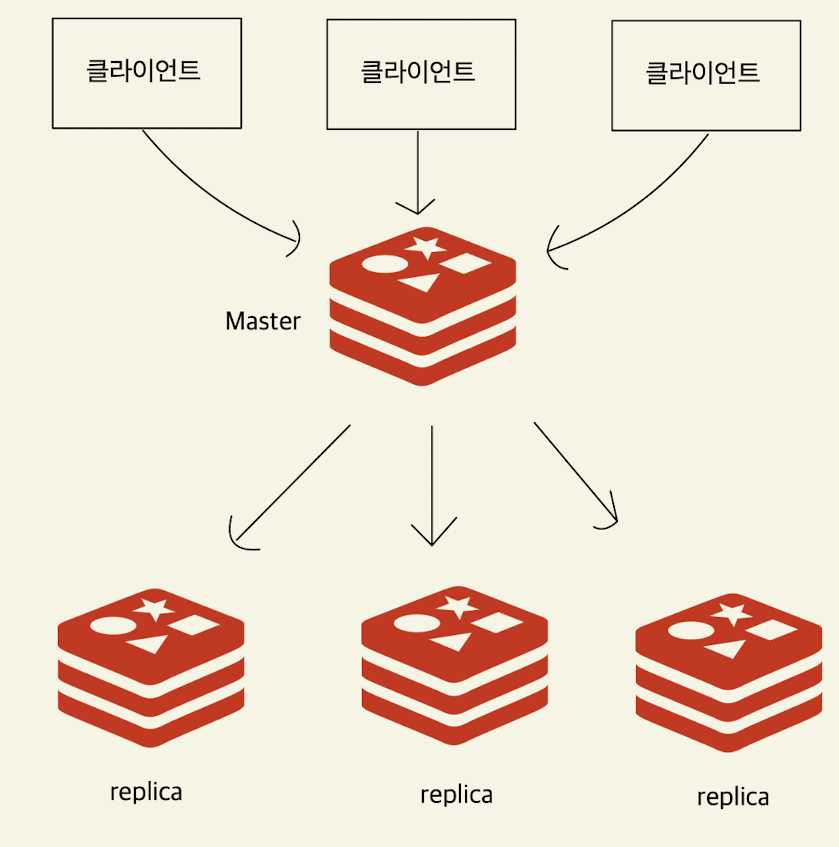
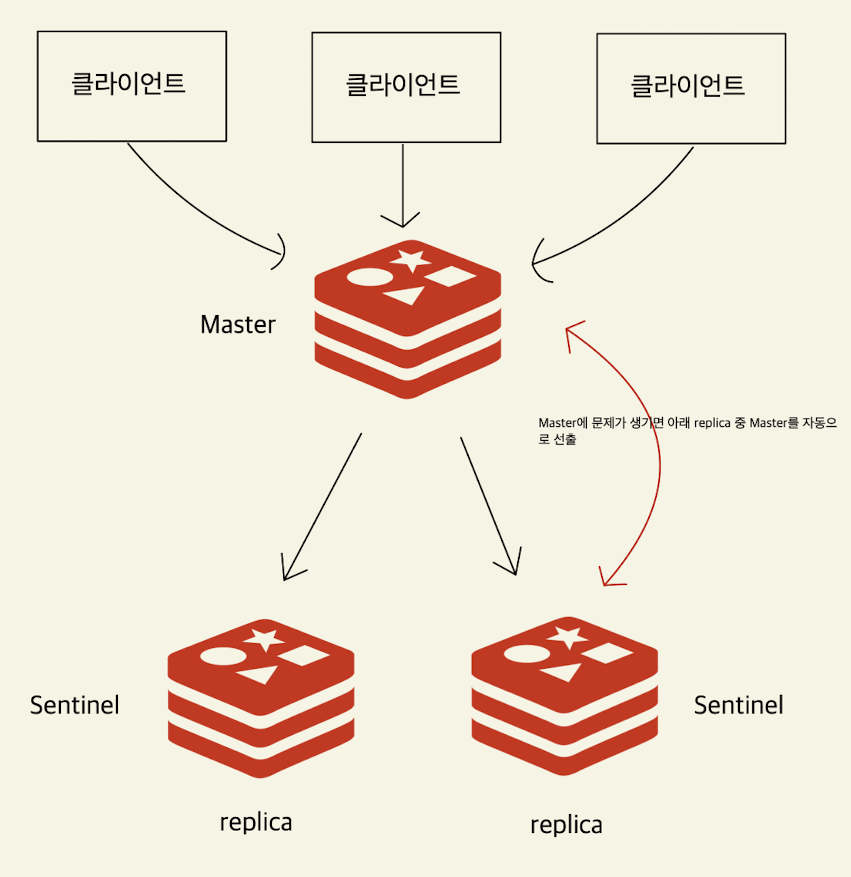
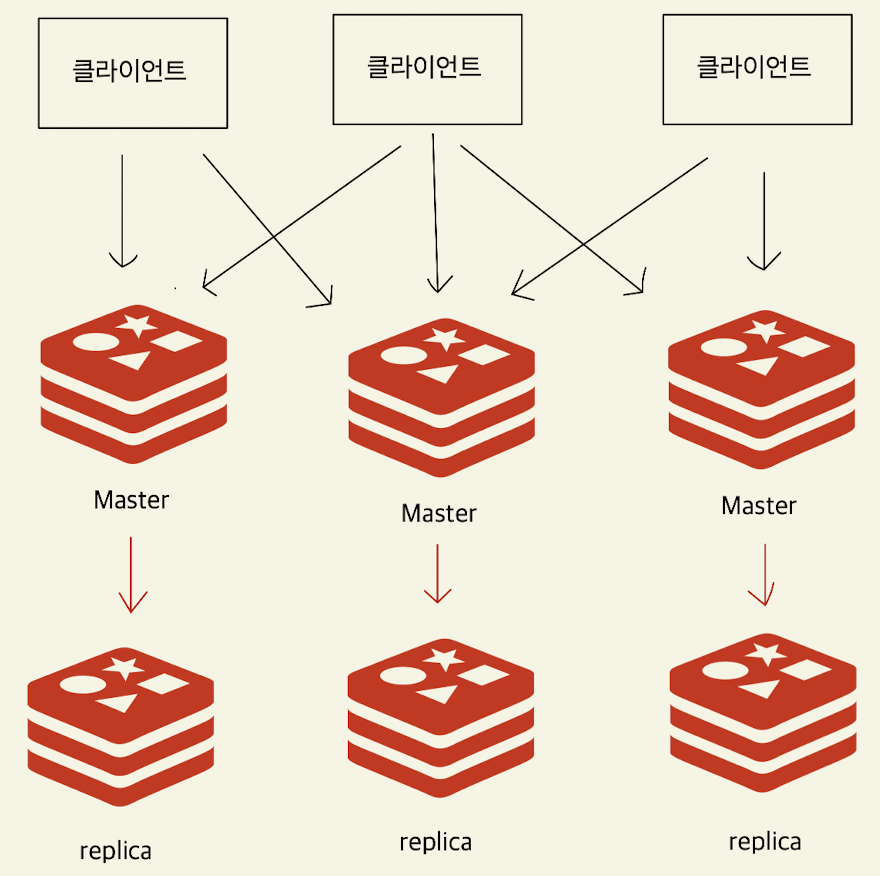

# Redis
Redis는 메모리 기반의 데이터 저장소다. key-value 구조이며 다양한 형태의 자료구조를 제공한다.  
메세지큐로(PUB/SUB)도 사용이 가능하고, 메모리에 데이터를 저장하기 때문에 빠른 처리속도가 장점이며 레디스 내부에서 명령어를 처리하는 부분은 싱글 스레드로 동작한다. 

## Redis Instance
레디스 인스턴스를 하나만 띄워서 처리하는 경우 여러 클라이언트가 하나의 redis 서버로 요청을 전달한다. 단일 redis 서버에 문제가 발생하면 장애로 인해 모든 클라이언트에서 접속이 불가능해진다.  
이러한 문제를 막기 위해 여러가지 기술이 제공된다.

### Redis replication
master와 replica로 구성되어 있으며, 모든 클라이언트는 master를 대상으로 값을 변경하거나 업데이트한다. 그 후 master가 이 변화를 replica에 싱크한다. 그리고 replica는 읽기만 가능한 node이며 aksdir replica에 문제가 생기더라도 여러 node에 데이터들은 복제되어 있기 때문에 복구가 가능하고 master에 문제가 생기면 개발자가 replica를 master로 변경할 수 있다.  

결국 개발자가 할 일이 늘어난다. 자동으로 해결할 수 있는 기술이 sentinel이다.  

  

### Redis sentinel
레디스 센티넬은 Redis replication과 비슷하지만 Master에 문제가 생겼을때 replica들이 master를 선출한다. 이 때 이전 master가 복구된 경우 replica로 자동으로 전환되어 새로운 master를 바라보게 되며, 이러한 기능을 Automatic Failover 기능이라고 한다.

  

하지만 이런 방식은 트래픽이 많이 늘어난다면 master에 문제가 생길 수 밖에 없다.  
이런 문제점을 보완하기 위해 제공되는건 Redis Cluster 다.

### Redis cluster
레디스 클러스터는 데이터를 자동으로 파티셔닝하고, client의 요청을 필요한 master 혹은 replica에게 전달한다. 고가용성의 목적 뿐만 아니라 데이터 분산과 자동 파티셔닝 기술이며, 각가의 master에 문제가 생기는 경우 replica가 master 역할을 수행한다.  

  

## Lettuce
**Mongo, R2dbc와는 다르게 Reactive Redis는 Repository를 지원하지 않는다. 따라서 RedisTemplate이 가장 고수준 클래스이며, 동기 방식은 Repository를 사용할 수 있다.**  

Lettuce는 Spring에서 제공하는 기본 connector 이며, 별도의 설정으로 jedis를 사용할 수 있지만 Lettuce에 비해 성능이 떨어져 잘 사용하지 않는다.  
Lettuce는 Reactor를 기반으로 Reactive API를 지원하는데, Reactive streams API 뿐 아니라 동기 API, 비동기 API 모두를 지원한다. Netty(Reactor Netty 아님)와 Reactor를 기반으로 동작하여 일반 TCP 통신  뿐만 아니라 epoll, kqueue 기반의 multiplexing I/O 까지 지원한다.  

### Lettuce 주요 컴포넌트
- RedisClient : Redis의 연결 정보를 포함하는 객체 (RedisConnection 생성)
- StatefulRedisConnection : Redis 서버 Connection 
  - 여러 스레드가 동시에 접근해도 안전하게 사용 가능
  - 동기, 비동기, Reactive command를 제공한다.
- RedisReactiveCommand : Redis API와 관련된 400개 이상의 reactive command를 제공한다.

````java
import io.lettuce.core.RedisClient;
import io.lettuce.core.RedisURI;
import io.lettuce.core.api.reactive.RedisReactiveCommands;
import lombok.extern.slf4j.Slf4j;


@Slf4j
public class ReactiveLettuceExample {

  public static void main(String[] args) {
    RedisClient redisClient = RedisClient.create(
            RedisURI.builder()
                    .withHost("localhost")
                    .withPort(6379)
                    .build()
    );
    StatefulRedisConnection<String, String> connection = redisClient.connect();
    RedisReactiveCommands<String, String> commands = connection.reactive();

    commands.set("name", "capo")
            .then(commands.get("name"))
            .subscribe(value -> log.info("value : {}", value));
    
    Thread.sleep(1000);
  }
}
````
  

기본적인 ReactiveCommands 방식이며, 동기적인 방식은 commands를 sync로 획득하면 된다. 간단한 예제를 보면

````java
import io.lettuce.core.RedisClient;
import io.lettuce.core.RedisURI;
import io.lettuce.core.api.StatefulRedisConnection;
import io.lettuce.core.api.async.RedisAsyncCommands;
import io.lettuce.core.api.reactive.RedisReactiveCommands;
import lombok.extern.slf4j.Slf4j;

@Slf4j
public class SyncLettuceExample {
  public static void main(String[] args) {
    RedisClient redisClient = RedisClient.create(
            RedisURI.builder()
                    .withHost("localhost")
                    .withPort(6379)
                    .build()
    );
    
    StatefulRedisConnection<String, String> connection = redisClient.connect();
    // 퍼블리셔가 반환되는게 아니기 때문에 훨씬 직관적이고 사용하기 간편하다.
    RedisCommands<String, String> syncCommands = connection.sync();
    String syncResult = syncCommands.set("age", "10");
    log.info("syncResult : {}", syncResult);

    RedisAsyncCommands<String, String> asyncCommands = connection.async();
    // async는 RedisFuture가 반환되는데, CompletableFuture와 유사하다.
    asyncCommands.set("gender", "M")
            .thenAccept(result -> {
                log.info("AsyncResult : {}", result);
            });
    
    Thread.sleep(1000);
  }
}
````
### RedisReactiveCommands
RedisReactiveCommands는 여러 타입의 commands를 상속한다. 클래스 이름과 데이터타입이 맵핑돼서 사용된다.  
String, List, Set, Hash, SortedSet, Stream, HyperLogLog... 등등
````java
RedisAclReactiveCommands<K, V>, 
RedisClusterReactiveCommands<K, V>, 
RedisGeoReactiveCommands<K, V>, 
RedisHashReactiveCommands<K, V>,
RedisHLLReactiveCommands<K, V>,
RedisKeyReactiveCommands<K, V>,
RedisListReactiveCommands<K, V>,
RedisScriptingReactiveCommands<K, V>, 
RedisServerReactiveCommands<K, V>,
RedisSetReactiveCommands<K, V>, 
RedisSortedSetReactiveCommands<K, V>, 
RedisStreamReactiveCommands<K, V>,
RedisStringReactiveCommands<K, V>, 
RedisTransactionalReactiveCommands<K, V>
````

## String

````java
import io.lettuce.core.RedisClient;
import io.lettuce.core.RedisURI;
import io.lettuce.core.api.StatefulRedisConnection;
import io.lettuce.core.api.reactive.RedisReactiveCommands;
import lombok.extern.slf4j.Slf4j;

@Slf4j
public class StringExample {

    public static void main(String[] args) {
      RedisClient redisClient = RedisClient.create(
              RedisURI.builder()
                      .withHost("localhost")
                      .withPort(6379)
                      .build()
      );
    
      StatefulRedisConnection<String, String> connection = redisClient.connect();
      RedisReactiveCommands<String, String> commands = connection.reactive();
      
      // set을 통해서 person:1:name, person:1:age를 설정
      commands.set("person:1:name", "capo") 
                      .then(commands.set("person:1:age", "20")
                      // setnx로 값을 바꾸려고 하지만 이미 key value가 존재하기 때문에 미반영
                      .then(commands.setnx("person:1:name", "notchanged"))
                      .then(commands.get("person:1:name"))
                      // name: capo
                      .doOnNext(name -> log.info("name : {}", name))
                      // get은 value, mget은 KeyValue를 반환
                      .thenMany(commands.mget("person:1:name", "person:1:age"))
                      .doOnNext(keyValue -> log.info("keyValue: {}", keyValue))
                      // incrby를 통해서 key값을 증가
                      .then(commands.incrby("person:1:age", 10))
                      .doOnNext(result -> log.info("result: {}", result)))
                      .subscribe();
    
      Thread.sleep(1000);
    }
}
````
### List (queue, stack)
lpqush를 이용해서 값들을 추가하고, llen을 이용해서 길이를 파악이 가능하다. rpop을  하면 가장 처음에 들어간 item이 pop되기 때문에 queue를 구현할 수 있다.  

stack은 queue와 반대로 LIFO로 구현되기 때문에 반대로 가장 마지막에 들어간 아이템을 lpop을 이용하면 구현할 수 있다.

````java

import io.lettuce.core.RedisClient;
import io.lettuce.core.RedisURI;
import io.lettuce.core.api.StatefulRedisConnection;
import io.lettuce.core.api.reactive.RedisReactiveCommands;
import lombok.extern.slf4j.Slf4j;

@Slf4j
public class ListQueueExample {
  public static void main(String[] args) {
    RedisClient redisClient = RedisClient.create(
            RedisURI.builder()
                    .withHost("localhost")
                    .withPort(6379)
                    .build()
    );

    StatefulRedisConnection<String, String> connection = redisClient.connect();
    RedisReactiveCommands<String, String> commands = connection.reactive();
    
    /* queue */
    var queue1 = "queue:1";
    commands.lpush(queue1, "100")
            .then(commands.lpush(queue1, "200"))
            .then(commands.llen(queue1))
            // queue:1 len: 2
            .doOnNext(len -> log.info("queue:1 len: {}", len))
            .then(commands.rpop(queue1))
             // pop : 100
            .doOnNext(pop -> log.info("pop: {}", pop))
            .then(commands.rpop(queue1))
            // pop : 200
            .doOnNext(pop -> log.info("pop : {}", pop))
            .subscribe();
  }
}

````

### Set
Set은 value들이 고유하게 유지하고 싶을때 사용한다.

````java
import io.lettuce.core.RedisClient;
import io.lettuce.core.RedisURI;
import io.lettuce.core.api.StatefulRedisConnection;
import io.lettuce.core.api.reactive.RedisReactiveCommands;
import lombok.extern.slf4j.Slf4j;

@Slf4j
public class SetExample {
  public static void main(String[] args) {
    RedisClient redisClient = RedisClient.create(
            RedisURI.builder()
                    .withHost("localhost")
                    .withPort(6379)
                    .build()
    );

    StatefulRedisConnection<String, String> connection = redisClient.connect();
    RedisReactiveCommands<String, String> commands = connection.reactive();

    var set1 = "set:1";
    commands.sadd(set1, "100")
            .doOnNext(added -> log.info("added: {}", added))
            .then(commands.sadd(set1, "100", "200", "300"))
            .doOnNext(added -> log.info("added: {}", added))
            .then(commands.scard(set1))
            .doOnNext(scard -> log.info("set card: {}", scard))
            .thenMany(commands.smembers(set1))
            .doOnNext(member -> log.info("member: {}", member))
            .then(commands.sismember(set1, "100"))
            .doOnNext(result -> log.info("result: {}", result))
            .then(commands.sismember(set1, "999"))
            .doOnNext(result -> log.info("result: {}", result))
            .then(commands.srem(set1, "100"))
            .subscribe();
  }
}

````
````text
[lettuce-nioEventLoop-4-1] - added: 1
[lettuce-nioEventLoop-4-1] - added: 2
[lettuce-nioEventLoop-4-1] - set card: 3
[lettuce-nioEventLoop-4-1] - member: 100
[lettuce-nioEventLoop-4-1] - member: 200
[lettuce-nioEventLoop-4-1] - member: 300
[lettuce-nioEventLoop-4-1] - result: true
[lettuce-nioEventLoop-4-1] - result: false
````
sadd를 통해 값을 추가하고 결과로 추가된 개수를 반환한다. set은 값이 unique 하기 때문에 이미 존재하는 item에 대해서는 무시하고 scard를 통해서 set의 cardinality를 반환하고 smembers로 모든 item을 조회, sismember로 redis에 item이 포함되는지 확인한다. srem으로 item을 삭제한다


### Hash
Java에서 제공하는 Map과 유사하게 사용할 수 있다. 

````java 

import io.lettuce.core.RedisClient;
import io.lettuce.core.RedisURI;
import io.lettuce.core.api.StatefulRedisConnection;
import io.lettuce.core.api.reactive.RedisReactiveCommands;
import lombok.extern.slf4j.Slf4j;

@Slf4j
public class HashExample {
  public static void main(String[] args) {
      RedisClient redisClient = RedisClient.create(
              RedisURI.builder()
                      .withHost("localhost")
                      .withPort(6379)
                      .build()
      );

      StatefulRedisConnection<String, String> connection = redisClient.connect();
      RedisReactiveCommands<String, String> commands = connection.reactive();

    var hash = "person:1";
    var fieldMap = Map.of("name", "capo", "age", "20", "gender", "M");
    commands.hset(hash, fieldMap)
            .thenMany(commands.hgetall(hash))
            .doOnNext(item -> log.info("item: {}", item))
            .then(commands.hlen(hash))
            .doOnNext(hlen -> log.info("hash len: {}", hlen))
            .then(commands.hincrby(hash, "age", 10))
            .thenMany(commands.hmget(hash, "name", "age"))
            .doOnNext(item -> log.info("item: {}", item))
            .then(commands.hdel(hash, "age"))
            .subscribe();
  }

````
````text
[lettuce-nioEventLoop-4-1] - item: KeyValue[age, 20]
[lettuce-nioEventLoop-4-1] - item: KeyValue[name, capo]
[lettuce-nioEventLoop-4-1] - item: KeyValue[gender, M]
[lettuce-nioEventLoop-4-1] - hash len: 3
[lettuce-nioEventLoop-4-1] - item: KeyValue[name, capo]
[lettuce-nioEventLoop-4-1] - item: KeyValue[age, 30]
````
hset에 map을 제공하여 여러 field를 한번에 추가할 수 있으며, hgetall로 모든 필드에 접근하여 flux로 반환한다. hlen을 통해서 hash의 크기를 조회하고 hincrby로 age 필드의 크기를 10만큼 증가시키고, hmget으로 여러 필드에 대한 값을 조회하고 hdel로 age 필드를 제거한다.  


### SortedSet
set에서 score를 같이 포함시켜서 정렬시키거나 랭크를 할수있는 기능을 제공한다.  

````java
import io.lettuce.core.RedisClient;
import io.lettuce.core.RedisURI;
import io.lettuce.core.api.StatefulRedisConnection;
import io.lettuce.core.api.reactive.RedisReactiveCommands;
import lombok.extern.slf4j.Slf4j;

@Slf4j
public class SortedSetExample {

  public static void main(String[] args) {
    RedisClient redisClient = RedisClient.create(
            RedisURI.builder()
                    .withHost("localhost")
                    .withPort(6379)
                    .build()
    );

    StatefulRedisConnection<String, String> connection = redisClient.connect();
    RedisReactiveCommands<String, String> commands = connection.reactive();

    var zset1 = "zset:1";
    commands.zadd(zset1,
                    ScoredValue.just(10.0, "a"),
                    ScoredValue.just(1.0, "b"),
                    ScoredValue.just(0.1, "c"),
                    ScoredValue.just(100.0, "d")
            )
            .then(commands.zrem(zset1, "d"))
            .doOnNext(result -> log.info("result: {}", result))
            .then(commands.zcard(zset1))
            .doOnNext(len -> log.info("zset len: {}", len))
            .thenMany(commands.zrangeWithScores(zset1, 0, -1))
            .doOnNext(item -> log.info("zset item: {}", item))
            .then(commands.zrank(zset1, "a"))
            .doOnNext(rank -> log.info("rank: {}", rank))
            .subscribe();
  }
}
````
````text
[lettuce-nioEventLoop-4-1] - result: 1
[lettuce-nioEventLoop-4-1] - zset len: 3
[lettuce-nioEventLoop-4-1] - zset item: ScoredValue[0.1, c]
[lettuce-nioEventLoop-4-1] - zset item: ScoredValue[1.0, b]
[lettuce-nioEventLoop-4-1] - zset item: ScoredValue[10.0, a]
[lettuce-nioEventLoop-4-1] - rank: 2
````
zadd를 통해서 score와 value를 추가하고, zrem으로 value를 삭제한다. zcard로 sortedSet의 cardinality를 조회 후 zrangeWithScores로 특정 범위의 값들을 score와 함께 조회하고, zrank로 특정 value의 rank를 조회할 수 있다.  

### TTL
시간을 지정해서 특정 시간동안 유지, 혹은 특정 시간이 지난 후에 동작을 시킬 수 있다. 

````java
import io.lettuce.core.RedisClient;
import io.lettuce.core.RedisURI;
import io.lettuce.core.api.StatefulRedisConnection;
import io.lettuce.core.api.reactive.RedisReactiveCommands;
import lombok.extern.slf4j.Slf4j;


@Slf4j
public class TtlExample {

  public static void main(String[] args) {
      RedisClient redisClient = RedisClient.create(
              RedisURI.builder()
                      .withHost("localhost")
                      .withPort(6379)
                      .build()
      );

      StatefulRedisConnection<String, String> connection = redisClient.connect();
      RedisReactiveCommands<String, String> commands = connection.reactive();

    var nameKey = "person:1:name";
    commands.set(nameKey, "capo")
            .then(commands.expire(nameKey, 5))
            .then(commands.ttl(nameKey))
            .doOnNext(ttl -> log.info("ttl: {}", ttl))
            .then(commands.get(nameKey))
            .doOnNext(value -> log.info("value: {}", value))
            .subscribe();
    
    Thread.sleep(7000);
    
    commands.ttl(nameKey)
            .doOnNext(ttl -> log.info("ttl: {}", ttl))
            .then(commands.get(nameKey))
            .defaultIfEmpty("(empty)")
            .doOnNext(value -> log.info("value: {}", value))
            .subscribe();
  }

````
````text
[lettuce-nioEventLoop-4-1] - ttl: 5
[lettuce-nioEventLoop-4-1] - value: capo
[main] - after 7s
[lettuce-nioEventLoop-4-1] - ttl: -2 
[lettuce-nioEventLoop-4-1] - value: (empty)
````
expire로 key에 ttl을 부여할 수 있고, commands.ttl 을 통해서 key에 남은 ttl을 확인할 수 있다. 지정한 시간이 만료된 경우 key에 조회시 empty를 반환하고 key가 존재하지 않는다면 -2를 반환한다.  

### TTL - persist
TTL을 설정했다가 만료시간을 없애고 싶은 경우에 persist를 통해서 key를 영구하게 보관할 수 있다.

````java
import io.lettuce.core.RedisClient;
import io.lettuce.core.RedisURI;
import io.lettuce.core.api.StatefulRedisConnection;
import io.lettuce.core.api.reactive.RedisReactiveCommands;
import lombok.extern.slf4j.Slf4j;


@Slf4j
public class TtlPersistExample {

  public static void main(String[] args) {
      RedisClient redisClient = RedisClient.create(
              RedisURI.builder()
                      .withHost("localhost")
                      .withPort(6379)
                      .build()
      );

      StatefulRedisConnection<String, String> connection = redisClient.connect();
      RedisReactiveCommands<String, String> commands = connection.reactive();

    commands.set(nameKey, "capo")
            .then(commands.expire(nameKey, 5))
            .then(commands.persist(nameKey))
            .then(commands.ttl(nameKey))
            .doOnNext(ttl -> log.info("ttl: {}", ttl))
            .subscribe();
  }
````
````text
[lettuce-nioEventLoop-4-1] - ttl: -1
````
expire로 key에 ttl을 부여한 후, persist를 통해서 key를 영구하게 보관할 수 있고 key에 ttl이 없는 경우 -1을 반환한다.


#### pub sub
pub/sub은 redis에 값을 넣으면 각각의 다른 connection에 있는 redisClient가 바라보면서 메세지를 구독할 수 있다.

````java
import io.lettuce.core.RedisClient;
import io.lettuce.core.RedisURI;
import io.lettuce.core.api.StatefulRedisConnection;
import io.lettuce.core.api.reactive.RedisReactiveCommands;
import io.lettuce.core.pubsub.StatefulRedisPubSubConnection;
import io.lettuce.core.pubsub.api.reactive.RedisPubSubReactiveCommands;
import lombok.extern.slf4j.Slf4j;


@Slf4j
public class PubSubExample {

  public static void main(String[] args) {
    RedisClient redisClient = RedisClient.create(
            RedisURI.builder()
                    .withHost("localhost")
                    .withPort(6379)
                    .build()
    );

    StatefulRedisPubSubConnection<String, String> connection = redisClient.connectPubSub();
    RedisPubSubReactiveCommands<String, String> commands = connection.reactive();
    
    var channel = "abc";
    commands.subscribe(channel)
            .thenMany(commands.observeChannels())
            .doOnNext(item -> log.info("item: {}", item.getMessage()))
            .subscribe();

    Thread.sleep(1000);
    StatefulRedisConnection<String, String> connection2 = redisClient.connect();
    RedisReactiveCommands<String, String> commands2 = connection2.reactive();

    commands2.publish(channel, "hello")
            .then(commands2.publish(channel, "world"))
            .subscribe();
    Thread.sleep(1000);
  }

````
````text
[lettuce-nioEventLoop-4-1] - item: hello
[lettuce-nioEventLoop-4-1] - item: world
````
StatefulRedisPubSubConnection과 RedisPubSubReactiveCommand를 이용해 서 channel을 subscribe하고 observe 할 수있고, 다른 StatefulRedisConnection을 만들어서 channel에 publish해서 값을 읽어올 수 있다.  
하지만 문제점은 데이터가 휘발되기 때문에 장애가 생기는 경우 큰 문제가 발생할수 있으며, 이런 단점을 보완하기 위해 Redis에서 제공하는 Stream을 사용할수있다.

### Stream
pub/sub은 데이터가 휘발되는 문제가 있었다면 Stream은 데이터를 처음부터 읽는다거나, 추가된 값을 최신부터 읽는다거나 하는 동작을 수행할 수 있다.  


````java

import io.lettuce.core.RedisClient;
import io.lettuce.core.RedisURI;
import io.lettuce.core.api.StatefulRedisConnection;
import io.lettuce.core.api.reactive.RedisReactiveCommands;
import lombok.extern.slf4j.Slf4j;


@Slf4j
public class StreamExample {

  public static void main(String[] args) {
      RedisClient redisClient = RedisClient.create(
              RedisURI.builder()
                      .withHost("localhost")
                      .withPort(6379)
                      .build()
      );

    StatefulRedisConnection<String, String> connection = redisClient.connect()
    RedisReactiveCommands<String, String> commands = connection.reactive();
    
    var streamName = "stream:1";
    var readArgs = XReadArgs.Builder
            .block(10_000) // 최대 대기시간은 10초
            .count(2); // 데이터가 아무리 많아도 2개만 가져가겠다.
  
    // 가장 최근에 들어온것만 read
    var streamOffset = XReadArgs.StreamOffset
            .latest(streamName);
    commands.xread(readArgs, streamOffset)
            .doOnSubscribe(subscription -> {
                log.info("subscribed");
            })
    .subscribe(message -> {
          log.info("message: {}", message);
    });
    
  }
````
특정 stream의 최신 메세지를 읽기 위해 대기한다. xread는 한번 count 만큼의 stream을 받은 후 complete 하고, 지속적으로 listen 하기 위해서는 repeat등을 활용할 수 있다.   
하지만 이 방법또한 문제가 있는데, xread는 block 인자로 받은 시간만큼 connection을 blocking한다. 위 예제같은 경우 10초동안 대기하게 되는것이다.

multi는 일종의 transaction으로 이해하면 되며, xread를 진행하는 동안 즉, blocking이 되는 동안 다른 connection을 만들어서 redis transaction을 이용해서 여러 stream을 xadd로 추가해준다면 blocking없이 사용할 수 있다.  
이렇게 구현하면 block시간을 짧게 갖고 짧은 주기로 polling 하듯이 사용할수도 있을듯하다.
````java

StatefulRedisConnection<String, String> connection2 = redisClient.connect(
RedisReactiveCommands<String, String> commands2 = connection2.reactive();
commands2.multi().subscribe(multiResp -> {
    Flux.mergeSequential(
    commands2.xadd(streamName, Map.of("hello1", "world1")),
    commands2.xadd(streamName, Map.of("hello2", "world2")),
    commands2.xadd(streamName, Map.of("hello3", "world3")),
    commands2.exec()
    ).subscribe();
});

````