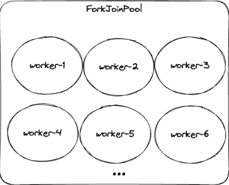
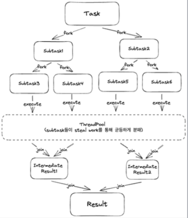

## CompletionStage
- CompletionStage는 일종의 파이프라인으로 각각의 함수를 연결하여 사용할 수 있다.
- 연산자들을 활용하여 비동기 task들을 실행하고 값을 변형하는 등 chaning을 이용한 조합이 가능하다.
- Future의 단점이였던 Exception 처리를 CompletionStage에서는 가능하다.

````java
import com.example.webfluxstudy.basicReactiveProgramming.completableFuture.completionStage.thenAsyncSufix.Helper;
import lombok.extern.slf4j.Slf4j;

@Slf4j
public class CompletionStageExample {
    public static void main(String[] args) {
        Helper.completionStage()
                .thenApplyAsync(value -> {
                    log.info("thenApplyAsync : {}", value);
                    return value + 1;
                }).thenAccept(value -> {
                    log.info("thenAccept : {}", value);
                }).thenRunAsync(() -> {
                    log.info("thenRun");    
                }).exceptionally(e -> {
                    log.info("exceptionally : {}", e.getMessage());
                    return null;
                });
        Thread.sleep(100);
    }
}
````
비동기 None-blocking으로 동작하기 위해서 필요한 조건은, 별도의 스레드를 필요로한다.
CompletionStage(CompletableFuture) 에서는 내부적으로 비동기 함수들을 실행하기 위해 ForkJoinPool을 사용하고 있다.  
ForkJoinPool은 기본 size가 할당된 cpu코어의 -1 개의 갯수를 갖고, 데몬 스레드로 동작하기 떄문에 main 스레드가 종료되면 즉각적으로 종료된다.  
    
ForkJoinPool은 Task에 대한 작업을 subTask 여러개로 나누고, Thread pool에서 steal work 알고리즘을 이용해서 균등하게 처리한다.  
처리된 결과는 join을 통해서 결과를 생성하게 된다.  
  

## CompletionStage 연산자

### thenAccept[Async]
thenAccept는 함수형 인터페이스인 Consumer의 accept와 비슷한 성격을 갖는다.  
이전 task로부터 값을 받지만 값을 넘기지는 않고, 다음 task에게 null이 전달되어 값을 받아서 어떤 특정 로직을 실행할때 사용하면 좋다.
````java

import java.util.concurrent.CompletionStage;

public interface CompletionStage {
    public CompletionStage<Void> thenAccept(Consumer<? super T> action);
    public CompletionStage<Void> thenAcceptAsync(Consumer<? super T> action);
}
````

### thenApply[Async]
thenApply는 Function을 파라미터로 받는다. 이전 task로부터 T 타입의 값을 받아서 가공하고 U 타입의 값을 반환한다.
다음 task에게 반환했던 값이 전달된다. 이는 이전 task에서 넘겨받은 값을 다른 값으로 가공해서 다음 task로 넘겨줄때 유용하게 사용할 수 있다.

````java

import com.example.webfluxstudy.basicReactiveProgramming.completableFuture.completionStage.thenAsyncSufix.Helper;
import lombok.extern.slf4j.Slf4j;

import java.util.concurrent.CompletionStage;

public interface CompletionStage {
    public <U> CompletionStage<U> thenApply(Function<? super T, ? extends U> fn);

    public <U> CompletionStage<U> thenApplyAsync(Function<? super T, ? extends U> fn);
}

@Slf4j
public class CompletionStageThenApplyAsyncExample {
    public static void main(String[] args) {
        var stage = Helper.completionStage();
        stage.thenApplyAsync(value -> {
            var next = value + 1;
            log.info("in thenApplyAsync: {}", next);
            return next;
        }).thenApplyAsync(value -> {
            var next = "result: " + value;
            log.info("in thenApplyAsync: {}", next);
            return next;
        }).thenApplyAsync(value -> {
            var next = value.equals("result : 2");
            log.info("in thenApplyAsync: {}", next);
        }).thenAcceptAsync(value -> log.info("{}", value));
        
        Thread.sleep(100);
    }
}
````
thenAsyncSufix.Helper - return in future  
thenApply.CompletionStageThenApplyAsyncExample - in thenApplyAsync: 2  
thenApply.CompletionStageThenApplyAsyncExample - in thenApplyAsync: result: 2  
thenApply.CompletionStageThenApplyAsyncExample - in thenApplyAsync: true  
thenApply.CompletionStageThenApplyAsyncExample - true  

실행 결과를 보면 Helper 클래스에서 정수 1을 반환하고, 이를 파이프라인에서 연속적으로 +1 증가시키고, 그 값을 문자열로 변환하거나 boolean으로 변경할 수 있다는 것을 의미한다. 

### thenCompose[Async]
- thenCompose는 Function을 파라미터로 받아서 이전 task로부터 T 타입의 값을 받아서 가공하고 U 타입의 CompletionStage를 반환한다.     
반환한 CompletionStage가 done 상태가 될떄까지 기다렸다가 반환된 값을 task에 전달한다.  
다른 future를 compose 내부적으로 호출해서 Future를 연계해서 반환해야 하는 경우 사용한다.  
````java
@Slf4j
public class CompletionStageThenComposeAsyncExample {
    public static void main(String[] args) throws InterruptedException {
        log.info("start main !");

        CompletionStage<Integer> stage = Helper.completionStage();

        stage.thenComposeAsync(value -> {
        // 값을 받아서 값에 +1한 결과를 100미리 세컨드 후에 Future 형태로 반환
            var next = Helper.addOne(value);
        // NotCompleted 상태의 Future 반환 -> next에는 Future가 할당되어 있음.
            log.info("in thenComposeAsync : {}", next); 
            return next;
        }).thenComposeAsync(value -> {
            var next = Helper.addResultPrefix(value);
        // NotCompleted 상태의 Future 반환 :
        // addResultPrefix는 단순히 문자열 result: 를 붙여주는 함수임.
            log.info("in thenComposeAsync2 : {}", next);
            return next;
        }).thenAcceptAsync(value -> {
        // 결과로 result 2 출력
            log.info("{} in thenAcceptAsync", value); 
        });
        Thread.sleep(1000);
    }
}
````
[main] INFO com.example.webfluxstudy.basicReactiveProgramming.completableFuture.completionStage.thenCompose.CompletionStageThenComposeAsyncExample - start main !  
[ForkJoinPool.commonPool-worker-1] INFO com.example.webfluxstudy.basicReactiveProgramming.completableFuture.completionStage.thenAsyncSufix.Helper - return in future  
[ForkJoinPool.commonPool-worker-1] INFO com.example.webfluxstudy.basicReactiveProgramming.completableFuture.completionStage.thenCompose.CompletionStageThenComposeAsyncExample - in thenComposeAsync : java.util.concurrent.CompletableFuture@3ef1289e[Not completed]  
[ForkJoinPool.commonPool-worker-1] INFO com.example.webfluxstudy.basicReactiveProgramming.completableFuture.completionStage.thenCompose.CompletionStageThenComposeAsyncExample - in thenComposeAsync2 : java.util.concurrent.CompletableFuture@34df0c43[Not completed]  
[ForkJoinPool.commonPool-worker-2] INFO com.example.webfluxstudy.basicReactiveProgramming.completableFuture.completionStage.thenCompose.CompletionStageThenComposeAsyncExample - result: 2 in thenAcceptAsync  

실행 결과를 보면 종료되지 않은 CompletableFuture를 반환받지만, 최초에 값이 1로 시작하는 것에서부터 addOne까지의 과정, 그리고 prefix까지의 future 조합이 잘 동작하는 것을 알 수 있다. 

### thenRun[Async]  
- Runnable을 파라미터로 받고, 이전 task로부터 값을 받지 않고 값을 반환하지 않는다.  
- 다음 task에게 null이 전달되며, 시점이 필요한 상황 즉, future가 완료되었다는 이벤트를 기록할 때 사용하면 좋다

````java
import com.example.webfluxstudy.basicReactiveProgramming.completableFuture.completionStage.thenAsyncSufix.Helper;
import lombok.extern.slf4j.Slf4j;

import java.util.concurrent.CompletionStage;

public interface CompletionStage {
    public CompletionStage<Void> thenRun(Runnable action);
    public CompletionStage<Void> thenRunAsync(Runnable action);
}

@Slf4j
public class CompletionStageThenRunAsyncExample {
    public static void main(String[] args) throws InterruptedException {
        log.info("start main");
        // Helper에서 정수 1 반환
        CompletionStage<Integer> stage = Helper.completionStage();
        stage.thenRunAsync(() -> {
            log.info("in thenRunAsync");
        }).thenRunAsync(() -> {
            log.info("in thenRunAsync2");
        }).thenAcceptAsync(value -> {
            log.info("{} in thenAcceptAsync", value);
        });

        Thread.sleep(100);
    }
}
````
[main] INFO com.example.webfluxstudy.basicReactiveProgramming.completableFuture.completionStage.thenRun.CompletionStageThenRunAsyncExample - start main  
[ForkJoinPool.commonPool-worker-1] INFO com.example.webfluxstudy.basicReactiveProgramming.completableFuture.completionStage.thenAsyncSufix.Helper - return in future  
[ForkJoinPool.commonPool-worker-1] INFO com.example.webfluxstudy.basicReactiveProgramming.completableFuture.completionStage.thenRun.CompletionStageThenRunAsyncExample - in thenRunAsync  
[ForkJoinPool.commonPool-worker-1] INFO com.example.webfluxstudy.basicReactiveProgramming.completableFuture.completionStage.thenRun.CompletionStageThenRunAsyncExample - in thenRunAsync2  
[ForkJoinPool.commonPool-worker-1] INFO com.example.webfluxstudy.basicReactiveProgramming.completableFuture.completionStage.thenRun.CompletionStageThenRunAsyncExample - null in thenAcceptAsync  

실행 결과를 보면 이전 task의 값이나 이후 task에게 전달되는 값이 없다.

### exceptionally
- Function을 파라미터로 받고, 이전 task에서 발생한 exception을 받아서 처리하고 값을 반환한다.
- 다음 task에게 반환된 값을 전달하고, future 파이프에서 발생한 에러를 처리할 때 유용하게 사용할 수 있다.

````java
import com.example.webfluxstudy.basicReactiveProgramming.completableFuture.completionStage.thenAsyncSufix.Helper;
import lombok.extern.slf4j.Slf4j;

import java.util.concurrent.CompletionStage;

public interface CompletionStage {
    public CompletionStage<T> exceptionally(Function<Throwable, ? extends T> fn);
}

@Slf4j
public class CompletionStageExceptionallyExample {
    public static void main(String[] args) throws InterruptedException {
        Helper.completionStage()
                .thenApplyAsync(i -> {
                    log.info("in thenApplyAsync");
                    // ArithmeticException 발생 !
                    return i / 0; 
                }).exceptionally(e -> {
                    // 발생한 익셉션을 잡아서 출력!
                    log.info("{} in exceptionally", e.getMessage());
                    // 값을 0으로 변환해서 다음 task로 반환!
                    return 0;
                }).thenAcceptAsync(value -> {
                    // 0을 출력
                    log.info("{} in thenAcceptAsync", value);
                });
        Thread.sleep(1000);
    }
}
````
[ForkJoinPool.commonPool-worker-1] INFO com.example.webfluxstudy.basicReactiveProgramming.completableFuture.completionStage.thenAsyncSufix.Helper - return in future  
[ForkJoinPool.commonPool-worker-2] INFO com.example.webfluxstudy.basicReactiveProgramming.completableFuture.completionStage.exceptionally.CompletionStageExceptionallyExample - in thenApplyAsync    
[ForkJoinPool.commonPool-worker-2] INFO com.example.webfluxstudy.basicReactiveProgramming.completableFuture.completionStage.exceptionally.CompletionStageExceptionallyExample - java.lang.ArithmeticException: / by zero in exceptionally    
[ForkJoinPool.commonPool-worker-2] INFO com.example.webfluxstudy.basicReactiveProgramming.completableFuture.completionStage.exceptionally.CompletionStageExceptionallyExample - 0 in thenAcceptAsync    
실행 결과를 보면 Excpetion이 발생했고, Exception을 잡아서 출력하고, 다시 값을 변경해서 다음 task에 내려줬다. 이는 에러 핸들링이 가능하다는것을 알수있다.    