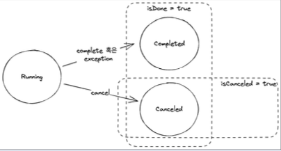

## Future Interface
- 비동기적인 작업을 수행하고 해당 작업이 완료되면 결과를 반환하는 인터페이스

### Future 인터페이스의 주요 메서드

````java
import java.util.concurrent.ExecutionException;
import java.util.concurrent.TimeUnit;
import java.util.concurrent.TimeoutException;

public interface Future<V> {
    boolean cancel(boolean mayInterruptIfRunning);

    boolean isCancelled();

    boolean isDone();

    V get() throws InterruptedException, ExecutionException;

    V get(long timeout, TimeUnit unit) throws InterruptedException, ExecutionException, TimeoutException;
}
````

### Future 예제 작성전에 사용될 Helper Class
```java
public class FutureHelper {
    public static Future<Integer> getFuture() {
        var executor = Executors.newSingleThreadExecutor();
        try {
            return executor.submit(() -> {
                return 1;
            });
        } finally {
            executor.shutdown();
        }
    }

    public static Future<Integer> getFutureCompleteAfter1s() {
        var executor = Executors.newSingleThreadExecutor();

        try {
            return executor.submit(() -> {
                Thread.sleep(1000);
                return 1;
            });
        } finally {
            executor.shutdown();
        }
    }
}
```
- getFuture()는 새로운 스레드를 생성하여 1이라는 값을 반환한다.
- getFutureCompleteAfter1s() - 새로운 스레드를 생성하고 1초 대기 후 1을 반환한다.

### isDone(), isCancelled()
- future의 상태를 반환하는 메서드  
isDone : task가 완료되었다면, 원인과 상관없이 true를 반환한다.
isCancelled: task가 명시적으로 취소된 경우, true를 반환한다.  
  

### get()
- 결과를 구할 때까지 thread가 계속 block 상태로 대기한다.
```java
import com.example.webfluxstudy.basicReactiveProgramming.completableFuture.future.FutureHelper;

import java.util.concurrent.Future;

public class FutureGetExample {
    public static void main(String[] args) {
        // FutureHelper class에서 1을 반환하게 했다.
        Future<Integer> future = FutureHelper.getFuture();
        // 미묘한 차이겠지만 바로 isDone을 호출하면 isDone은 false이다
        assert !future.isDone();
        // future를 명시적으로 종료한적이 없기 때문에 false이다.
        assert !future.isCancelled();
        
        // getFuture 를 통해 반환된 future는 1 이라는 값을 가지고 있다.
        var result = future.get();
        assert result.equals(1);
        
        // 1이라는 값을 반환하고 future는 Completed 되었으니 true이다.
        assert future.isDone();
        // 여전히 cancel을 명시적으로 사용하지 않았으니 false이다.
        assert !future.isCancelled();
    }
}
```
- future에서 무한 루프나 오랜 시간이 걸린다면 thread가 blocking 상태를 유지하게 되는데,  
이런 위험한 상태를 방지하게끔 해주는 메서드가 **get에 imteout을 인자로 받는 메서드**이다.  

- 결과를 구할 때까지 timeout동안 thread가 block된다.  
timeout이 넘어가도 응답이 반환되지 않으면 TimeoutException이 발생한다.
```java
import com.example.webfluxstudy.basicReactiveProgramming.completableFuture.future.FutureHelper;

import java.util.concurrent.ExecutionException;
import java.util.concurrent.Future;
import java.util.concurrent.TimeUnit;
import java.util.concurrent.TimeoutException;

public class FutureGetTimeoutExample {
    public static void main(String[] args) {
        Future<Integer> future = FutureHelper.getFutureCompleteAfter1s();
        // 1.5초니까 반환받고 비교 가능
        var result = future.get(1500, TimeUnit.MILLISECONDS);
        assert result.equals(1);

        Future futureToTimeout = FutureHelper.getFutureCompleteAfter1s();
        Exception exception = null;
        try {
            // getFutureCompleteAfter1s 안에서 1초 대기
            // 0.5초동안 get 대기 = Excpetion 발생!
            futureToTimeout.get(500, TimeUnit.MILLISECONDS);
        } catch (TimeoutException e) {
            exception = e;
        }
        assert exception != null;
    }
}
```
### cancel(boolean mayInterruptIfRunning)
- future의 작업 실행을 취소한다.
- 취소할 수 없는 상황이라면 false를 반환한다.
- **mayInterruptIfRunning가 false**라면 시작하지 않은 작업에 대해서만 취소한다.

```java
import com.example.webfluxstudy.basicReactiveProgramming.completableFuture.future.FutureHelper;

import java.util.concurrent.Future;
public class FutureCacnelExample {
    public static void main(String[] args) {
        Future future = FutureHelper.getFuture();
        // 인자를 true로 주었기 떄문에 무조건 작업 취소
        var successToCancel = future.cancel(true);
        // 명시적으로 cancel 시켰기 때문에 true
        assert future.isCancelled();
        // 취소되면서 작업이 끝났기 때문에 true
        assert future.isDone();
        // cancel이 되었기 때문에 true
        assert successToCancel;
        
        
        successToCancel = future.cancel(true);
        assert future.isCancelled();
        assert future.isDone();
        assert !successToCancel;
    }
}
```
!! 주의점
- isDone과 isCancelled의 상태값은 그대로 가져온다.   
아래에서 호출한 결과가 successToCancel 값이 false인 이유는,  
다시 cancel을 호출을 해서 취소 시킨게 아니기 때문이다.  
future 생성 -> cancel -> true -> 다시 cancel -> 다시 cancel을 호출했을 때 취소된게 아니기 때문이다.

### Future 인터페이스의 한계
1. cancel을 제외하고 외부에서 future를 컨트롤할 수 없다.
2. 반환된 결과를 get()해서 접근하기 떄문에 비동기 처리가 어렵다.

```java
import com.example.webfluxstudy.basicReactiveProgramming.completableFuture.future.FutureHelper;

import java.util.concurrent.ExecutionException;
import java.util.concurrent.Future;

public class FutureCompleteExample {
    public static void main(String[] args) throws InterruptedException, ExecutionException {
        Future<Integer> futureToComplete = FutureHelper.getFuture();
        // get을 통해 접근하지 않았기 때문에 에러 발생!
        futureToComplete.complete(null);
    }
}
```
- get을 통해 접근을 해야하기 때문에 반환된 결과를 직접 이용 한다는건, **비동기**라고 하기보다 **동기**적인 측면이 강하다.  
Non-blocking 이라고 할수는 있겠지만 자원상에는 계속 호출하고 확인하고 get으로 가져오고 처리를 해야하기 때문에 좋지 않다.  

3. 완료되거나 에러가 발생했는지 구분하기가 어렵다.  
future를 cancel로 명시적으로 종료한 후 isDone을 호출해도 true가 반환되고, Exception이 발생한 Future를 get으로 접근 후 isDone을 호출해도 true가 반환된다.  
Exception을 알아보려면 무조건 catch를 써야하고, isDone만 사용해서는 어떤 이유로 Future가 종료되었는지 알 수 없다.

