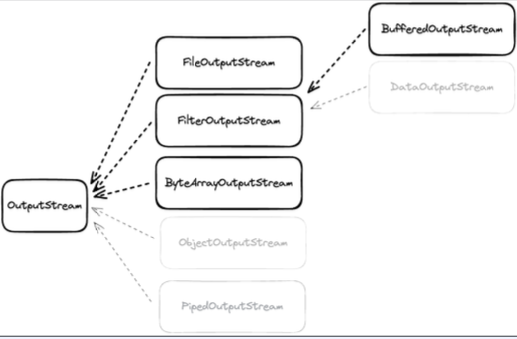
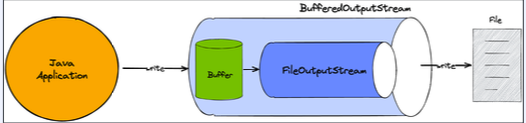
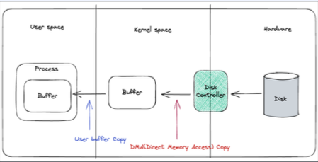
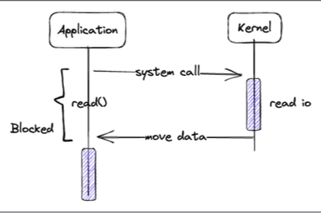

## Java IO - OutputStream
InputStream과 동일하게 Closeable 인터페이스를 구현하고 있고 추가로 Flushable도 같이 구현하고 있다.
명시적으로 close도 가능하고, try-with-resources 사용이 가능하다.  

write시 바로 전송하지 않고 버퍼에 저장한 다음 일정량의 데이터가 모이면 한번에 전달한다. 만약 일정량의 데이터가 모이기 전에 바로 buffer에 있는 값을 전달하고 다음 로직을 처리해야 한다면  
Flushable에서 제공하는 flush 메서드를 사용해서 buffer를 비우고 다음 로직을 수행한 후 원하는 결과를 내보낼 수 있다.

````java
import java.io.Closeable;
import java.io.Flushable;
import java.io.IOException;

public abstract class OutputStream implements Closeable, Flushable {
    // write : stream으로 데이터를 쓴다.
    public abstract void write(int b) throws IOException;
    // flush : 버퍼의 모든 데이터를 출력하고 비운다.
    public void flush() throws IOException;
    // close : stream을 닫고 더 이상 쓰지 않는다.
    public void close() throws IOException;
}
````
어떤 destination에 데이터를 쓸 지에 따라 다양한 구현체가 존재한다.  
FileOutputStream, ByteArrayOutputStream, BufferedOutputStream 등등..   
  

## ByteArrayOutputStream
byte는 JVM에서 관리되기 때문에 write을 할때마다 메모리에 값이 생성된다.  
-> 메모리가 destination이 된다.

````java
@Slf4j
public class ByteArrayOutputStreamExample {
    @SneakyThrows
    public static void main(String[] args) {
        try (var baos = new ByteArrayOutputStream()){
            baos.write(100);
            baos.write(101);
            baos.write(102);
            baos.write(103);
            baos.write(104);

            var bytes = baos.toByteArray();
            log.info("bytes : {}", bytes);
        }
    }
}
````
## FileOutputStream
file에 값을 쓸 수 있고, File 객체나 Path를 통해서 FileOutputStream을 열 수 있다.    
파일에 값을 쓰는동안은 blocking이 발생한다.  
````java
@Slf4j
public class FileOutputStreamExample {
    @SneakyThrows
    public static void main(String[] args) {
        var file = new File(FileOutputStreamExample.class
                .getClassLoader()
                .getResource("dest.txt").getFile());
        
        try (var fos = new FileOutputStream(file)) {
            var content = "키보드 더 사고 싶다 ^^";
            fos.write(content.getBytes());
            fos.flush();
        }
    }
}
````

## BufferedOutputStream
다른 OutputStream과 조합해서 사용이 가능하고 Buffer를 사용한다. 한 번 write을 호출하면 buffer에만 write하고, 추후에 flush하여 한번에 outputStream에 write한다.  


````java
import java.io.BufferedOutputStream;
import java.io.File;

public class BufferedOutputStreamExample {
    @SneakyThrows
    public static void main(String[] args) {
        var file = new File(BufferedOutputStream.class
                .getClassLoader()
                .getResource("dest2.txt")
                .getFile()
        );

        // 파일을 outputStream 에 주고
        var fos = new FileOutputStream(file);
        // FileOutputStream을 BufferedOutputStream에 넘겨줌
        try (var bos = new BufferedOutputStream(fos)) {
            var content = "키보드 더 사고싶다ㅏㅏㅏㅏㅏㅏ";

            bos.write(content.getBytes());
            bos.flush();
        }
    }
}
````
OutputStream은 이미 내부적으로 버퍼를 가지고 있지만, BufferedOutputStream이 존재하는 이유는 더 큰 처리를 위해서다.  
BufferedOutputStream은 더 큰 버퍼를 가지고 있어서 데이터를 효율적으로 처리할 수 있다. 또한, BufferedOutputStream은 명시적으로 flush를 호출하지 않아도 자동으로 버퍼를 비워주기 때문에 개발자가 flush를 신경쓰지 않아도 된다.  

## SocketOutputStream
SocketOutputStream은 public이 아니기 때문에 직접 접근이 불가능하고, socket.getOutputStream으로만 접근 가능하다.
SocketOutputStream에 write을 하는 동안 blocking이 발생한다.
````java
@Slf4j
public class SocketOutputStreamExample {
    @SneakyThrows
    public static void main(String[] args) {
        // 서버 소켓 생성
        ServerSocket serverSocket = new ServerSocket(8080);

        // 클라이언트 리슨 상태로 대기 -> blocking
        Socket clientSocket = serverSocket.accept();

        // 읽어옴
        byte[] buffer = new byte[1024];
        clientSocket.getInputStream().read(buffer);

        // 클라이언트에게 전달하기 위한 값을 쓰기 위한 코드

        // 아웃풋 스트림 가져오기.
        var outputStream = clientSocket.getOutputStream();
        // outputStream으로 BufferedOutputStream을 열기.
        var bos = new BufferedOutputStream(outputStream);
        // 해당 문자열을 byte로 바꾸기.
        var bytes = "키보드 사고싶다.".getBytes();
        // 쓰고
        bos.write(bytes);
        // 플러시!
        bos.flush(); 

        clientSocket.close();
        serverSocket.close();
    }
}
````
InputStream, OutputStream은 무조건 byte로 변환을 해서 통신을 해야한다. 문자열이나 정수 위주로 통신을 자주하게 되는데,  
이런 불편한 점을 해소하기 위해 등장하게 된게 **Java IO Reader와 Writer다.**

## Reader 와 Writer
Java 1.1에서 도입된 Reader와 Writer는 character 단위로 읽고 쓸 수 있는 스트림이며, 문자 인코딩을 지원하고 Read, Write 하는 동안 blocking 방식으로 동작한다.


### FileReader
````java
import java.io.File;

@Slf4j
public class FileReaderExample {
    @SneakyThrows
    public static void main(String[] args) {
        new File(FileReaderExample.class
                .getClassLoader()
                .getResource("koreanhello.txt")
                .getFile());

        // UTF_8로 설정했기 때문에 3바이트씩 읽어온다
        var charset = StandardCharsets.UTF_8;
        try (var fis = new FileReader(file, charset)) {
            var value = 0;
            while ((value = fis.read()) != -1) {
                log.info("value : {}", (char) value);
            }
        }
    }
}
````
### FileWriter

````java
import java.io.File;
import java.io.FileWriter;

@Slf4j
public class FileWriterExample {

    @SneakyThrows
    public static void main(String[] args) {
        new File(FileWriter.class
                .getClassLoader()
                .getResource("FC660MBT.txt")
                .getFile());

        var charset = StandardCharsets.UTF_8;

        try (var fis = new FileWriter(file, charset)) {
            var content = "FC660MBT 사고싶다ㅏㅏㅏ";
            fis.write(content);
        }
    }
}
````

## Java IO 의 한계점

- 커널 버퍼에 직접 접근이 불가하다. 따라서 메모리 copy가 발생한다.  
    
하드웨어에서 값을 읽어오면, 디스크 컨트롤러는 DMA(Direct Memory Access)를 통해 커널 버퍼로 값을 복사한다.  
커널 버퍼에서 값을 가져오는 과정에서는 사용자 버퍼로의 복사가 발생하며, 이는 JVM 버퍼로 복사된다. 이 과정에서 CPU 자원을 사용하고, JVM 버퍼와 메모리에 있기 때문에 가비지 컬렉션의 대상이된다. 이로 인해 CPU 자원이 또 소모되는 부담이 발생된다.  


- 동기 blocking으로 동작한다.
  
application이 read를 호출하면, Kernel이 응답을 돌려줄때까지, 아무것도 할 수 없다.
I/O 요청이 발생할 때마다 스레드를 새로 할당하면, 스레드를 생성 및 관리하는 비용과 컨텍스트 스위칭으로 인한 CPU 자원이 소모된다.    


 
