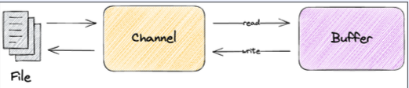
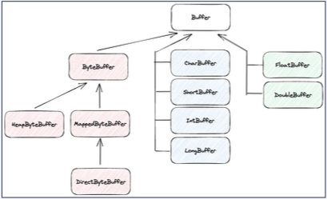
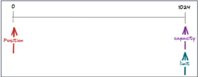
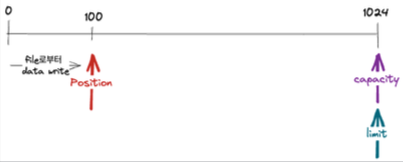
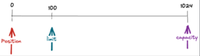
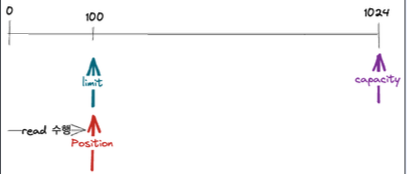
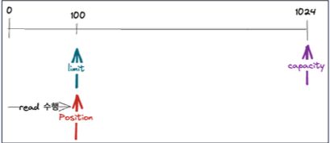
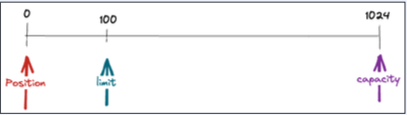
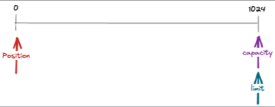
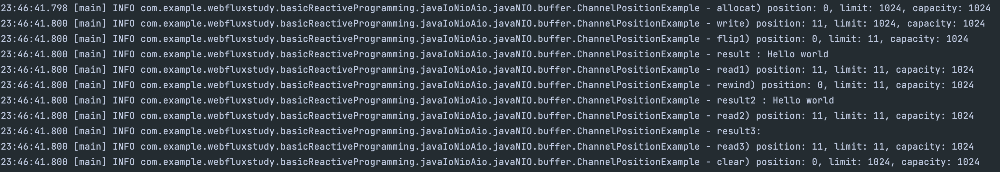

## Java NIO
Java 1.4부터 도입된 NIO는 기존의 Java IO의 단점을 보완하기 위해 도입되었다. NIO는 Non-blocking이 아니라 Java New Input/Out의 약자로, 파일과 네트워크 데이터를 읽고 쓰는 API를 제공한다. 이는 기존의 Stream 기반의 입출력 대신 Buffer 기반으로 작동하고, Non-blocking을 지원하여 성능을 향상시켰다. Selector와 Channel이 도입되어 높은 성능이 보장된다.  

## Java NIO 와 Java IO의 비교
|            | Java NIO                                | Java IO                   |
|------------|-----------------------------------------|---------------------------|
| 데이터의 흐름    | 양방향                                     | 단방향                       |
| 종류         | Channel                                 | InputStream, OutputStream |
| 데이터의 단위    | buffer                                  | byte 혹은 character         |
| blocking 여부 | non-blocking 지원<br/> (blocking한 API도 존재) | blocking만 가능              |
| 특이사항       | Selector 지원                             | -                         |

## Channel 과 Buffer
  
- 데이터를 읽을 때 : 적절한 크기의 Buffer를 생성하고 Channel의 read() 메서드를 사용하여 데이터를 Buffer에 저장한다.
- 데이터를 쓸 때 : 먼저 Buffer에 데이터를 저장하고 Cahnnel의 write() 메서드를 사용하여 목적지로 전달한다.
- clear() 메서드로 초기화하여 다시 사용이 가능해진다.

## Buffer의 종류 
Buffer 인터페이스를 구현한 많은 종류의 구현체가 존재하고, 각 데이터 단위의 이름을 가져와서 구현한 Buffer들이 존재한다.  
Byte, Char, Short, Int, Long, Float, Double.. 등...
  

## Buffer의 위치 속성
Buffer는 데이터를 읽고 쓴다. 그렇기 때문에 위치 속성을 갖게 된다.
1. capacitiy : Buffer가 저장할 수 있는 데이터의 최대 크기. Buffer 생성시 결정되며 변경이 불가능하다.
2. position : Buffer에서 현재 위치를 가리킨다. 버퍼에서 데이터를 읽거나 쓸 때, 해당 위치부터 시작하고 Buffer에 1Byte가 추가될 때마다 1씩 증가한다.
3. limit : Buffer 에서 데이터를 읽거나 쓸 수 있는 마지막 위치. limit 이후로 데이터를 읽거나 쓰기 불가. 최초 생성시 capacity와 동일하다.
4. mark : 현재 position 위치를 mark()로 지정할 수 있고 reset() 호출시 position을 mark로 이동시킨다.

## Buffer 위치 초기 상태
  
capacity는 초기 주어진 값으로 세팅하고, limit은 capacity와 동일하게 만들어진다. 현재 위치를 가리키는 position도 0으로 생성된다.

## Buffer 위치 메서드 - flip
flip은 Buffer의 limit 위치를 현재 Position 위치로 이동시키고, position을 0으로 리셋시킨다. Buffer를 쓰기 모드에서 읽기 모드로 전환하는 경우 사용한다.   

  
resource로부터 값을 읽어와서 100 위치까지 buffer에 적재해둔 상황이라면, 100 이후로는 접근도 안되고 읽을 수 있는 범위는 0~100까지다.  

  
0~100까지 buffer에 데이터가 있는 상황에서 flip을 사용하게 되면 limit의 위치가 100으로, position 즉, 현재 위치가 0으로 설정되어 100 이후로는 접근도 안되고 데이터 적재도 불가능해진다.

    
최종적인 모습은 이 그림과 같아진다.   


## Buffer 위치 메서드 - rewind
Buffer의 position 위치를 0으로 리셋하고, limit은 유지한다. limit은 유지가 되기 때문에 데이터를 처음부터 다시 읽는 경우에 사용한다.  

      
      
쉽게 생각해서 limit은 유지하고, 내 위치만 reset 시켜서 처음으로 돌아간다고 생각하면 된다.  

## Buffer 위치 메서드 - clear
Buffer의 limit 위치를 capacity 위치로, 초기에 주어진 위치로 이동시키고 position을 0으로 리셋한다. 즉, Buffer를 초기에 생성됐던 상태로 만든다.  
    

````java
@Slf4j
public class ChannelPositionExample {

    @SneakyThrows
    public static void main(String[] args) {
        var file = new File("/study/webfluxStudy/src/main/java/com/example/webfluxstudy/javaIoNioAio/javaNIO/buffer/test.txt");

        // fileChannel 을 열어서 파일에 있는 내용을 가져옴
        try (var fileChannel = FileChannel.open(file.toPath())){
            // 1kb 짜리 공간을 만듬
            var byteBuffer = ByteBuffer.allocate(1024);
            logPosition("allocat", byteBuffer);

            // file로부터 값을 읽어서 byteBuffer에 write
            fileChannel.read(byteBuffer);
            logPosition("write", byteBuffer);

            // flip() 을 호출하여 읽기모드로 전환
            byteBuffer.flip();
            logPosition("flip1", byteBuffer);

            // 읽기모드로 전환하여 처음부터 limit (마지막까지 write한 위치까지)까지 읽음
            var result = StandardCharsets.UTF_8.decode(byteBuffer);
            log.info("result : {}", result);
            logPosition("read1", byteBuffer);

            byteBuffer.rewind();
            logPosition("rewind", byteBuffer);

            var result2 = StandardCharsets.UTF_8.decode(byteBuffer);
            log.info("result2 : {}", result2);
            logPosition("read2", byteBuffer);

            var result3 = StandardCharsets.UTF_8.decode(byteBuffer);
            log.info("result3: {}", result3);
            logPosition("read3", byteBuffer);

            byteBuffer.clear();
            logPosition("clear", byteBuffer);
        }
    }

    private static void logPosition(String action, ByteBuffer byteBuffer) {
        log.info("{}) position: {}, limit: {}, capacity: {}",
                action,
                byteBuffer.position(),
                byteBuffer.limit(),
                byteBuffer.capacity());
    }
}
````

예제 코드의 실행 결과는 다음과 같다. 다른 메서드의 결과들은 position, limit, capacity 출력된 값을 보면 이해가 잘 된다.  
result3의 값이 왜 비어 있는지 잘 생각해보도록 하자...!
