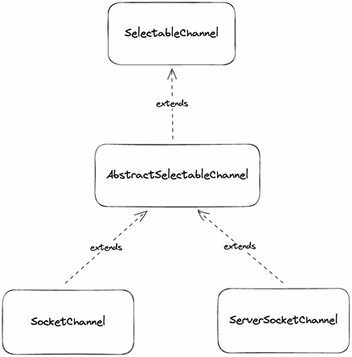

## DirectBuffer, HeapByteBuffer
Java IO의 단점 중 커널 버퍼에 직접 접근이 불가능해서 메모리 copy가 발생해 CPU 자원이 소모된다는 단점이 있다.  
JavaNIO 에서는 이런 단점을 보완한 DirectByteBuffer, HeapByteBuffer를 제공한다.  

DirectByteBuffer의 특징은 native메모리(off-heap)에 저장하고, 커널 메모리에서 복사를 하지 않으므로 데이터를 읽고 쓰는 속도가 빠르며 비용이 많이 드는 system call을 사용하므로 allocate, deallocate가 느리다는 특징을 가지고 있다.  
HeapByteBuffer의 특징은 JVM heap 메모리에 저장하고 byte array를 랩핑하고 있다. 커널 메모리에서 복사가 일어나게 되는데 이 과정에서 임시로 Direct Buffer를 만들기 때문에 읽고 쓰는 성능에 저하가 생긴다. 그리고 gc에서 관리 되므로 allocate, deallocate가 빠르다.

## ByteBuffer의 구분
- DirectByteBuffer : allocateDirect() 함수로 생성 가능하다.
- HeapByteBuffer : allocate(), wrap() 함수로 생성 가능하다.
- isDirect()로 구분한다.

````java
import java.nio.ByteBuffer;

public class TestBuffer {
    public static void main(String[] args) {
        var directByteBuffer = ByteBuffer.allocateDirect(1024);
        assert directByteBuffer.isDirect();
        
        var heapByteBuffer = ByteBuffer.allocateDirect(1024);
        assert !heapByteBuffer.isDirect();
        
        var byteBufferByWrap = ByteBuffer.wrap("hello".getBytes());
        assert !byteBufferByWrap.isDirect();
    }
}
````

## DirectByteBuffer - FileChannel Read
FileChannel은 FileChannel 하나로 FileInputStream, FileOutputStream의 역할을 할 수 있다.

````java
@Slf4j
public class FileChannelReadExample {
    @SneakyThrows
    public static void main(String[] args) {
        var file = new File(FileChannelReadExample.class
                .getClassLoader()
                .getResource("hello.txt")
                .getFile());

        // 파일 채널 열기
        try (var fileChannel = FileChannel.open(file.toPath())){
            // 1키로바이트 다이렉트 바이트 버퍼 생성
            ByteBuffer byteBuffer = ByteBuffer.allocateDirect(1024);
            // 바이트 버퍼에 fileChannel이 파일 내용을 write
            fileChannel.read(byteBuffer);                                          

            // 파일을 한번 끝까지 읽고 난 후, 
            // 다시 가장 앞으로 position을 0으로 limit을 가장 끝으로 옮겨줌
            byteBuffer.flip();
            
            var result = StandardCharsets.UTF_8.decode(byteBuffer);
            log.info("result : {}", result);
        }
    }
}
````
## HeapByteBuffer - FileChannel Write
````java
import java.io.File;

@Slf4j
public class FileChannelWriteExample {

    @SneakyThrows
    public static void main(String[] args) {
        var file = new File(FileChannelWriteExample.class
                .getClassLoader()
                .getResource("hello.txt")
                .getFile());

        // write 는 별도로 인자에 mode를 넘겨주어야 함
        var mode = StandardOpenOption.WRITE;
        
        // 따로 모드를 넘겨주자
        try (var fileChannel = FileChannel.open(file.toPath(), mode)) {
            // 키보드 ! 라는 내용의 HeapByteBuffer 생성
            var byteBuffer = ByteBuffer.wrap("키보드 !".getBytes()); 
            // 파일 생성
            var result = fileChannel.write(byteBuffer);
            log.info("result : {}", result);
        }
    }
}
````
## Socket connect
channel을 활용한 socket 통신  
SocketChannel을 하나만 생성해서 Read 와 Write을 할 수 있다.  
소켓 프로그래밍에서 Client, Server 코드를 보면 이해가 잘 된다.  
````java
@Slf4j
public class ClientSocketChannel {

    @SneakyThrows
    public static void main(String[] args) {
        // socket 채널 오픈
        try (var socketChannel = SocketChannel.open()){
            // 바인딩
            var address = new InetSocketAddress("localhost", 8080);
            // 커넥팅 -> 커넥팅 될떄까진 블락킹 대기
            var connected = socketChannel.connect(address); 
            log.info("connected : {}", connected );

            String request = "This is client";
            // 힙 바이트 버퍼
            ByteBuffer requestBuffer = ByteBuffer.wrap(request.getBytes());
            // 소켓채널에 write
            socketChannel.write(requestBuffer); 
            requestBuffer.clear();

            // 1키로 바이트 버퍼 생성
            ByteBuffer res = ByteBuffer.allocateDirect(1024);
            // 서버에서 응답받은 결과를 버퍼에 작성
            while (socketChannel.read(res) < 0) { 
                res.flip();
                log.info("response {}", StandardCharsets.UTF_8.decode(res));
                res.clear();
            }
        }
    }
}
````
````java
@Slf4j
public class ServerSocketChannelExample {

    @SneakyThrows
    public static void main(String[] args) {
        try (var serverChannel = ServerSocketChannel.open()){
            var address = new InetSocketAddress("localhost", 8080);
            serverChannel.bind(address);

            // 서버 채널에서 accept ->
            // 클라이언트와 연결 되기 전까지 블락킹 상태로 대기
            try (var clientSocket = serverChannel.accept()) { 
                ByteBuffer buffer = ByteBuffer.allocateDirect(1024);
                clientSocket.read(buffer);
                buffer.flip();

                var request = new String(buffer.array()).trim();
                log.info("request: {}", request);

                var response = "This is server.";
                // response로 byte 버퍼 생성
                var responseBuffer = ByteBuffer.wrap(response.getBytes());
                // 클라이언트에게 넘겨줄 버퍼에 write
                clientSocket.write(responseBuffer); 
                responseBuffer.flip();
            }
        }
    }
}
````

## SelectableChannel
Java NIO를 non-blocking하게 사용하려면 SelectbaleChannel을 사용해야 한다.   
SelectableChannel은 SocketChannel, ServerSocketChannel 모두 AbstractSelectableChannel을 상속하고 있고, AbstractSelectableChannel은 SelectableChannel을 상속하고 있다.     

        

SelectableChannel의 주요 메서드는 configureBlocking과 register 메서드다.  
configureBlocking 메서드를 사용하게 되면 serverSocketChannel의 accept, socketChannel의 connect 등이 non-blocking으로 동작한다.  
기존의 IO나 channel을 사용해서 통신할때 blocking이 발생했던 부분은 accept를 하면서 client가 접속하는것을 기다리고, client에서는 connect가 되기를 기다리면서 blocking이 발생했다.  
SeletableChannel의 configureBlocking을 false로 설정하게 되면 accept와 connect에서 blocking이 발생하지 않는다.
````java
import java.io.IOException;
import java.nio.channels.Channel;
import java.nio.channels.SelectableChannel;
import java.nio.channels.SelectionKey;
import java.nio.channels.spi.AbstractInterruptibleChannel;

public abstract class SelectableChannel extends AbstractInterruptibleChannel implements Channel {
    public abstract SelectableChannel configureBlocking(boolean block) throws IOException;

    public final SelectionKey register(Selector sel, int ops) throws ClosedChannelException;
}
````
## ServerSocketChannel - non-Blocking accept
````java
@Slf4j
public class ServerSocketChannelNonBlockingAcceptOnlyExample {
    @SneakyThrows
    public static void main(String[] args) {
        try (var serverChannel = ServerSocketChannel.open()){
            var address = new InetSocketAddress("localhost", 8080);
            serverChannel.bind(address);

            // configureBlocking 의 default는 true
            //   -> false로 설정 blocking으로 동작
            
            // 아래에서 accept를 호출하는 순간 바로 다음 라인이 동작된다.
            serverChannel.configureBlocking(false);
            
            var clientSocket = serverChannel.accept();
            assert clientSocket == null;
        }
    }
}
````

## ServerSocketChannel - non-Blocking connect
````java
@Slf4j
public class SocketChannelNonBlockingConnectOnlyExample {
    @SneakyThrows
    public static void main(String[] args) {
        try (var socketChannel = SocketChannel.open()){
            var address = new InetSocketAddress("localhost", 8080);
            // non-blocking 설정
            socketChannel.configureBlocking(false); 

            // 커넥트 하는 시점에 바로 false로 결과가 온다.
            var connected = socketChannel.connect(address);
            assert !connected;
        }
    }
}
````