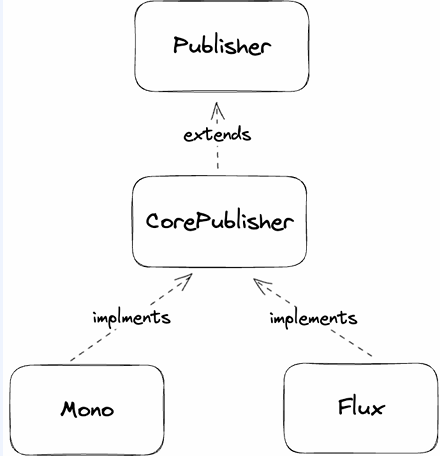
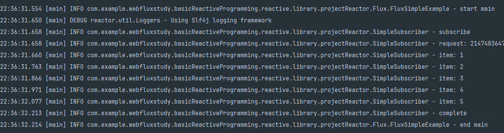
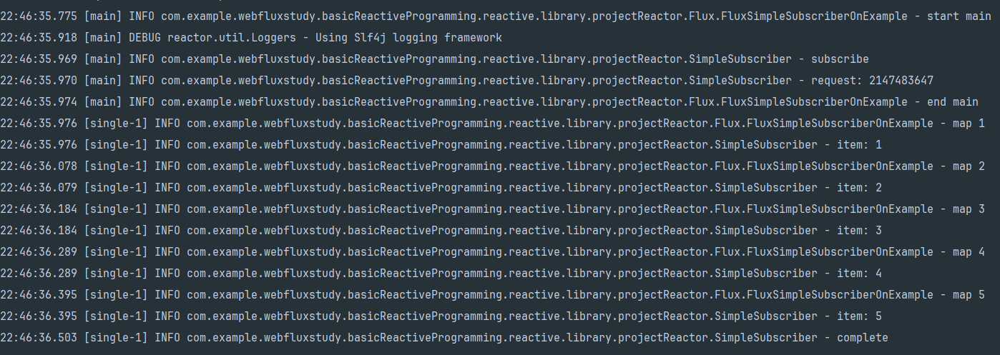
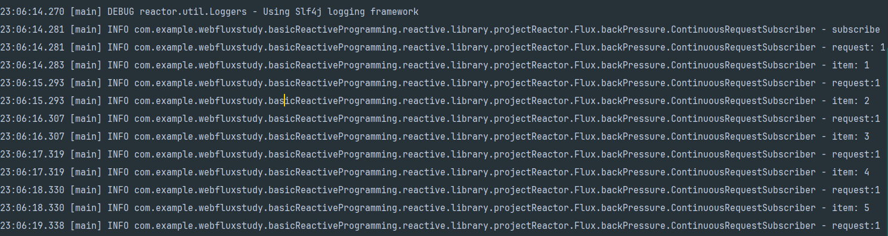
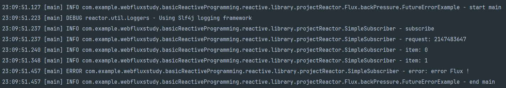

## Project reactor
Reactive Streams는 publisher, subscriber, subscription 개념을 활용하여 메시지를 비동기적으로 교환하고, 이를 이벤트로 전달한다. 또한 backpressure를 통해 필요한 만큼의 요청을 처리할 수 있다.  

Project Reactor는 Reactive Streams를 기반으로 한 라이브러리다. Project Reactor 외에도 RxJava와 Mutiny 같은 라이브러리가 있고, WebFlux의 기본 라이브러리는 Project Reactor다.  

Pivotal에서 개발한 Project Reactor는 Spring Reactor에서 사용되며, Mono와 Flux publisher를 제공한다.    



## SimpleSubscriber
- 예제에 사용할 Subscriber, n개의 갯수를 받고, 딱 한번 n개의 요청을 보내고 요청 보낸만큼 값을 받는 형태의 subscriber
````java
@RequiredArgsConstructor
@Slf4j
public class SimpleSubscriber<T> implements Subscriber<T> {
    private final Integer count;

    @Override
    public void onSubscribe(Subscription s) {
        log.info("subscribe");
        s.request(count);
        log.info("request: {}", count);
    }

    @SneakyThrows
    @Override
    public void onNext(T t) {
        log.info("item: {}", t);
        Thread.sleep(100);
    }

    @Override
    public void onError(Throwable t) {
        log.error("error: {}", t.getMessage());
    }

    @Override
    public void onComplete() {
        log.info("complete ");
    }
}
````


## Project reactor - Flux
- 0..n 개의 item을 전달한다.
- 에러가 발생하면 error signal을 전달하고 종료하고, 모든 item을 전달했다면 complete signal을 전달하고 종료한다. 
- reactive streams의 특징이였던 backpressure도 지원한다.

````java
@Slf4j
public class FluxSimpleExample {
    public static void main(String[] args) {
        // 해당 예제는 전부 main 스레드에서 실행된다.
        log.info("start main");
        // maxValue 만큼 요청
        getItems().subscribe(new SimpleSubscriber<>(Integer.MAX_VALUE)); 
        log.info("end main");
    }
    private static Flux<Integer> getItems() {
        // 1, 2, 3, 4, 5 를 가지고 Flux 객체 생성 
        // -> FixedIntPublisher와 동일하다 (고정된 값을 가지고 Subscriber에게 요청)
        return Flux.fromIterable(List.of(1,2,3,4,5));
    }
}
````
  
실행 결과를 보면 Integer.MAX_VALUE 만큼 요청이 로그에 남는것을 확인할 수 있고, 생성한 Flux의 고정 갯수만큼 item이 실행된걸 알 수 있다  
그리고 onNext 함수의 결과가 전부 다 main 스레드에서 실행됐는데, 이를 다른 스레드에서 실행하게끔 하고 싶다면 어떻게 해야할까?  

## Flux - subscribeOn
- map은 CompletableFuture의 thenApply와 비슷한 역할을 한다. 그리고 이러한 연산을 수행할 때 subscribeOn을 사용하여 다른 스레드에서 실행할 수 있다. 이때 실행하려는 스레드는 Schedulers 클래스를 인자로 받는다.
````java
@Slf4j
public class FluxSimpleSubscriberOnExample {
    // main이 아닌 다른 스레드에서 실행하고 싶다면 subscribeOn() 을 사용하자.
    @SneakyThrows
    public static void main(String[] args) {
        log.info("start main");
        getItems()
                .map(i -> {
                    log.info("map {}", i);
                    return i;
                })
                // 어떠한 스케쥴러를 이용할지 설정 
                // -> singleThread 생성해서 실행하겠다.
                // -> 다양한 스레드 사용 가능
                .subscribeOn(Schedulers.single()) 
                .subscribe(new SimpleSubscriber<>(Integer.MAX_VALUE));
        log.info("end main");
        Thread.sleep(1000);
    }

    private static Flux<Integer> getItems() {
        return Flux.fromIterable(List.of(1,2,3,4,5));
    }
}
````
    
실행 결과를 보면 다른 스레드에서 동작하기 때문에 바로 end main이 호출되고, map과 item이 다른 스레드에서 동작한 것을 확인할 수 있다.

## FLux - subscribe
- CompletableFuture의 문제점이 지연로딩, CompletableFuture를 반환하는 함수를 호출하자마자 실행이 되는 문제점이 있었다. Project reactor는 subscribe하지 않으면 아무런 동작도 하지 않는다.
````java
@Slf4j
public class FluxNoSubscribeExample {
    public static void main(String[] args) {
        log.info("start main");
        // flux를 반환은 받지만, subscribe는 하지 않음
        // -> 아무 동작도 되지 않음
        getItems();
        log.info("end main");
    }
    
    private static Flux<Integer> getItems() {
        return Flux.create(fluxSink -> {
            log.info("start getItems");
            for (int i = 0; i <5; i++) {
                fluxSink.next(i);
            }
            fluxSink.complete();
            log.info("end getItems");
        });
    }
}
````
FluxNoSubscribeExample - start main  
FluxNoSubscribeExample - end main  
실행결과는 중간에 item 로그 같은것을 찍지 않고 main에서의 처리만 이루어진다.  
Publisher를 만든다는것은 데이터나, 요청에 대한 처리를 흘려보내줄 pipeLine을 준비하는거지 무언가의 요청을 처리하는게 아니다. 그래서 subscribe하지 않으면 아무런 동작도 이루어지지 않는것이다.

## Flux - backPressure
````java
public class FluxContinuousRequestSubscriberExample {
    public static void main(String[] args) {
        getItems().subscribe(new ContinuousRequestSubscriber<>());
    }
    private static Flux<Integer> getItems(){
        return Flux.fromIterable(List.of(1,2,3,4,5));
    }
}

@Slf4j
public class ContinuousRequestSubscriber<T> implements Subscriber<T> {
    private final Integer count = 1;
    private Subscription subscription = null;

    @Override
    public void onSubscribe(Subscription s) {
        this.subscription =s;
        log.info("subscribe");
        // count 갯수만큼 요청
        s.request(count); 
        log.info("request: {}", count);
    }

    @SneakyThrows
    @Override
    public void onNext(T t) {
        // 하나 로그 찍고 1초기다리고 처리 , 반복
        log.info("item: {}", t);

        Thread.sleep(1000);
        // 본인이 처리 가능한 만큼만 요청한다.
        subscription.request(1);
        log.info("request:{}", t);
    }

    @Override
    public void onError(Throwable t) {

    }

    @Override
    public void onComplete() {

    }
}
````
          
ContinuousRequestSubscriber를 보면 최초의 count는 1이다. 즉, 최초의 요청은 1이고 1,2,3,4,5 라는 값을 가진 Flux를 흘려보내주게 되면
subscription을 가지고 request를 보내게된다. request를 보내면 onNext에서 1초 기다렸다가 request를 1개씩만 조절해서 Flux에서 흘려보낸 숫자만큼 처리하게 된다.  

## Flux - error
- Flux는 error가 파이프라인 중간에 발생하게 된다면 더 이상 Flux를 진행시키지 않는다..
````java
@Slf4j
public class FutureErrorExample {
    public static void main(String[] args) {
        log.info("start main");
        getItems().subscribe(new SimpleSubscriber<>(Integer.MAX_VALUE));
        log.info("end main");
    }

    private static Flux<Integer> getItems() {
        return Flux.create(fluxSink -> {
            /// 1개 내림
            fluxSink.next(0);
            // 2개 내림
            fluxSink.next(1);
            // 에러를 전달하고 나면 더 이상 Flux는 진행되지 않는다.
            var error = new RuntimeException("error Flux !"); 
            fluxSink.error(error);
        });
    }
}
````
              

## complete
- FLux는 아무런 값도 내리지 않고 바로 complete 시킬 수 있다.
````java
@Slf4j
public class FutureCompleteExample {
    public static void main(String[] args) {
        log.info("start main");
        getItems().subscribe(new SimpleSubscriber<>(Integer.MAX_VALUE));
        log.info("end main");
    }

    private static Flux<Integer> getItems() {
        return Flux.create(fluxSink -> {
            // 비어있는 Flux 생성
            // 바로 complete 호출
            fluxSink.complete();
        });
    }
}
````
비어있는 Flux를 생성하고 Subscriber에게 MAX_VALUE만큼 요청을 했지만, complete를 바로 호출했기 때문에 바로 종료된다