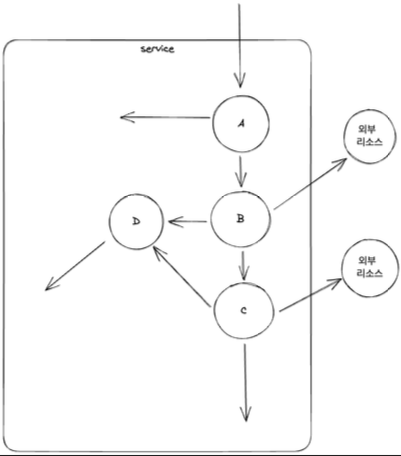
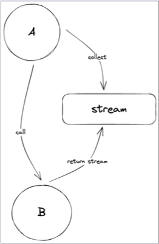
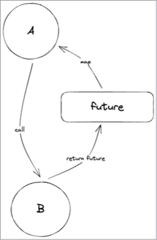
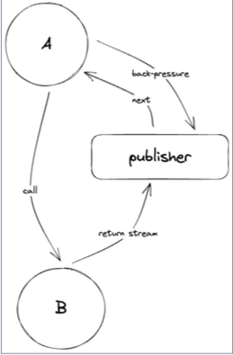

## 일반적인 프로그래밍 패러다임

**Reactive programming**이 아닌 서비스의 패러다임은 구성 요소 혹은 객체는 다른 객체를 직접 호출하고 데이터를 받아야 한다.
이 과정에서 경계가 무너지고 구성 요소의 독립적인 실행이 보장되지 않음며 복원력과 유연성 모두 위협을 받게 된다.  
  

### 이러한 일반적인 프로그래밍에 Reactive manifesto를 대입해서 생각해보면?

- **동기 stream**
  callee는 caller에게 응답이 아닌 stream을 제공하여, callee는 각각의 값을 stream을 통해서 값을 전달한다. 그리고 caller는 해당 stream을 collect 하여 이를 처리한다.  
      

- **비동기 future**
  callee는 caller에게 응답이 아닌 future를 제공한다. 위와 다르게 stream이 아니라 future를 통해서 전달하고, caller는 해당 future를 chaning 하여 이를 처리한다.  
    

동기 stream은 Reactive manifesto의 2가지를 만족하지 못한다.
1. caller와 callee 서로 비동기적으로 메시지를 주고 받으며, 독립적인 실행을 보장해야 한다.
   --> caller는 collect를 통해서 값을 조회해야 한다. 이는 동기적으로 동작 한다는것을 의미한다.
2. 메시지 큐를 생성하고 배압을 적용하여 부하를 관리하고 흐름을 제어한다.
   --> stream이 메시지 큐와 유사한 역할을 하지만, 부하를 관리할 수 없다.

비동기 future는 Reactive manifeso를 대입해본다면
1. 구성 요소는 서로 비동기적으로 메시지를 주고 받으며, 독립적인 실행을 보장한다.
   --> caller와 callee는 비동기적으로 동작한다고 할 수 있다. 이는 manifesto를 만족한다.
2. 메시지 큐를 생성하고 배압을 적용하여 부하를 관리하고 흐름을 제어한다.
   --> future는 메시지 큐의 역할을 할 수 없고, 부하를 관리할 수 없다. 그리고 배압도 적용할 수 없다.

## Reactive stream
**Reactive stream** 은 callee는 caller에게 응답이 아닌 publisher를 제공한다. callee는 각각의 값을 publisher를 통해서 값을 전달하고 caller는 해당 publisher를 subscribe하거나 다른 caller에게 전달한다.
caller는 subscriber를 등록하여 back-pressure를 조절하여 처리 가능한만큼 전달 받는다.(배압 조절)  
  

Reactive stream은 manifesto를 만족한다.
1. 서로 비동기적으로 메시지를 주고 받고 독립적인 실행을 보장한다.
   --> callee는 publisher를 반환하고 caller는 subscriber를 등록한다. 이 과정에서 caller와 callee는 비동기적으로 동작한다.
2. 메시지 큐를 생성하고 배압을 적용하여 부하를 관리하고 흐름을 제어한다.
   --> publisher는 메시지 큐를 생성해서 부하를 관리하고 흐름을 제어한다. back-pressure를 조절할 수 있는 수단을 제공한다.

**Reactive programming**은 비동기 데이터 stream을 사용하는 패러다임이다. 모든 것이 이벤트로 구성되고 이벤트를 통해서 전파되어야 하고 event-driven 해야한다 즉, 데이터의 전달, 에러, 완료 까지 모두 이벤트로 취급한다. 이 모든것을 편하게 구현할 수 있게 만든 라이브러리가 Reactive-streams이다. 

