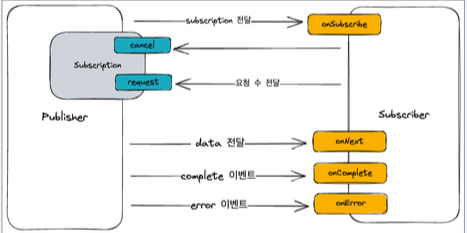
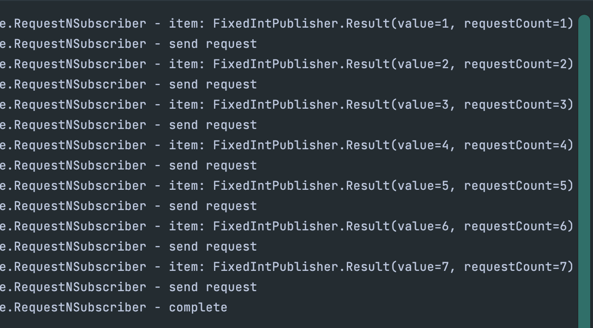
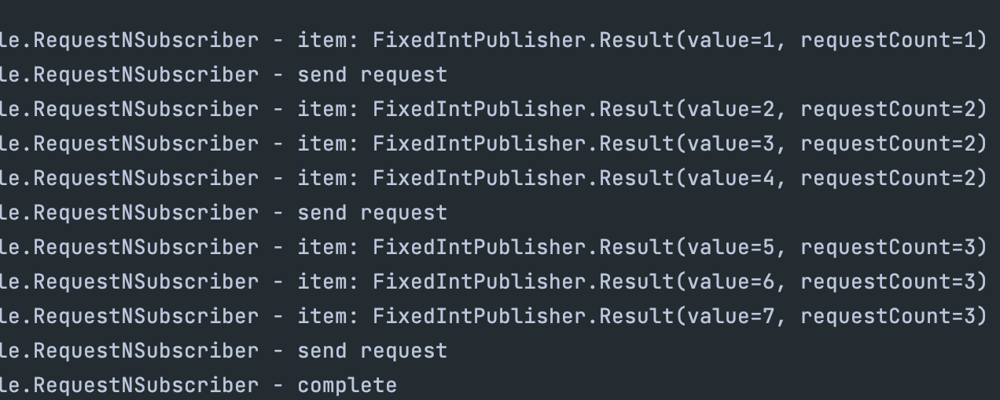
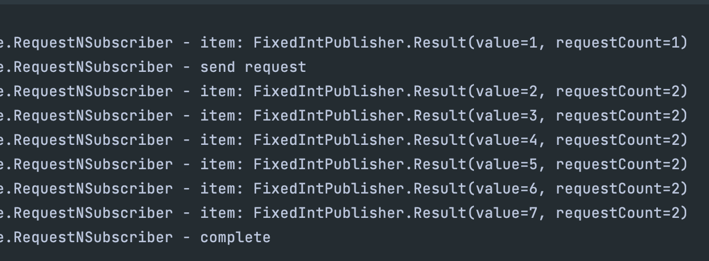

## Reactive streams
- Reactive 시스템을 구성하기 위해서는 Reactive Programming을  사용해야 하고 Reactive Programming을 가장 쉽게 구현할 수 있게 해주는게 Reactive streams다.

### Reactive stream의 구조
- 데이터 혹은 이벤트를 제공하는 **Publisher**
- 데이터 혹은 이벤트를 제공받는 **Subscriber**
- 데이터 흐름을 조절하는 **Subscription**  
  
Publisher는 Subscription을 Subscriber에게 전달하고, Subscription 내부에는 데이터를 얼마나 받고, 데이터를 그만 받을지를 설정할 수 있다.  
이 Subscription으로 Subscriber는 Publisher에게 데이터를 더 요청하거나, 데이터를 그만 받겠다를 조절할 수 있게 된다.  
그리고 Publihser는 각 이벤트를 Subscriber에게 전달한다.

### Publisher? 
- subscribe 함수를 제공하여 publisher 다수의 subscriber 등록을 지원한다.
- subscription을 포함하고 Subscriber가 추가되는 시점에 subscription을 제공한다.
````java
@FunctionalInterface
public static interface Publisher<T> { 
    public void subscribe(Subscriber<? super T> subscriber);
}
````

### Subscriber?
- subscribe하는 시점에 publisher로부터 subscription을 받을 수 있는 인자 제공
- onNext, onError, onComplete를 통해서 값이나 이벤트를 받을 수 있다.
- onNext는 여러 번, onError나 onComplete는 딱 한 번만 호출된다. 
````java
public static interface Subscriber<T> {
    public void onSubscribe(Subscription subscription);
    public void onNext(T item);
    public void onError(Throwable throwable);
    public void onComplete();
}
````
Subscriber는 각각의 이벤트가 들어오는 channel을 구현한다.

### Subscription?
- back-pressure를 조절할 수 있는 request 함수를 제공한다.
- Publisher가 onNext를 통해서 값을 전달 하는것을 취소할 수 있는 cancel 함수를 제공한다.
````java
public static interface Subscription {
    public void request(long n);
    public void cancel();
}
````

## Publisher 와 Subscriber 연동
 

### Publisher - 고정된 숫자의 integer를 전달하는 publisher
- 8개의 integer를 전달 후 complete 처리하는 Publisher

````java
import com.example.webfluxstudy.basicReactiveProgramming.reactive.reactiveStreams.reactiveStreamsExample.IntSubscription;
import lombok.Data;

import java.util.ArrayList;
import java.util.Collections;
import java.util.Iterator;
import java.util.List;
import java.util.concurrent.Flow;

public class FixedIntPublisher implements Flow.Publisher<FixedIntPublisher, Result> {

  @Data
  public static class Result {
    private final Integer value;
    private final Integer requestCount;
  }

  @Override
  public void subscribe(Flow.Subscriber<? super FixedIntPublisher> subscriber) {
    var numbers = Collections.synchronizedList(
            new ArrayList<>(List.of(1, 2, 3, 4, 5, 5, 6, 7))
    );
    
    Iterator<Integer> iterator = numbers.iterator();
    var subscription = new IntSubscription(subscriber, Iterator);
    
    subscriber.onSubscribe(subscription);
  }
}
````
- subscribe 하는 순간, 고정된 숫자를 가진 Array를 만들고, 이 Array를 IntSubscription으로 만든다.  
- subscription은 Publisher가 subscriber에게 전달하는 객체다. 이 객체를 subscriber에게 전달한다.


### IntSubsCription - Publisher에서 Subscriber에게 넘겨줄 Subscription
````java
@Data
public class IntSubscription implements Flow.Subscription{
    
    private final Flow.Subscriber<? super FixedIntPublisher.Result> subscriber;
    private final Iterator<Integer> numbers;
    private final ExecutorService excutor = Executors.newSingleThreadExecutor();
    private final AtomicInteger count = new AtomicInteger(1);
    private final AtomicBoolean isCompleted = new AtomicBoolean(false);

    @Override
    public void request(long n) {
        excutor.submit(() -> {
            for (int i = 0; i < n; i++) {
                if(numbers.hasNext()) {
                    int number = numbers.next();
                    numbers.remove();
                    subscriber.onNext(new FixedIntPublisher.Result(number, count.get()));
                } else {
                    var isChanged = isCompleted.compareAndSet(false, true);
                    if (isChanged) {
                        excutor.shutdown();
                        subscriber.onComplete();
                        isCompleted.set(true);
                    }
                    break;
                }
            }
            // 카운트는 단순하게 몇번째 요청인지를 알기 위한 증가 값이다.
            count.incrementAndGet();
        });
    }

    @Override
    public void cancel() {
        subscriber.onComplete();
    }
}
````
subscriber의 onNext와 subscription의 request가 동기적으로 동작하면 안되기 때문에 excutor를 이용해서 별도의 쓰레드에서 실행한다.  
요청 횟수를 count에 저장하고 결과에 함께 전달하고, 더 이상 iterator에 값이 없으면, onComplete 이벤트를 호출한다.

### ReqeustNSubscriber - n개만큼의 요청을 하는 Subscriber
````java
@Data
@Slf4j
public class RequestNSubscriber<T> implements Flow.Subscriber {
    // Flow.Subscriber를 구현
    // 최초 연결시 1개를 고정적으로 요청한다.
    // onNext에서 count를 세고 n번째 onNext 마다 request
    // onNext, onComplete, onError를ㄹㄹ 받으면 로그 남김

    private final Integer n;
    private Flow.Subscription subscription;
    private int count = 0;

    @Override
    public void onSubscribe(Flow.Subscription subscription) {
        this.subscription = subscription;
        this.subscription.request(1); // 최초 연결시 1개를 고정적으로 요청한다.
    }

    @Override
    public void onNext(Object item) {
      log.info("item: {}", item);
      if (count++ % n == 0) {
          log.info("send request");
          this.subscription.request(n);
      }
    }

    @Override
    public void onError(Throwable throwable) {
        log.error("error : {}", throwable.getMessage());
    }

    @Override
    public void onComplete() {
        log.info("complete");
    }
}
````

### 연동하기

````java
import com.example.webfluxstudy.basicReactiveProgramming.reactive.reactiveStreams.reactiveStreamsExample.FixedIntPublisher;
import com.example.webfluxstudy.basicReactiveProgramming.reactive.reactiveStreams.reactiveStreamsExample.RequestNSubscriber;

import java.util.concurrent.Flow;

public class testPubliserAndSubscriber {
    public static void main(String[] args) {
        Flow.Publisher publisher = new FixedIntPublisher();
        Flow.Subscriber subscriber = new RequestNSubscriber(1);
        publisher.subscribe(subscriber);
        
        Thread.sleep(100);
    }
}
````
### 연동 결과는 ?
### n이 1일때 1개 처리하고 1개 요청을 Complete할 때까지 반복하고, requestCount가 1개씩 증가한다.    
    
### n이 3일때 3개 처리하고 다시 3개 요청을 complete까지 반복한다.  

### n이 Integer.MAX_VALUE일때 요청을 complete할 때까지 반복한다.  
  


