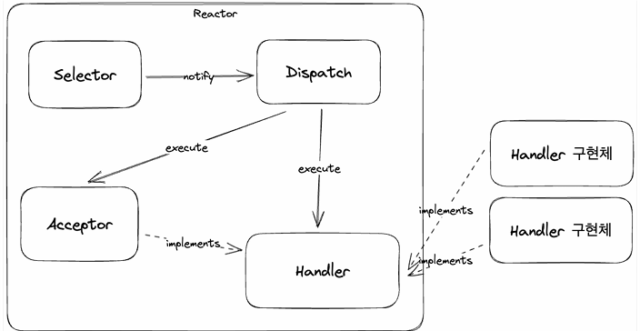

## Reactor pattern
Reactor pattern은 동시에 들어오는 요청을 처리하는 이벤트 핸들링 방식이다.  
Service handler는 요청을 demultiplexing하여 동기적으로 request handler에 전달한다.  
Accept, read, write와 같은 이벤트들을 한 곳에 등록하여 관찰하고, 준비된 이벤트를 request handler에게 전달한다.  
이는 Java NIO의 selector를 이용한 처리와 유사한 방식으로 볼 수 있다.

## Reactor pattern의 구현
Reactor, Selector, Acceptor, EventHandler 구현체로 구성되며, Acceptor는 EventHandler 구현체의 일부이고 accept 이벤트에만 집중한다.  
EventHandler 구현체는 read 이벤트에만 집중할 수 있어야 한다.  

  

Reactor pattern의 구성 요소는 다음과 같다.
1. Reactor : 별도의 스레드에서 실행 되어야 하고, 여러 요청의 이벤트를 등록하고 감시하며, 이벤트가 준비되면 dispatch 한다.
2. Handler : Reactor로부터 이벤트를 받아서 처리할 수 있어야 한다.

풀어서 생각해보면, 별도의 스레드에서 동작해야 한다는것은 Runnable을 구현하고 별도의 스레드에서 run을 구현해서 실행할 수 있다.  
여러 요청의 이벤트를 등록하고 감시한다. 부분은 Selector를 사용해서 구현할 수 있다.  
이벤트가 준비되면 dispatch 한다. 이 부분은 EventHandler 인터페이스를 만들고 call 한다.

````java
import lombok.SneakyThrows;
import lombok.extern.slf4j.Slf4j;

import java.net.InetSocketAddress;
import java.nio.channels.SelectionKey;
import java.nio.channels.Selector;
import java.nio.channels.ServerSocketChannel;
import java.util.Iterator;
import java.util.concurrent.ExecutorService;
import java.util.concurrent.Executors;

@Slf4j
public class Reactor implements Runnable { 
    // 내부에서는 EventHandler 구현에 대해서는 알 수 없어짐. -> Acceptor 가 밖에서 구현되고 주입만 받기 떄문

    private static ExecutorService executorService = Executors.newSingleThreadExecutor();
    private final ServerSocketChannel serverSocket;
    private final Selector selector;
    private final EventHandler acceptor;

    @SneakyThrows
    public Reactor(int port) {
        selector = Selector.open();
        serverSocket = ServerSocketChannel.open();
        serverSocket.bind(new InetSocketAddress("localhost", port));
        serverSocket.configureBlocking(false);

        acceptor = new Acceptor(selector, serverSocket);
        serverSocket.register(selector, SelectionKey.OP_ACCEPT).attach(acceptor);
    }

    @Override
    public void run() {
        executorService.submit(() -> {
            while (true) {
                selector.select();
                Iterator<SelectionKey> selectedKeys = selector.selectedKeys().iterator();

                while (selectedKeys.hasNext()) {
                    SelectionKey key = selectedKeys.next();
                    selectedKeys.remove();

                    dispatch(key);
                }
            }
        });
    }

    private void dispatch(SelectionKey selectionKey) {
        EventHandler eventHandler = (EventHandler) selectionKey.attachment();

        if (selectionKey.isReadable() || selectionKey.isAcceptable()) {
            eventHandler.handle();
        }
    }
}
````
````java
import lombok.SneakyThrows;
import lombok.extern.slf4j.Slf4j;

import java.nio.ByteBuffer;
import java.nio.channels.SelectionKey;
import java.nio.channels.Selector;
import java.nio.channels.SocketChannel;
import java.nio.charset.StandardCharsets;
import java.util.concurrent.CompletableFuture;
import java.util.concurrent.ExecutorService;
import java.util.concurrent.Executors;

@Slf4j
public class TcpEventHandler implements EventHandler{
    private ExecutorService executorService = Executors.newFixedThreadPool(50);
    private final SocketChannel clientSocket;

    @SneakyThrows
    public TcpEventHandler (Selector selector , SocketChannel clientSocket) {
        this.clientSocket = clientSocket;
        this.clientSocket.configureBlocking(false);
        this.clientSocket.register(selector, SelectionKey.OP_READ).attach(this);
    }

    @Override
    public void handle() {
        log.info("start handle");
        // handle 은 요청이 완료된 시점이기 떄문에, 소켓 채널로부터 값을 무조건 읽어와도 된다.
        String requestBody = handleRequest(this.clientSocket);
        sendResponse(this.clientSocket, requestBody);
    }


    @SneakyThrows
    private String handleRequest(SocketChannel clientSocket) {
        ByteBuffer requestByteBuffer = ByteBuffer.allocateDirect(1024);
        clientSocket.read(requestByteBuffer);

        requestByteBuffer.flip();
        String requestBody = StandardCharsets.UTF_8.decode(requestByteBuffer).toString();
        log.info("request: {}", requestBody);

        return requestBody;
    }

    @SneakyThrows
    private void sendResponse(SocketChannel clientSocket, String requestBody) {
        CompletableFuture.runAsync(() -> {
            try {
                Thread.sleep(10);

                String content = "received: " + requestBody;
                ByteBuffer responeByteBuffer = ByteBuffer.wrap(content.getBytes());
                clientSocket.write(responeByteBuffer);
                clientSocket.close();
            } catch (Exception e) { }
        }, executorService);
    }

}

````
````java
import lombok.RequiredArgsConstructor;
import lombok.SneakyThrows;
import lombok.extern.slf4j.Slf4j;

import java.nio.channels.Selector;
import java.nio.channels.ServerSocketChannel;
import java.nio.channels.SocketChannel;

@Slf4j
@RequiredArgsConstructor
public class Acceptor implements EventHandler {
    private final Selector selector;
    private final ServerSocketChannel serverSocketChannel;

    @SneakyThrows
    @Override
    public void handle() {
        SocketChannel clientSocket = serverSocketChannel.accept();
        new TcpEventHandler(selector, clientSocket);
    }
}
````
Reactor 클래스는 주로 I/O 이벤트를 감지하고 처리하기 위한 컴포넌트다.  
Reactor는 별도의 스레드에서 실행되며, Selector를 사용하여 네트워크 이벤트를 감지한다. Selector가 이벤트를 발견하면 해당 이벤트를 처리하기 위해 적절한 EventHandler에게 dispatch한다.

Acceptor는 새로운 클라이언트 연결을 받아들이는 역할을 한다.   
이벤트를 처리하기 위해 Reactor에 의해 호출되며, 새로운 클라이언트가 연결되면 Acceptor는 새로운 TcpEventHandler를 생성하여 해당 클라이언트의 요청을 처리한다.

TcpEventHandler는 각 클라이언트의 요청을 처리하는 역할을 한다. 이 클래스는 클라이언트 소켓과 연결되어 있으며, 클라이언트의 요청을 수신하고 처리한 후에 응답을 보낸다. 비동기적인 방식으로 응답을 처리하기 위해 CompletableFuture를 사용하여 백그라운드에서 작업을 수행한다.  

정리하자면, Reactor는 이벤트를 감지하고 처리하며, Acceptor는 연결을 받아들이고 TcpEventHandler는 요청을 처리하고 응답을 보낸다.  
이러한 패턴, 방식이 Spring-webflux에서 기본 내장되어 있는 netty의 기본적인 원리이다.

꼭 reactive 진영에서 사용되는 netty가 아니여도 Netty 라이브러리를 사용해서 TCP 기반 통신, 포트를 바인딩하고, event handler를 구현해서 이벤트가 발생하면 요청을 처리하는것은 동일하다.  
실무에서 썼던 Netty는 굉장히 편했는데, 이런 동작 과정을 따로 구현해서 해보니 굉장히 어렵고 더 깊은 이해가 필요하다..
