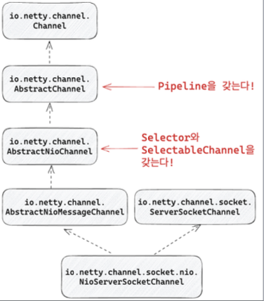
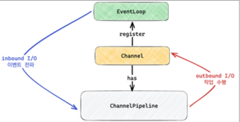
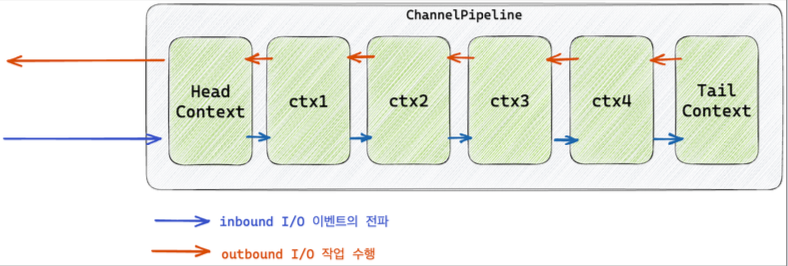
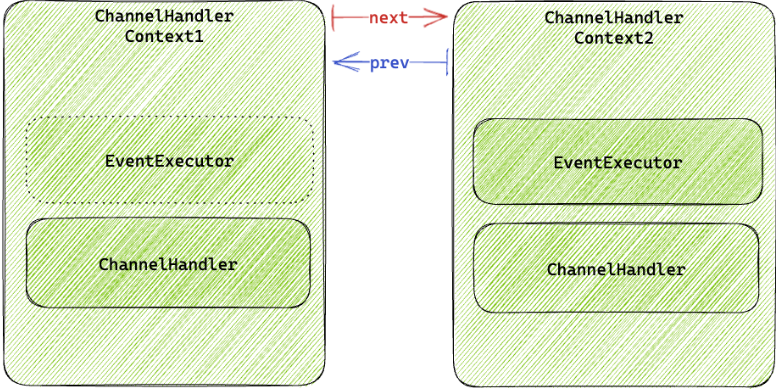

## Channel
Netty에서 중요한 역할을 하는 channel은 JavaNIO에서 사용되는 Channel과 비슷한 역할을 가진다.  
Netty에서의 channel은 pipeline, channelFuture 기능을 추가하여 channel에서 IO 연산이 완료 되었을 때 리스너를 추가하거나 결과를 조회할 수 있는 기능을 제공한다.

## ChannelFuture

````java
import io.netty.util.concurrent.GenericFutureListener;

import java.nio.channels.Channel;

public interface ChannelFuture extends Future<Void> {
    /*
     * Returns a channel where the I/O operation associated with this future takes place.
     */

    Channel channel();

    @Override
    ChannelFuture addListener(GenericFutureListener<? extends Future<? super Void>> listener);

    @Override
    ChannelFuture removeListener(GenericFutureListener<? extends Future<? super Void>> listener);

    @Override
    ChannelFuture sync() throws InterruptedException;
}
````
ChannelFuture는 Channel I/O 작업이 완료되면 isDone이 ture가 되는 Future로, futureListener 등록/삭제를 지원하여 비동기 처리가 가능하다.
futureListener를 등록하고 삭제함으로인해 get으로 접근하지 않아서 더 손쉽고 정확하게 비동기적으로 처리가 가능해진다.

addListener : Channel I/O 작업이 완료되면 수행할 futureListener을 등록한다.  
removeListener : 등록된 futureListener 제거  
sync : 작업이 완료될때까지 blocking 처리한다.

## NioServerSocketChannel
Netty에서는 java nio의 Channel을 사용하지 않고 거의 자체 구현해서 사용한다.  
AbstractChannel : ChannelPipeline을 갖는다.  
AbstractNioChannel : 내부적으로 java.nio.ServerSocketChannel을 저장하고 register할 때 java nio Selector에 등록한다.  
  


## ChannelPipeline 
Channel의 I/O이벤트가 준비되면, EventLoop가 pipeline 실행한다. I/O task에 해당하며, pipelien에서는 결과로 I/O 작업을 수행한다.
    
Channel에서 전체적인 플로우를 보면,    
EventLoop에서 시작해, Selector를 통해서 이벤트가 감지되고 처리가 완료되면 inbound I/O 이벤트가 ChannelPipeline으로 이벤트가 전파된다.   
그리고 channelPipeline을 통해 channel에 write(outbound I/O) 작업을 수행한다.  

ChannelPipeline은 ChannelHandlerContext의 연속으로 구성되어 있다.    
Head context와 Tail context는 기본적으로 무조건 생성되며, 각각의 context는 LinkedList 형태로 next, prev를 통해서 이전 혹은 다음 context에 접근 가능하다.    
inbound I/O 이벤트는 ChannelPipeline으로 들어오는 것이기 때문에 next, outbound 이벤트는 prev로 진행된다.  
    


ChannelHandlerContext의 내부에는 EventExecutor와 ChannelHandler를 포함하고 있고, ChanneelHandler는 I/O 이벤트를 받아서 다음 context에게 넘겨줄 수도 있고, 다음 context에게 넘겨주지 않고 I/O 작업을 수행할 수도 있다.
      
