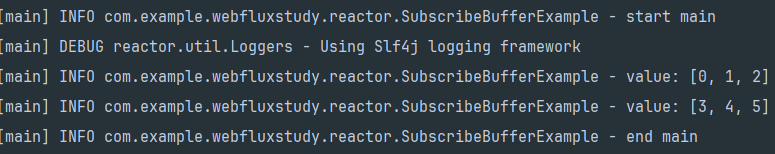
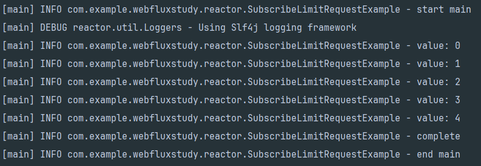

## Reactor
Reactive streams를 구현한 비동기 데이터 스트림 처리를 지원한다.  
Spring webflux에서 메인으로 사용되며, backpressure를 제공하여 안정성을 높이고 다양한 연산자로 다양한 연산들을 조합하여 가독성을 증대시킨다.  

데이터는 소스(Publisher)에서 나와서 소비자(Subscriber)에게 전달된다. 데이터는 다양한 변형과 중간 단계를 거치게되고 중간 부품을 모으는 더 큰 조립 라인의 일부가 된다.  
한 지점에서 결함이 발생하거나 처리가 불가능해진다면 업스트림에 신호를 보내서 흐름 제한도 가능하다.  

## Reactor Publisher
Reactor에서 Mono와 Flux를 제공한다. CorePublisher는 reactive streams의 Publisher를 구현하며, reactive streams와 호환된다.  
  

### Flux
0..n개의 item을 subscriber에게 전달한다.  
subscriber에게 onComplete, onErrorsignal을 전달하면 연결을 종료한다.
모든 event가 optional하기 때문에 다양한 flux를 정의해서 사용 가능하며, onComplete도 optional하게 사용할 수 있다.  
onComplete를 호출하지 않으면 sequence도 무한으로 생성할 수 있다.


### Mono
0..1개의 item을 subscriber에게 전달한다.  
subscriber에게 onComplete, onErrorsignal을 전달하면 연결을 종료한다.  
모든 event가 optional하게 사용 가능하며, onNext가 호출되면 곧바로 onComplete 이벤트를 전달한다.  

### Mono는 왜 쓰는가
Flux에 값을 1개만 세팅해서 반환하거나 사용하면 Mono랑 똑같은거 아닌가?  
Mono는 **반드시 하나의 값 혹은 객체를 필요로 하는 경우**에 사용한다. 예를들어 유저가 작성한 게시글의 숫자, http응답 객체처럼 꼭 있어야 하는값인 경우 사용하고  
**있거나 혹은 없거나 둘 중 하나인 경우**, **특정 id를 유니크하게 갖게 해야되는 상황일때 사용하며 완료된 시점**을 전달해야 하는 경우에 사용한다. 사용자에게 알림을 보내고 완료된 시점을 전달할때 사용한다.

Publisher에서는 onNext 이후 바로 onComplete를 호출하면 되기 때문에 구현이 더 간단하고, Subscriber를 구현할때도 최대 1개의 item이 반드시 전달된다는 사실을 알고 있기 때문에 코드 작성에 더 도움이 될 수 있다.  


## Reactor Subscribe
Publisher에 subscribe하지 않으면 아무 일도 일어나지 않는다.  
키보드를 컴퓨터에 연결만하고 타자를 치지 않으면 글자가 쳐지지 않는것처럼..~

아무도 subscribe 하지 않았기 때문에 아래 코드는 아무일도 하지 않는 Publisher 다
````java
import lombok.extern.slf4j.Slf4j;
import reactor.core.publisher.Flux;

import java.util.List;

@Slf4j
public class Example {
    public static void main(String[] args) {
        Flux.fromIterable(List.of(1, 2, 3, 4, 5))
                .doOnNext(value -> {
                    log.info("value : " + value);
                });
    }
}
````

subscribe는 3가지 종류가 있다.
1. consumer를 넘기지 않는 subscribe : 별도로 consume을 하지 ㅇ낳고 최대한으로 요청할 수 있다.  
2. 함수형 인터페이스 기반의 subscribe : Disposable을 반환하고 disposable을 통해서 언제든지 연결 종료 가능
3. Subscriber 기반의 subscribe : Subscriber는 subscription을 받기 때문에 request와 cancel을 통해서 backpressure 조절과 연결 종료가 가능하다.

````java
import io.micrometer.core.lang.Nullable;
import reactor.core.Disposable;

public final Disposable subscribe();

public final Disposable subscribe(
        @Nullable Consumer<? super T> consumer,
        @Nullable Consumer <? super Throwable> errorConsumer,
        @Nullable Runnable completeConsumer,
        @Nullable Context initialContext
        );

    public final void subscribe(Subscriber<? super T> actual);
````
Subscribe는 Publisher에서 아이템을 만드는 것이 중요한 경우 별도의 consume을 하지 않는다.
결과를 확인하기 위해서 doOnNext를 이용하며, doOnNext는 파이프라인에 영향을 주지 않고 지나가는 값을 확인하는 메서드다.

````java
import lombok.extern.slf4j.Slf4j;
import reactor.core.publisher.Flux;

import java.util.List;

@Slf4j
public class FirstExample {
    public static void main(String[] args) {
        // 1 번 케이스
        Flux.fromIterable(List.of(1, 2, 3, 4, 5))
                .doOnNext(value -> {
                    log.info("value : " + value);
                }).subscribe();
    }
}
````

````java

import lombok.extern.slf4j.Slf4j;
import reactor.core.publisher.Flux;
import reactor.util.context.Context;

import java.util.List;
import java.util.function.Consumer;

@Slf4j
public class SecondExample {
    public static void main(String[] args) {
        Flux.fromIterable(List.of(1, 2, 3, 4, 5))
                .subscribe(new Consumer<Integer>() {
                    @Override
                    public void accept(Integer integer) {
                        log.info("value : " + integer);
                    }
                }, new Consumer<Throwable>() {
                    @Override
                    public void accept(Throwable throwable) {
                        log.error("error : " + throwable);
                    }
                }, new Runnable() {
                    @Override
                    public void run() {
                        log.info("complete");
                    }
                }, Context.empty());
    }
}
````
함수형 인터페이스를 subscribe에 제공할 수 있고, 각각의 consumer는 null이 가능하다.
1. consumer : 값을 인자로 받아야 하기 때문에 Consumer 함수형 인터페이스를 구현한다.
2. errorConsumer : 에러를 인자로 받아야 하기 때문에 Consumer를 구현한다.
3. completeConsumer : 받을 인자가 없기 때문에 Runnable을 구현한다.
4. initialContext : upstream에 전달할 context.

````java
import lombok.extern.slf4j.Slf4j;
import reactor.core.publisher.Flux;
import reactor.util.context.Context;

import java.util.List;

@Slf4j
public class SecondExampleLambda {
    public static void main(String[] args) {
        Flux.fromIterable(List.of(1, 2, 3, 4, 5))
                .subscribe(value -> {
                    log.info("value : " + value)
                }, error -> {
                    log.error("error: " + error);
                }, () -> {
                    log.info("complete");
                }, Context.empty());
    }
}
````
함수형 인터페이스로 구현되기 때문에 람다식으로도 변경하여 처리가 가능하다.  
subscription을 받을 수 없기 때문에 backpressure를 이용할 수 없고,  
마지막 인자로 Consumer<? super Subscription> subscriptionConsumer를 받는 형태도 있지만 deprecated 되었다.

````java
import lombok.extern.slf4j.Slf4j;
import org.reactivestreams.Subscriber;
import org.reactivestreams.Subscription;
import reactor.core.publisher.Flux;

import java.util.List;

@Slf4j
public class ThirdExample {
    public static void main(String[] args) {
        Flux.fromIterable(List.of(1, 2, 3, 4, 5))
                .subscribe(new Subscriber<Integer>() {
                    @Override
                    public void onSubscribe(Subscription subscription) {
                        subscription.request(Long.MAX_VALUE);   
                    }
                    @Override
                    public void onNext(Integer integer) {
                        log.info("value : " + integer);
                    }
                    @Override
                    public void onError(Throwable throwable) {
                        log.error("error : " + throwable);
                    }
                    @Override
                    public void onComplete() {
                        log.info("compelte");
                    }
                });
    }
}
````
Subscriber를 직접 구현해서 사용하는 경우가 있다. Subscriber 구현체를 subscribe에 전달하고, onSubscribe를 통해서 subscription을 받고 즉시 Long.Max_VALUE개만큼 request한다.
Publisher에서 제공할 수 있는 데이터를 최대한 요청하는 것을 **unbounded request** 라고 한다.  

## BaseSubscriber
Reactor는 BaseSubscriber를 따로 제공한다. 
subscriber를 직접 구현하는 대신, hookOnNext, hookOnComplete, hookOnError, hookOnSubscribe를 구현해준다.  
BaseSubscriber의 장점은 BaseSubscriber를 선언해서 제공되는 hook 메서드들을 구현하면 외부에서 request와 cancel을 자동으로 호출할 수 있게 해주며,  
기본적으로 unbounded request가 적용된다.

````java
import lombok.extern.slf4j.Slf4j;
import reactor.core.publisher.BaseSubscriber;

@Slf4j
public class BaseSubscriberExample {
    public static void main(String[] args) {
        var subscriber = new BaseSubscriber<Integer>() {
            @Override
            protected void hookOnNext(Integer value) {
                log.info("value : " + value);
            }

            @Override
            protected void hookOnComplete() {
                log.info("complete");
            }
        };
        // subscriber.reqeust(1);
        // subscriber.cancel();
    }
}
````

## backPressure
unbounded request는 Publisher에게 가능한 빠르게 아이템을 전달해달라는 요청이다. request(Long.MAX_VALUE)로 실행되며, 조절하는게 아니라 가능한 빨리 전부 다 줘 라는게 unbounded request이기 때문에 back Pressure는 비활성화된다고 생각해야한다.  
  

unbounded reqeust가 일어나는 경우는  
1. 아무것도 넘기지 않는 그리고, lambda 기반의 subscribe()
2. BaseSubscriber의 hookOnSubscribe를 그대로 사용
3. block(), blockFirst(), blockLast() 등의 blocking 연산자.
4. toIterable(), toStream() 등의 toCollect 연산자.

````java
import lombok.extern.slf4j.Slf4j;
import org.reactivestreams.Subscription;
import reactor.core.publisher.BaseSubscriber;
import reactor.core.publisher.Flux;

import java.util.List;

@Slf4j
public class BackpressureExample {
    public static void main(String[] args) {
        var subscriber = new BaseSubscriber<Integer>() {
            @Override
            protected void hookOnSubscribe(Subscription subscription) {
                request(1);
            }

            @Override
            protected void hookOnNext(Integer value) {
                log.info("value : " + value);
                cancel();
            }

            @Override
            protected void hookOnComplete() {
                log.info("complete");
            }
        };
        Flux.fromIterable(List.of(1,2,3,4,5))
                .subscribe(subscriber);
    }
}
````
hookOnSubscribe 메서드를 이용해서 1개만 request하고, onNext가 이벤트가 발생하면 cancel을 실행한다.
onNext를 한번 실행하고 cancel을 호출했으므로, 1,2,3,4,5 list를 가지고 있는 Publisher를 subscribe해도 결과는 value : 1 만 출력되고 끝나게 된다. 

## buffer
동작방식을 다르게 구현할 수 있는 연산자들도 제공한다.  
buffer(N)를 호출하면 N개만큼 모아서 List로 전달할 수 있다. buffer(3) 을 호출 후 reqeust(2)를 하는 경우, 3개가 담긴 List 2개가 Subscriber에게 전달할 수 있다.
List 2개, 6개의 item을 전달 받을 수 있다.
````java
@Slf4j
public class SubscribeBufferExample {
    public static void main(String[] args) {
        log.info("start main");

        var subscriber = new BaseSubscriber<List<Integer>>() {
            private Integer count = 0;
            @Override
            protected void hookOnSubscribe(Subscription subscription) {
                request(2);
            }
            @Override
            protected void hookOnNext(List<Integer> value) {
                log.info("value: " + value);
                if (++count == 2) cancel();
            }
            @Override
            protected void hookOnComplete() {
                log.info("complete");
            }
        };

        // onNext를 사용해서 하나씩 받는것이 아니라 buffer를 사용해서 모아서 받을 수 있음
        // buffer(n) : n * request count
        Flux.fromStream(IntStream.range(0, 10).boxed())
                .buffer(3)
                .subscribe(subscriber);

        log.info("end main");
    }
}
````
    
실행 결과를 보면 List 2개, 총 6개의 아이템이 전달됐다.
  

  
## take(n, limitRequest)
Publisher에 아이템이 수만개의 아이템이 있을때 개수를 제한해서 받고 싶은 경우라면 take를 사용한다.  
limitReqeust가 true인 경우, 정확히 n개만큼 요청 후 compelte 이벤트를 전달하고 BaseSubscriber의 기본 전략이 unbounded reqeust이지만 take(5, ture)를 설정하면 5개 전달 후 complete 이벤트가 호출된다.
````java
@Slf4j
public class SubscribeLimitRequestExample {
    public static void main(String[] args) {
        log.info("start main");

        var subscriber = new BaseSubscriber<Integer>() {
            @Override
            protected void hookOnNext(Integer value) {
                log.info("value: " + value);
            }

            @Override
            protected void hookOnComplete() {
                log.info("complete");
            }
        };

        Flux.fromStream(IntStream.range(0, 10).boxed())
                .take(5)
                .subscribe(subscriber);

        log.info("end main");
    }
}
````
      
